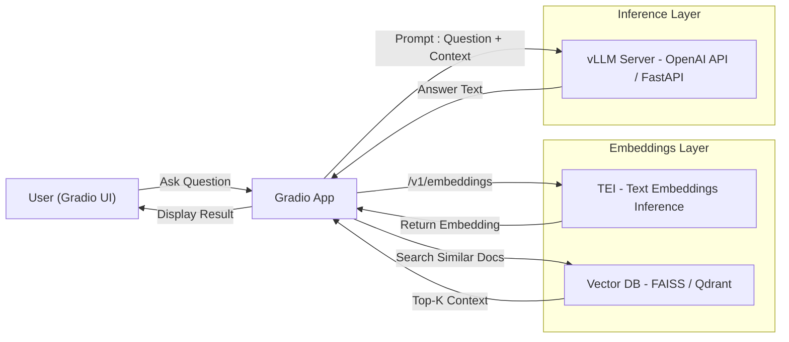

## 1) Setup
- GPU 환경 / Docker / K8s 준비
- Hugging Face Token, 기본 개발 환경 세팅

## 2) Datasets
- 공개 데이터셋(MTEB/KorSTS) 살펴보기
- 내 도메인 문서 수집 및 전처리(청크, 메타데이터)

## 3) Embeddings
- 임베딩 모델 이해 및 선택 (bge-m3, e5, gte-qwen2 등)
- 파인튜닝 (Sentence-Transformers)
- TEI(Text Embeddings Inference)로 서빙
- 평가(MTEB 벤치마크)

## 4) Vector DB
- 로컬 인덱스(FAISS)로 시작
- 필요 시 Qdrant/Weaviate 같은 DB로 확장

## 5) RAG
- 문서 청크 사이즈, Top-K 검색 전략
- Re-rank / 프롬프트 설계
- 검색 결과 + 질문을 합쳐 LLM 입력에 넣기

## 6) Inference
- vLLM으로 LLM 서빙
- OpenAI 호환 API 호출 실습
- 파인튜닝된 LoRA 모델 붙여보기

## 7) UI
- Gradio로 인터랙티브 Q&A 웹앱 만들기
- 질문 입력 → 검색 → 답변 출력 흐름

## 8) Serving & Deployment
- TEI + vLLM을 K8s에 배포
- Ingress & 인증, HPA & 모니터링
- 실제 서비스 환경에서 운영 고려

---

## 🎯 최종 목표
- **질문**을 입력하면  
- **임베딩 → 검색 → LLM 생성** 과정을 거쳐  
- **답변**을 웹 UI에서 확인할 수 있는  
**엔드 투 엔드 RAG 데모 시스템** 완성!