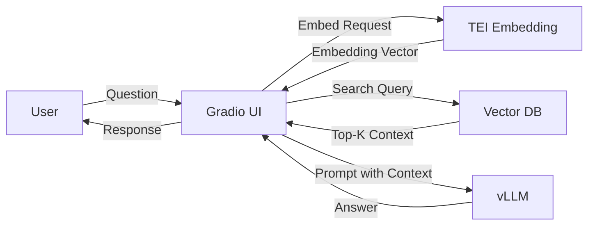

## AI 시스템 기본 구조
- 현대적인 AI 서비스는 단순히 모델 하나만으로 돌아가지 않음
- **데이터 ➡️ 모델 ➡️ 서빙 ➡️ UI/응용** 의 흐름으로 이루어짐
  - 데이터 : 학습/검색에 활용되는 원천
  - 모델 : Embedding 모델, LLM
  - 서빙 : 모델을 API 형태로 띄워 실제 서비스에 사용 가능하게 함
  - UI/응용 : 사용자가 직접 질문/답변을 주고받을 수 있는 인터페이스
---
## 모델과 인프라 구분
AI 서비스는 크게 **모델**과 **인프라**로 나뉨
- 모델
  - Embedding 모델 (텍스트 -> 벡터)
  - LLM (텍스트 생성)
- 인프라
  - Vector DB (벡터 검색 엔진)
  - Serving Framework (vLLM, TEI)
  - Deployment 환경 (Docker, kubernetes)
---

## 주요 구성요소

| 구성요소        | 역할                                | 대표 도구/프레임워크 |
|-----------------|-------------------------------------|----------------------|
| **Embeddings** | 텍스트를 의미 벡터로 변환            | TEI, Sentence Transformers |
| **Vector DB**  | 벡터 저장 및 유사도 검색             | FAISS, Milvus, Qdrant, Weaviate |
| **LLM Inference** | 질문+문서 기반 답변 생성           | vLLM, TGI |
| **UI**         | 사용자 인터페이스                    | Gradio |
| **Deployment** | 서비스 운영/배포                     | Docker, Kubernetes |

---
## 주의사항
1. **&&LLM 만 있으면 다 된다?** ❌
   - 사실 검색(RAG) 없이는 Hallucination 이 잦음
2. **Embedding 모델 = LLM** ❌
   - Embedding 은 검색용 / LLM은 생성용
3. **Vector DB = 일반 DB** ❌
   - Vector DB는 벡터 유사도 검색에 특화
4. **LLM이 모든 걸 처리한다** ❌
   - vLLM은 LLM 서빙만, Embedding은 TEI와 같은 별도 서버 필요
---
## 시나리오
사용자가 질문을 던지고 답을 받기까지의 과정을 단계별로 살펴보기

<Step2 index={1} title="질문 입력">
  사용자가 브라우저(Gradio)에서 질문을 입력한다.
</Step2>
<Step2 index={2} title="벡터화">
  Gradio 앱이 질문을 **TEI(임베딩 서버)**로 보내 → **벡터화**
</Step2>
<Step2 index={3} title="질의/검색">
  Gradio 앱이 질문 벡터를 **Vector DB(예: FAISS, Milvus)**에 질의 → Top-K 관련 문서 검색
</Step2>
<Step2 index={4} title="Call vLLM with context">
  Gradio 앱이 질문 + 문서 컨텍스트를 묶어 **vLLM(OpenAI API 호환)**에 전달
</Step2>
<Step2 index={5} title="Render answer">
  LLM이 답변 생성 → Gradio UI에 결과 표시
</Step2>