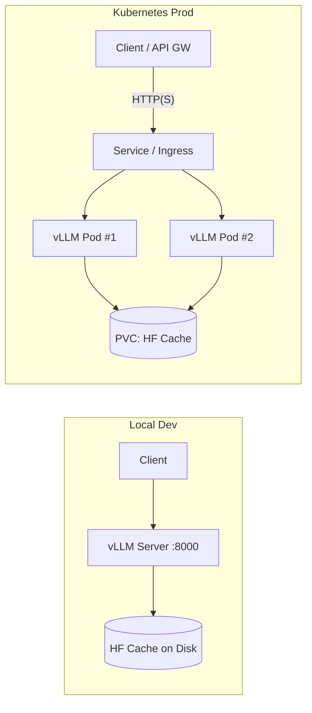
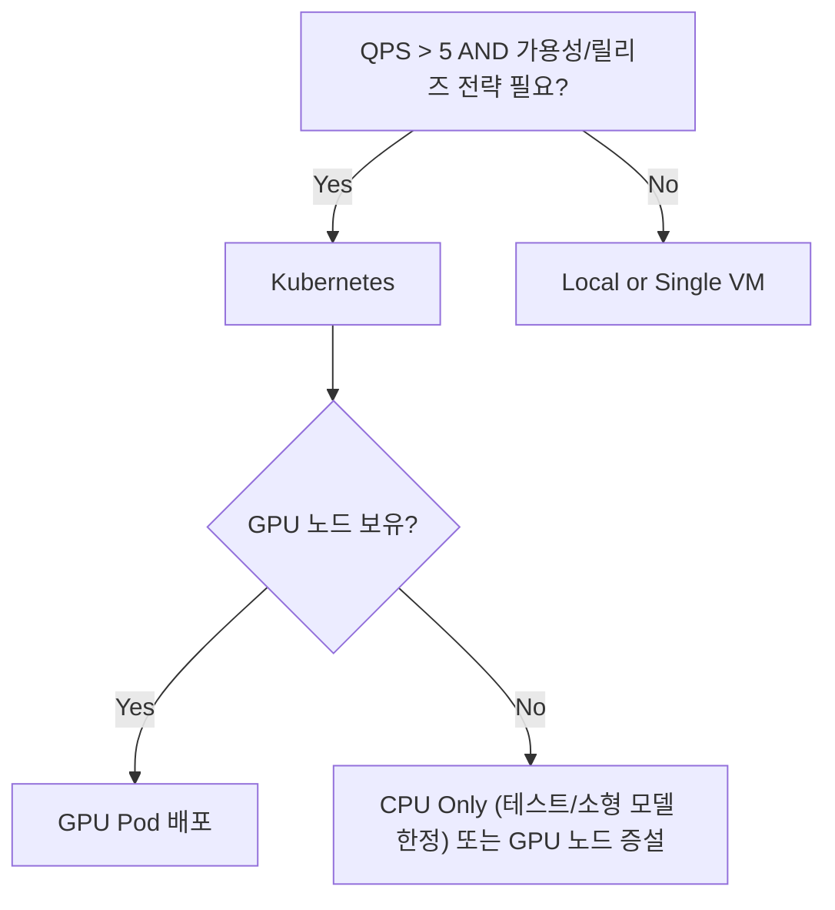

## 핵심 요약
- **로컬** : 빠른 실험/디버깅/소규모 데모에 적합 (GPU 없으면 소형 모델/저QPS만 권장)
- **k8s** : 멀티 인스턴스/자동 복구/수평확장/릴리즈 전략(Blue/Green/Canary)에 적합
- **성능** : 주로 **GPU 메모리 활용률**, **동시 시퀀스 수**, **프리필 최적화**로 결정
- **확장*** : 단일 인스턴스 튜닝 ➡️ 수평 복제(레플리카) ➡️ (필요 시)텐서 병렬 순으로
- **비용** : GPU 점유 시간 x QPS가 핵심, IDLE(유휴) 최소화가 관건(KEDA/스케일-투-제로)
---

## 아키텍쳐 개요

---
##  선택 기준

---
## Local vs K8S
| 항목    | Local(Dev)    | Kubernetes(Prod)           |
| ----- | ------------- | -------------------------- |
| 배포 속도 | 매우 빠름(단일 명령)  | 템플릿/파이프라인 필요               |
| 확장성   | 제한적(1\~N개 수동) | 자동 확장(HPA/KEDA)            |
| 가용성   | 프로세스 크래시 시 다운 | Pod 재시작/롤링업데이트             |
| 네트워크  | 로컬/포트포워딩      | Ingress/LB, mTLS 적용 용이     |
| 저장소   | 로컬 디스크(HF 캐시) | PVC/노드 캐시 공유               |
| 비용최적화 | 수동 종료         | 스케일-투-제로/예약 인스턴스           |
| 관측성   | 로컬 로그         | Prometheus/Grafana/Tracing |
---
## 배포
- Local(Docker)
```bash
# 1) HF 토큰(개인 액세스 토큰) 파일 또는 env 준비
export HUGGING_FACE_HUB_TOKEN=<YOUR_TOKEN>

# 2) 모델 캐시 디렉토리 준비
mkdir -p $HOME/.cache/huggingface

# 3) vLLM 서버 실행 (OpenAI 호환 API)
docker run --rm -it \
  -p 8000:8000 \
  -e HUGGING_FACE_HUB_TOKEN \
  -v $HOME/.cache/huggingface:/root/.cache/huggingface \
  vllm/vllm-openai:latest \
  vllm serve meta-llama/Llama-3-8b-instruct \
    --dtype float16 \
    --max-num-seqs 64 \
    --gpu-memory-utilization 0.90 \
    --tensor-parallel-size 1
# Note: GPU 없는 환경은 소형 모델/저QPS만 권장 (CPU 성능 제약)
```

- K8S (단일 GPU Pod)
```bash
apiVersion: apps/v1
kind: Deployment
metadata:
  name: vllm
spec:
  replicas: 1
  selector: { matchLabels: { app: vllm } }
  strategy:
    type: RollingUpdate
    rollingUpdate: { maxUnavailable: 0, maxSurge: 1 }
  template:
    metadata:
      labels: { app: vllm }
    spec:
      nodeSelector:
        nvidia.com/gpu.present: "true"   # GPU 노드 스케줄링
      containers:
        - name: vllm
          image: vllm/vllm-openai:latest
          args:
            - vllm
            - serve
            - meta-llama/Llama-3-8b-instruct
            - --dtype=float16
            - --max-num-seqs=64
            - --gpu-memory-utilization=0.90
            - --tensor-parallel-size=1
          env:
            - name: HUGGING_FACE_HUB_TOKEN
              valueFrom:
                secretKeyRef:
                  name: hf-token
                  key: token
          ports:
            - containerPort: 8000
          resources:
            limits:
              nvidia.com/gpu: 1
              cpu: "4"
              memory: "16Gi"
            requests:
              cpu: "2"
              memory: "12Gi"
          volumeMounts:
            - name: hf-cache
              mountPath: /root/.cache/huggingface
          readinessProbe:
            tcpSocket: { port: 8000 }    # 경로가 바뀔 수 있어 tcpProbe가 안전
            periodSeconds: 5
          livenessProbe:
            tcpSocket: { port: 8000 }
            periodSeconds: 10
          lifecycle:
            preStop:
              exec: { command: ["sh","-c","sleep 10"] }  # 연결 드레인
      terminationGracePeriodSeconds: 30
      volumes:
        - name: hf-cache
          persistentVolumeClaim:
            claimName: hf-cache-pvc
---
apiVersion: v1
kind: Service
metadata:
  name: vllm
spec:
  selector: { app: vllm }
  ports:
    - name: http
      port: 8000
      targetPort: 8000
  type: ClusterIP

# 실무에선 Helm/Kustomize로 값만 바꿔 여러 환경(DEV/STG/PRD)에 공용화하는 게 편리
```
---
## 스케일링  패턴
1. 수직/내부 병렬(텐서 병렬)
   - `--tensor-parallel-size=N` : 단일 모델을 N개의 GPU로 분할
   - 권장 : 가능하면 동일 노드에 N개의 GPU가 있는 인스턴스 사용 (NCCL 통신 비용 ⬇️)
2. 수평 복제 (레플리카)
   - `replicas: k`로 독립 vLLM 서버를 여러 개 띄우고 service/Ingress가 로드밸런스
   - 모델 캐시는 PVC 공유  또는 노드-로컬 캐시 전략으로 콜드 스타트 최소화
3. 자동 확장 (HPA/KEDA)
   - GPU 워크로드는 CPU 기반 HPA가 부정확할 수 있음 ➡️ 외부 지표(QPS/대기열 길이/응답 지연)로 스케일
   - KEDA + Prometheus Adapter 예시 : `requests_per_second` ≥ 임계치 ➡️ replicas 상향
---
## 성능/튜닝 체크리스트
- GPU 메모리 활용률 : `--gpu-memory-utilization 0.85~0.95` 범위에서 안정/성능 균형
- 동시 처리량 : `--max-num-seqs`(동시 시퀀스), 트래픽에 맞게 단계적으로 상향 테스트
- 프리필 최적화 : (버전에 따라) 청크 플필/페이지드 KV 캐시 옵션 확인 후 활성
- 컨텍스트 길이 : `--max-model-len` 과다 설정은 메모리 급증, 실제 요구치 기반으로 설정
- 압축/양자화 : AWQ/GPTQ 등 사전 양자화 모델로 메모리↓·처리속도↑(품질 트레이드오프)
- 핀 캐시 : HF 모델 캐시 PVC/노드 캐시로 콜드 스타트 시간 최소화
- 스레드/바인딩 : CPU 보조 경로 (토크나이저 등)스레드 수를 컨테이너 리소스에 맞춤
---
## 네트워킹/보안
- Ingress 뒤에 배치, `/v1/*` 라우팅 (openAI 호환)
- mTLS/API Key 게이트웨이에서 처리 ➡️ vLLM Pod는 내부망만 노출
- 리소스 보호 : 레이트 리밋 (전역/테넌트 별) 요청 당 최대 토큰/컨텍스트 길이 상한
---
## 관측성/모니터링
- 애플리케이션 지표 : QPS, P50/P95, 에러율(429/5xx), 토큰/초(throughput)
- 리소스 지표 : GPU 메모리/사용율, CPU/메모리, 네트워크 egress
- 콜드 스타트/캐시 히트율 : 최초 응답 지연, 모델 파일 캐시 히트율
- 알람 예시
  - P95 응답시간 > 2s (5분)
  - 에러율 > 1% AND QPS > 5
  - GPU 메모리 사용률 > 95% (과열/OOM 위험)
---
## 비용 최적화
- 아이들 제거 : 트래픽 없을 때 레플리카 축소 또는 스케일-투-제로
- 캐시 재활용 : PVC/노드 캐시로 재시작 비용 ⬇️
- 모델 포트폴리오 : 대형 1개 대신 중형x여러 대가 더 효율적일 때 많음
- 배치/실시간 분리 : 야간/배치 처리는 스팟/저가 인스턴스 사용
---
## 실전
<Stepper> 
<StepperItem title="1) 모델/리소스 정하기"> 
목표 QPS/지연/맥스 컨텍스트로 모델 크기·GPU 수 추정
</StepperItem> 
<StepperItem title="2) 단일 Pod 튜닝"> 
`--gpu-memory-utilization/--max-num-seqs/` 캐시 점검, SLA 만족 확인
</StepperItem> <StepperItem title="3) 수평복제">
 replicas 올리고 LB 성능/세션/레이트 리밋 확인
 </StepperItem> <StepperItem title="4) 자동확장/KEDA"> 
 외부 지표 기반 HPA 설정, 아이들 축소 검증
 </StepperItem> 
 <StepperItem title="5) 관측/알람/릴리즈"> 
 대시보드/알람, Canary 배포 파이프라인 적용
  </StepperItem> </Stepper>

---
## 트러블슈팅
| 증상                | 원인                 | 해결                                         |
| ----------------- | ------------------ | ------------------------------------------ |
| 첫 요청 매우 느림        | 콜드스타트(가중치 다운로드/로딩) | PVC 캐시·프리워밍·롤링업데이트 시 사전 준비                 |
| OOM/Out of memory | 컨텍스트 과다, 동시 시퀀스 과다 | `--max-model-len`/`--max-num-seqs` 조정, 양자화 |
| QPS 늘리면 지연 폭증     | GPU 포화/스케줄링 경쟁     | 레플리카 증설, 더 큰 GPU/텐서 병렬                     |
| 재시작 시 모델 재다운      | 캐시 미공유             | PVC/노드 로컬 캐시 도입                            |
| HPA가 GPU 부하 반영 못함 | CPU 지표 불일치         | KEDA+커스텀 지표(QPS/지연)로 확장                    |
