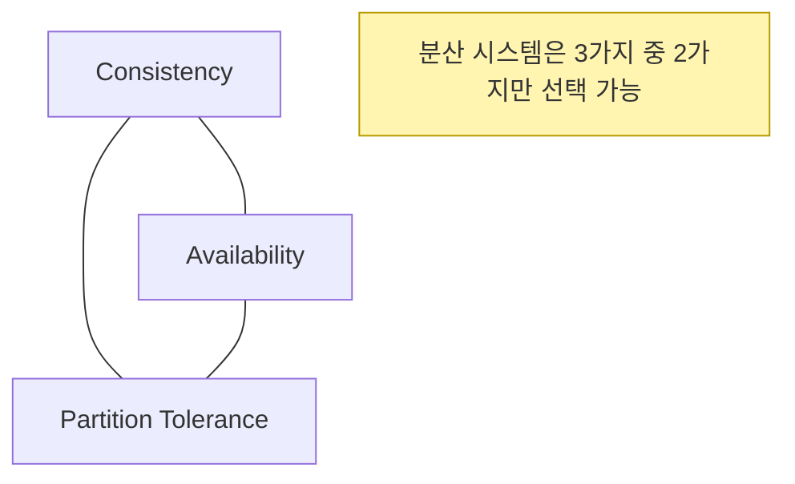

## CAP Theorem 
> 분산 시스템은 **Consistency(일관성), Availability(가용성), Partition Tolerance(분할 내성)** 중 2가지만 보장할 수 있음
> 
> 세 가지를 동시에 완벽히 충족할 수 ❌
---

## CAP
1. **C - Consistency (일관성)**
   - 모든 노드가 동일한 데이터를 반환
   - 사용자가 어느 노드에 접근하든 결과가 같음
   - ex) 은행 잔고 조회 시 모든 노드에서 같은 금액 확인 가능
2. **A - Availability (가용성)**
   - 모든 요청에 대해 항상 응답
   - 일부 노드가 장애가 나더라도 나머지가 요청 처리
   - 응답이 성공/실패일 수 있지만 항상 응답이 있다는 것이 핵심 (실패도 응답이니까,,)
3. **P - Partitio Tolerance (분할 내성)**
   - 네트워크 단절(Partition)이 발생해도 시스템이 동작 가능
   - 즉, 일부 노드가 서로 통신 불가해도 서비스가 완전히 멈추기 않음
---

## 핵심
- 분산 환경에서는 **Parition Tolerance(P)**는 **항상 필요** (네트워크 장애는 피할 수 없으니까)
- 따라서 실제 선택지는 **CP** 또는 **AP**
---
## 조합
1. CP (Consistency + Partition Tolerance)
   - 네트워크 분할 시 **일관성**을 보장, 대신 **가용성**을 희생
   - Primary 선출이 끝날 때까지 쓰기 불가 
   - 예: **MongoDB Replica Set**, **HBase**
2. AP (Availability + Partition Tolerance)
   - 네트워크 분할 시 **가용성**을 보장, 대신 **일관성**을 희생  
   - 일부 노드는 최신 데이터가 아닐 수 있음(Eventual Consistency) 
   - 예: **Cassandra, DynamoDB**
3. CA (Consistency + Availability) =  ❌
   - 네트워크 분할이 전혀 없는 경우만 가능
   - 현실의 분산 시스템에서는 Partition이 항상 가능하므로 **실제 불가능**
---
## 시각화

