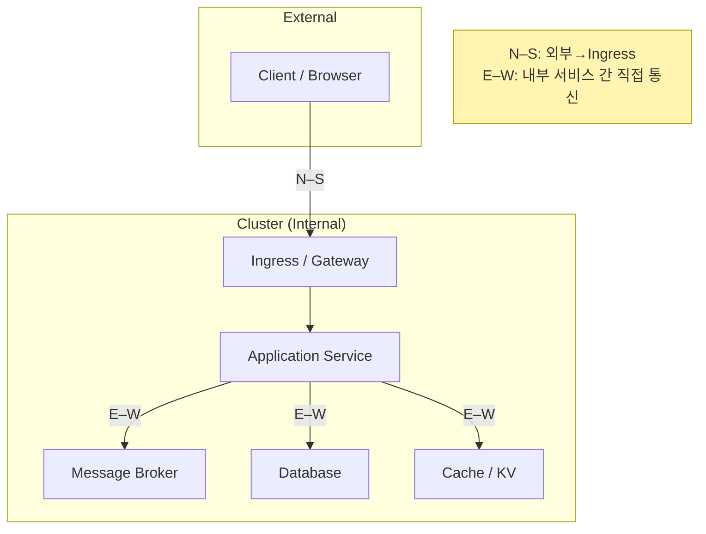

## N–S vs E–W Traffic 
> N–S(North–South) :  *외부(클라이언트) ↔ 내부(클러스터)* 트래픽, 보통 **Ingress/Gateway/LB**를 통해 들어옴
>
> E–W(East–West) : *내부 서비스 ↔ 서비스* 트래픽, 보통 **Service Discovery/ClusterIP/Headless/Service Mesh**로 **직접 통신**
> 
> 분산 환경으로 갈수록 **E–W 트래픽의 양과 중요도**가 급증하며, **지연/장애 전파/보안/관측성**이 핵심 이슈가 됨!
---

## 개념
1. **N-S (North - South)**
   - 방향 : 외부 인터넷 ↔️ 내부 시스템 (클러스터/데이터 센터)
   - 진입 경로 : L7 Ingress Controller / API Gateway , L4 Load Balancer
   - 주요 역할 : 인증/인가, SSL/TLS 종료, Rate Limiting, WAF, 라우팅, 캐싱
   - 관심사 : 보안(공격 방어), 사용자 경험(응답 시간), 버전 롤아웃(블루/그린,카나리)
2. **E-W (East-West)**
   - 방향 - 내부 서비스 ↔️ 내부 서비스
   - 연결 방식 : Service Discovery(DNS), ClusterIP/Headless Service, Service Mesh (mTLS/Retry/회로차단)
---
## 왜 중요할까?
멀티 노드 / 마이크로서비스에서의 변화
- 단일 노드 : 대부분이 로컬 호출 -> N-S만 신경 써도 큰 문제 없음
- 멀티 노드 / 마이크로서비스 : 서비스 분할과 상태관리로 E-W 트래픽 폭증
   - 내부 호출 실패/지연이 도미노 장애로 번짐
   - 내부 보안 (mTLS,zero trust), 관측성(분산 트레이싱) 없으면 원인파악 난이도 ⬆️
---
## 시각화

---
## Kubernetes 기준 설계 포인트
1. N-S (Ingress)
- Ingress Controller(ex. Nginx, Traefik, HAProxy) 또는 L4 LB(NLB)사용
- 정책 : TLS 종료, 인증/인가, Rate Limit, Path/Host 라우팅
```yaml
# 예시: Ingress (N–S)
apiVersion: networking.k8s.io/v1
kind: Ingress
metadata:
  name: app
spec:
  ingressClassName: traefik
  tls:
    - hosts: ["app.example.com"]
      secretName: app-tls
  rules:
    - host: app.example.com
      http:
        paths:
          - path: /api
            pathType: Prefix
            backend:
              service:
                name: api-svc
                port:
                  number: 80
```
2. E-W (Service Discovery)
- ClusterIP : 기본 내부 라우팅
- Headless Service(`clusterIP:None`) : Pod 개별 DNS 노출(Stateful/broker에 적합)
```yaml
# 예시: Service (E–W)
apiVersion: v1
kind: Service
metadata:
  name: api-svc
spec:
  type: ClusterIP
  selector: { app: api }
  ports:
    - port: 80
      targetPort: 3000
---
# 예시: Headless Service (상태풀 직접 연결)
apiVersion: v1
kind: Service
metadata:
  name: broker
spec:
  clusterIP: None
  selector: { app: broker }
  ports:
    - port: 9092
```
3. Service Mesh (선택)
- lstio / Linkerd로 E-W 트래픽에 mTLS,Retry,서킷브레이커, 분산 트레이싱(B3,W3C) 적용
- 정책을 코드 밖의 YAML/CRD로 선언 -> 일관된 트래픽 제어
---
## L4 vs L7
어디에 무엇을 둘 것인가?
- 원칙 : Stateful 데이터 경로 (브로커/DB)는 E-W 직접 통신을 우선, L7 Ingress/proxy는 외부진입(N-S) 위주

| 계층                 | 주 사용처      | N–S에서의 역할                   | E–W에서의 역할               |
| ------------------ | ---------- | --------------------------- | ----------------------- |
| **L4 (TCP/UDP)**   | 단순 분산/고성능  | NLB/CLB, TLS 패스스루           | 상태풀 데이터 경로(브로커/DB) 직결   |
| **L7 (HTTP/GRPC)** | 콘텐츠 라우팅/정책 | Ingress/Gateway, 인증/인가, WAF | 내부 API 간 정책·가시성(메시/프록시) |
---
## 보안 모델
- N-S : WAF, Bot 방어, OAuth/OIDC, API Key/Rate Limit, TLS 종료
- E-W : mTLS(서비스간 상호 TLS), 네임스페이스 격리, 정책(네트워크 폴리시), 제로 트러스트(ID기반 허용)
---
## 관측성(모니터링)
1. N-S 핵심 지표
   - Edge 4xx/5xx 비율, p95/p99 응답시간, SSL 핸드셰이크 에러, RateLimit 히트율
   - 카나리/롤아웃 중 라우팅 가중치/오류율 추적
2. E-W 핵심 지표
   - 서비스 간 RTT/지연, 재시도/타임아웃/서킷브레이크 발생률
   - 분산 트레이싱(요청 스팬 체인),큐(브로커) 지연/백 프레셔
   - Stateful : 리더선출 이벤트, 복제 지연
   - Alert Ex.
     - E-W 지연 p99 > 300ms(5분 지속)
     - 리더 선출 이벤트 10분 내 3회 이상
     - 재시도율 > 5% + 타임아웃율 > 1%
---
## 장애 유형
1. N-S
   - 증상 : Edge 5xx 급증, 인증실패, TLS 오류
   - 점검 : Ingress 로그/메트릭, 외부 LB 상태, WAF 정책 변경 내역
   - 조치 : 롤백/카나리 가중치 조정, 방화벽/보안정책 점검, TLS 재설정
2. E-W
   - 증상 : 내부 호출 지연/타임아웃, 메시지 발생/소비 지연, DB StepDown
   - 점검 : 서비스 메시 리트라이/서킷 이벤트, 브로커/DB 리더 이벤트, DNS/MTU/패킷 드롭
   - 조치 : Retry/Backoff 조정, 멱등성 보장, Outbox 등 일관성 패턴 적용, 리더/파티션 재분배
---
## Best Pracice
- N-S는 Ingress/Gateway, E-W는 직접 통신(Service Discovery/Headless/Mesh)
- Stateful 데이터 경로는 L7 Ingress 우회(지연/장수 커넥션/바이너리 프로토콜 고려)
- mTLS + 네트워크 폴리시로 내부 보안 강화
- 분산 트레이싱으로 E-W 호출 체인 가시화
- Retry는 멱등성과 함께(없으면 중복/불일치 위험)
- 백프레셔/서킷브레이커로 장애 전파 억제
---
## Anti Pattern
- 내부 E-W 호출을 모두 Ingress로 우회(불필요한 홉/지연/장애점)
- Stateful 브로커/DB 앞에 L7 프록시를 상시 경유
- Retry만 키우고 멱등성/서킷은 미적용
- DNS/MTU/네트워크 지표 무시
---
## Check List
☑️ 외부 진입은 Ingress/Gateway로, 내부는 ClusterIP/Headless로 설계했는가?
☑️ 상태풀 데이터 경로는 직접 통신하고 있는가? (브로커/DB)
☑️ mTLS/네트워크 폴리시로 내부 보안을 적용했는가?
☑️ 재시도 + 멱등성 + 서킷브레이커를 함께 적용했는가?
☑️ 리더/복제 지연/백프레셔 지표를 모니터링하고 경보를 설정했는가?
☑️ 분산 트레이싱으로 E–W 호출 체인을 추적 가능한가?
☑️ 카나리/블루그린 등 N–S 트래픽 제어 전략이 준비되어 있는가?