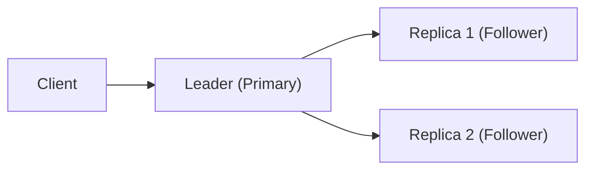

## Replica, Leader, Election

> **핵심 한 줄 요약**  
> Replica는 복제본, Leader는 쓰기를 책임지는 주 노드, Election은 장애 발생 시 새로운 리더를 뽑는 과정  
> 분산 환경에서 이 과정 때문에 **짧은 쓰기 불가 시간, 데이터 불일치**가 발생할 수 있음
---

## Replica 란?
- 복제본 (Replica) : 데이터를 여러 노드에 복사 해 두는 것
- 목적
  - 장애 발생 시 Failover -> 가용성 보장
  - 읽기 요청 분산 -> 성능 향상
- 종류 (예시)
  - MongoDB Replica Set: Primary 1개 + Secondary 여러 개
  - Kafka ISR (In-Sync Replicas): Leader 1개 + Follower 여러 개
  - Redis Sentinel: Master 1개 + Replica 여러 개
---

## Leader 란?
- Replica 중 하나는 반드시 **Leader(Primary/Master)** 역할
- 특징
  - 쓰기 요청은 Leader가 처리
  - 읽기 요청은 Leader 또는 Replica가 담당(시스템 설정에 따라 다름)
  - Leader가 죽으면 새로운 Leader를 선출해야 함

---
## Election 이란?
- 선출(Election) : 기존 Leader가 장애 발생 시 새로운 Leeder를 고르는 과정
- 절차
  1. 기존 Leader 간 감지 실패
  2. 노드 간 투표 (합의 알고리즘: Raft, ZAB, Paxos 등)
  3. 새로운 Leader 선출
- 이 과정에서 짧은 공백 시간 발생!!
  - 쓰기 불가
  - 일부 읽기 실패 가능
---
## 장애 현상
- Leader 장애 -> Election 중단 시간
  - kafka : 파티션 Leader가 없어 잠깐 메세지 발행 실패
  - MongoDB : Primary Stepdown 동안 쓰기 불가
  - Redis : Master 장애 시 Sentinel이 새 Replica를 승격하는 동안 쓰기 불가
- Replica 지연
  - Leader에 기록된 데이터가 Replica에 아직 반영 되지 않은 경우
  - 읽기 요청이 Replica로 가면 낡은 데이터 반환 가능
---
## 해결 전략
1. 일관성 수준 설정
   - Kafka: `acks=all` + `min.insync.replicas`로 동기화된 Replica까지 확인
   - MongoDB: `writeConcern=majority`, `retryWrites=true`
   - Redis: Sentinel Failover 후 클라이언트 재연결 로직 필요
2. 재시도 / 멱등성(idempotence, 같은 연산을 여러 번 수행해도 결과가 한 번 수행한 것과 동일한 성질)
   - Producer/Client는 자동 재시도, 중복 방지를 위한 멱등성(idempotence) 적용
3. 모니터링
   - Leader 교체 이벤트 감지
   - Failover 빈도/지연 시간 추적