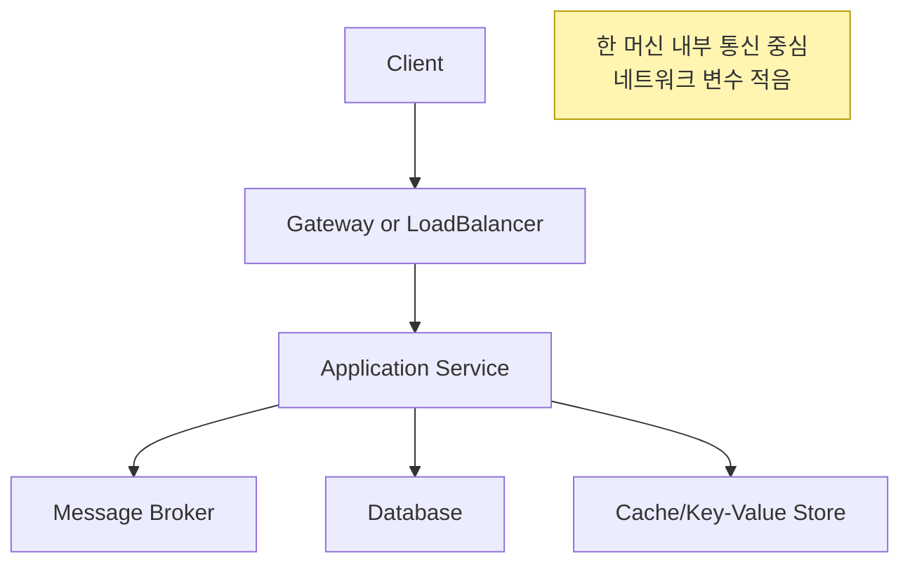
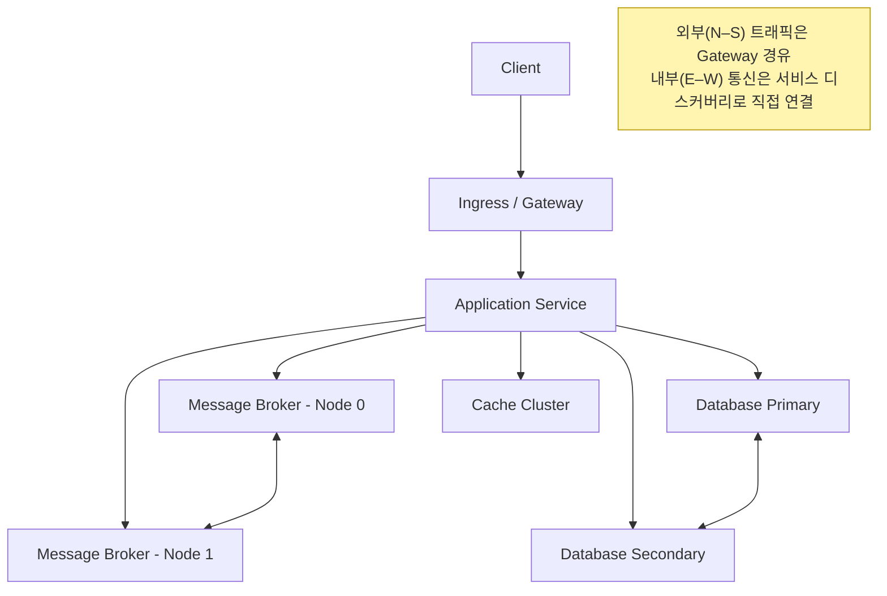

## Single Node vs Multi Node
- 분산 시스템을 이해하려면 먼저 **단일 노드 환경**과 **멀티 노드 환경**의 차이를 알아야함!
- 단일 노드에서는 안정적으로 보이던 서비스도, 멀티 노드로 확장하면 네트워크·리더 선출·부하 분산 문제로 새로운 장애가 발생

---

## 단일 노드 (Single Node)

- 모든 서비스와 데이터가 **하나의 머신** 안에서 동작 
- 네트워크 홉이 거의 없어 **지연·분리 문제**가 적음  
- 디버깅과 운영이 단순
- 하지만 확장성은**수직 확장(Scale-up)에 의존**

---
## 멀티 노드 (Multi Node, Cluster)
- 여러 노드에 서비스와 데이터를 **분산 배치**
- 장점 : 확장성 (수평확장), 가용성(Replica, Failover)
- 단점 : 네트워크 지연/손실, 리더 선출 중단, 데이터 불일치 등 새로운 복잡성 추가

---
## 비교

| 항목  | 단일 노드           | 멀티 노드                |
| --- | --------------- | -------------------- |
| 복잡도 | 낮음              | 높음 (네트워크, 리더 선출, 배치) |
| 확장성 | 수직 확장 중심        | 수평 확장 용이             |
| 가용성 | SPOF(단일 장애점) 존재 | Replica로 Failover 가능 |
| 지연  | 일정, 안정적         | 네트워크 지연/패킷 손실 존재     |
| 운영  | 단순, 추적 쉬움       | 원인 다양, 모니터링 필수       |
| 비용  | 초기 저렴           | 인프라·관측 도구 비용 증가      |

---
## 멀티노드 이슈
1. **리더/Primary 선출 지연**
   - 메시지 브로커나 DB에서 리더/Primary가 바뀌는 동안 쓰기/발행 실패 발생
2. **Replica 불일치**
   - 복제가 늦으면 읽기 결과가 뒤엉킴
3. **부하 쏠림**
   - 특정 리더/Primary에 요청 몰림 -> 해당 노드는 과부하
4. **네트워크 문제**
   - MTU mismatch, 패킷드롭, DNS 지연 등으로 타임아웃/재시도 발생
5. **순서 보장 붕괴**
   - 멀티 파티션, 멀티 컨슈머 구조에서는 요청 순서와 완료 순서가 다를 수 있음
> 따라서 분산 시스템에서는 재시도 로직, 멱등성, 일관성 패턴, 모니터링이 필수!