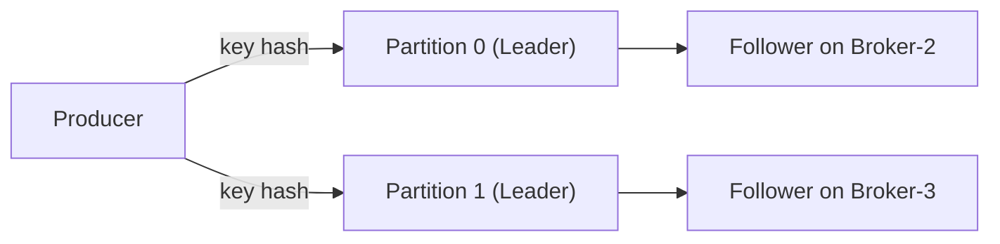

## 핵심 요약
- **partition** : 토픽 데이터를 여러 조각으로 나눠 병렬 처리와 확장을 가능하게함
- **Rebalance** : 
  - 컨슈머 그룹 리밸런스 : 소비자 사이의 파티션 재배치
  - 토픽 파티션 재할당/리더십 리밸런스 : 브로커 사이의 데이터/리더 분산
- 목표는 **처리량/지연/가용성**을 균형있게 유지
- 불필요한 리밸런스는 정지 ➡️ 재분배 ➡️ 웜업 비용을 키워 장애처럼 체감됨
---
## partition 기본
- 하나의 토픽을 **N개 파티션**으로 쪼갬 : **병렬성(컨슈머 N개 까지)** 확보
- 각 파티션엔 **리더 1개** + **팔로워(Replica)** 가 존재
- **키 기반 라우팅**(기본 파티셔너)은 같은 키가 **항상 같은 파티션**으로 라우팅 됨
- **주의** : 파티션을 뒤느게 늘리면 기존 키의 파티션 매핑이 달라질 수 있어 순서 보장,핫 파티션 이슈가 생길 수 있음!

---
## Rebalance
1. Consumer Group Rebalance
   - 언제 발생? : 컨슈머 추가/종료/크래시, 서브 스크립션 변경, 하트비트 타임 아웃
   - 발생 이슈 : 
     - 그룹 코디네이터가 파티션 ↔️ 컨슈머 매핑을 다시 계산
     - 전통(이저) 리밸런스는 모두 잠깐 멈춤 ➡️ 다시 나눔이라 가동 중간이 체감
   - 완화 방법 : 
     - Cooperative/Sticky Assignor 사용(부분적, 점진적 이동)
     - Static Membership(`group.instance.id`)으로 재시작 시 같은 파티션 재할당
     - `max.poll.interval.ms`, `session.timeout.ms`, `heartbeat.interval.ms` 적절히 조정
     - 파티션 수 ≤ 컨슈머 수 × K(균형 범위) 로 계획
2. 파티션 재할당 / 리더십 리밸런스 (Broker-side)
   - 언제 필요? :
     - 브로커 증감(스케일), 특정 브로커 과열, 리더 쏠림
     - 하드웨어 교체/데이터 이사
   - 무슨 일? : 파티션의 리더/팔로워 위치를 다른 브로커로 이동 또는 리더로 바꿈
   - 완화 방법 : 
     - 재할당 쿼터(스로틀)로 생산/소비 영향 최소화
     - 선호 리더 선출로 리더 분산
     - 자동화 툴(ex. Cruise Control)로 제안/실행
---
## Consumer Group Rebalance
1. 트리거 & 영향
   - 트리거 : 새 컨슈머 조인/이탈, 하트비트 실패, 구독 토픽 변경
   - 영향 : 리밸런스 중 일부 파티션은 일시 중단, 재배치 후 웜업 캐시 필요 ➡️ 지연 증가
2. 튜닝 포인트
   - Sticky/Cooperative 할당 전략 사용
     - ex. Java : `partition.assignment.strategy=org.apache.kafka.clients.consumer.CooperativeStickyAssignor`
   - Static Membership
     - `group.instance.id` 고정 ➡️ 동일 인스턴스가 같은 파티션 다시 받음
     - 컨테이너 롤링 재시작 시 stop-the-world 최소화
   - 타임아웃/하트비트
     - `session.timeout.ms`,`heartbeat.interval.ms`,`max.poll.interval.ms`
     - 너무 빡세면 헬시 컨슈머도 자주 추방되어 리밸런스 과잉 유발
---
## Partition Rebalance
1. 자주 보는 불균형
   - 리더 쏠림 : 특정 브로커가 리더를 과도하게 소유 ➡️ 쓰기/네트워크 집중
   - 파티션 쏠림 : 파티션 수/바이트 인/아웃이 일부 브로커에 집중
   - 핫 파티션 : 특정 키/파티션으로 트래픽 집중 ➡️ 컨슈머 한 대가 병목
2. 해결 전략
   - 리더 분산 
     - `auto.leader.rebalance.enable=true`(버전 따라 기본값 확인)
     - `leader.imbalance.per.broker.percentage`,
     `leader.imbalance.check.interval.seconds`
     - Preferred Leader Election으로 선호 브로커에 고르게 배분
   - 파티션 재할당 
     - 브로커 증설/교체 시 재할당 계획을 만들어 실행
     - 스로틀(replication quota)로 운영 영향 제한
   - 핫 파티션 완화
     -  키 다양화/샤딩 키 재설계
     -  파티션 수 증설(부작용 주의 : 순서/라벨링 변경)
---
## 파티션 재할당 절차 예시
목표 : Broker-1에 몰린 파티션을 Broker-3로 일부 이사
1. 현황 확인
   ```bash
   kafka-topics.sh --bootstrap-server broker:9092 --describe --topic orders
   ```
2. 계획 생성(Admin API 또는 CLI)
   - CLI 방식 (예시)
   ```bash
   # 1) 제안안 생성
    kafka-reassign-partitions.sh \
      --bootstrap-server broker:9092 \
      --topics-to-move-json-file topics.json \
      --broker-list "1,2,3" \
      --generate > proposal.json

    # 2) 제안안 수정(필요 시) 후 실행
    kafka-reassign-partitions.sh \
      --bootstrap-server broker:9092 \
      --reassignment-json-file proposal.json \
      --execute

    # 3) 진행/완료 확인
    kafka-reassign-partitions.sh \
      --bootstrap-server broker:9092 \
      --reassignment-json-file proposal.json \
      --verify
   ```
3. 스로틀(복제 제한)설정
   - 브로커/토픽에 leader/follower throttled replicas 지정 또는 replication.quota 동적 설정
   - 효과 : 재복제 트래픽이 생산/소비 경로를 압박하지 않도록
4. 모니터링
   - UnderReplicatedPartitions, BytesIn/Out, 재복제 지연, 디스크/네트워크 사용률
5. 마무리
   - 스로틀 해제, 리더 분포 재확인, 필요 시 Preferred Leader Election
> 팁: 대규모/자주 수행한다면 Cruise Control 같은 자동화 도구로 제안 생성 → 영향 예측 → 점진 실행까지 일원화하는 게 운영에 유리

---
## 모니터링
1. 브로커/클러스터
   - UnderReplicatedPartitions, OfflinePartitionsCount
   - ActiveControllerCount(=1), RequestHandlerAvgIdlePercent
   - Per-broker leader/partition count, BytesIn/Out, Network/Disk usage
2. 리밸런스 관련
   - 리더 선출 이벤트율(너무 잦으면 불안정 신호)
   - 재복제 지연/쓰루풋(스로틀 적정성)
   - 컨슈머 그룹 rebalancing 이벤트(빈도·시간), lag 스파이크
3. 알람 예시
   - `UnderReplicatedPartitions > 0` (5m)
   - `OfflinePartitionsCount > 0`
   - `consumer_group_rebalance_time_p95 > 5s`
   - `leader_imbalance_ratio > 20%`