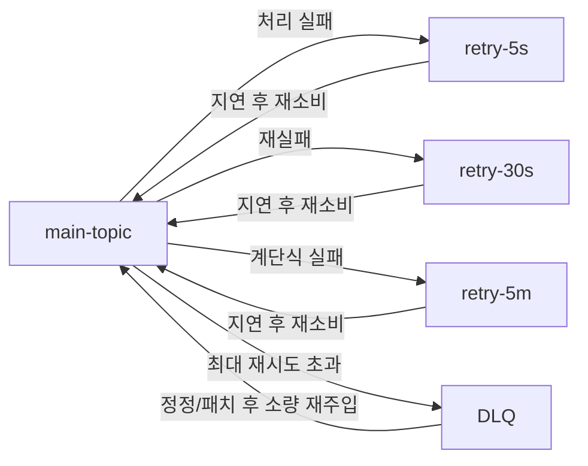

<Note>
   <a href="/backend/distributed/kafka/producer-reliability">Producer acks & Idempotence</a>와 함께 읽기
   
   여기서는 “에러 발생 시 **무엇을** 어떻게 **다시 처리**할지”에 집중
</Note>
## 핵심 요약
- **오류 3분류** : Transient(일시) / Intermittent(간헐) / Permanent(영구)
  - 재시도는 일시 또는 간헐에만 적용, 영구 오류는 즉시 **DLQ**
- **계층형 재시도 토폴로지** : `main → retry-5s → retry-30s → retry-5m → DLQ`
- **오프셋 커밋 원칙** : 실패 시 커밋 금지(at-least-once) , 성공 후 커밋
  - 필요 시 트랜잭션/EOS 또는 Outbox로 E2E 정합성
- **메타데이터 표준화** : `x-retry-count`, `x-first-seen`, `x-last-error`, `x-error-hash`, `x-next-at`, `x-correlation-id`
- **모니터링** : Lag, 실패율, 재시도 큐, DLQ 유입(증가율,체류시간)
---

## Retry 권장패턴


- 단일 무한 재시도는 메시지 폭주/적체/브로커 압박 유발
- 단계별 간격으로 압력 분산 및 장애 축소
- 지연 구현 : 브로커 지연기능(있다면) or 컨슈머가 헤더(`x-next-at`)기반 재발행
---
## 오류 분류

| 레이어             | 유형           | 대표 증상                 | 예시                | 재시도 정책      | 기본 액션                   |
| --------------- | ------------ | --------------------- | ----------------- | ----------- | ----------------------- |
| Producer        | Transient    | 네트워크 타임아웃             | `REQUEST_TIMEOUT` | 짧은 백오프 재시도  | 클라이언트 `retries/backoff` |
| Producer        | Permanent    | 직렬화/스키마 불일치           | Avro/JSON 스키마     | 무의미         | **DLQ** 즉시 (원본+에러메타)    |
| Consumer        | Transient    | 외부 API 5xx            | 503/504           | 지수+지터 재시도   | 지연큐 경유 재소비              |
| Consumer        | Intermittent | DB Deadlock/Lock wait | MariaDB/MySQL     | 단계별 재시도     | 한계 초과 시 DLQ             |
| Consumer        | Permanent    | 비즈니스 규칙 위반            | 필수 필드 누락          | 무의미         | **DLQ** 즉시              |
| Infra           | Transient    | 리더 교체 직후              | Rebalance         | 짧은 대기 후 재시도 | 안정화 대기                  |
| Connect/Streams | Permanent    | 싱크 인증/권한 실패           | Sink 401/403      | 구성 수정 필요    | DLQ + 설정 수정             |

---

## 메세지 헤더 규약
- 장점 : 원인 군집화, 알람/대시보드 필터, 대량 재처리 제어가 쉬워짐
```
x-retry-count: number            # 현재까지 재시도 횟수
x-first-seen: ISO8601            # 최초 실패 시각
x-last-error: "Class:message"    # 마지막 오류 요약
x-error-hash: string             # 에러/스택 해시 (동일 원인 식별)
x-correlation-id: string         # 트레이스 연계
x-next-at: ISO8601               # 다음 시도 시각 (지연 소비)
```
---
## 재시도 알고리즘
- 기본식 : `delay = base * 2^n` (단, `delay ≤ max`)
- 지터 : `delay = delay ± (delay * j)` (`j` 예: 0.2) → 시작 시각 분산
- 사다리형 : `[5s, 30s, 5m]` → 단계별 토픽으로 분배
```
base = [5s, 30s, 300s]      # ladder
n = min(retry_count, len(base)-1)
delay = jitter(base[n], 0.2)  # ±20%
if retry_count < MAX:
  send -> retry-topic
else:
  send -> DLQ
```
---
## commit offset 전략
- 외부 DB 포함 E2E는 Outbox가 현실적 : 로컬 트랜잭션 > kafka 비동기 내보내기

| 모드            | 설명                    | 장점          | 단점      | 권장               |
| ------------- | --------------------- | ----------- | ------- | ---------------- |
| At-most-once  | 소비 전 커밋               | 중복 無        | 손실 가능   | ❌ (대부분 비권장)      |
| At-least-once | 처리 성공 후 커밋            | 손실 최소       | 중복 가능   | ✅ 기본값, 멱등 처리로 상쇄 |
| EOS(트랜잭션)     | read-committed + 트랜잭션 | 중복/순서 강력 제어 | 복잡/오버헤드 | ⭕ 핵심 라인 한정       |

---
## DLQ 운영 규칙
- 즉시 격리 : Poison pill(역직렬화/스키마/영구 비즈오류)은 라인 차단 없이 DLQ로
- 보존/검색성 : 원본 payload + 헤더 메타 + 에러 전문을 JSON으로 저장
- 재주입 정책 : 원인 해결(코드/스키마/데이터 정정) 후 소량/저QPS/배치 단위로 메인에 재투입
- SLA/오너십 : DLQ 내 아이템은 서비스 오너가 T+N 내 처리 (운영 룰로)
---
## 설정
- 토픽 브로커
   ```
   # retry 토픽(각 단계 동일하게)
   cleanup.policy=delete
   retention.ms=43200000         # 예: 12h (단계/업무에 맞게)
   min.insync.replicas=2         # 핵심 라인
   replication.factor=3
   # DLQ
   cleanup.policy=delete
   retention.ms=259200000        # 예: 3d~7d
   ```
- 프로듀서(재발행용)
   ```
   acks=all
   enable.idempotence=true
   retries=1000000
   delivery.timeout.ms=120000
   request.timeout.ms=30000
   max.in.flight.requests.per.connection=1   # 순서 중요 시
   ```
- 컨슈머
   ```
   enable.auto.commit=false
   auto.offset.reset=earliest
   max.poll.interval.ms=...       # 처리시간 대비 여유
   session.timeout.ms=...
   max.poll.records=100~1000      # 처리량/지연 균형
   ```
---
## 예시
- 실제 서비스에서는 스케쥴러/백그라운드 워커가 `x-next-at`이전에 메시지를 임시보관하고 시간 도래 시 재발행하도록 구성하는 방식 권장
```python
from confluent_kafka import Consumer, Producer
import json, time, random
from datetime import datetime, timedelta

def jitter(ms, j=0.2):
    spread = int(ms * j)
    return ms + random.randint(-spread, spread)

def now_iso():
    return datetime.utcnow().isoformat()

def to_headers(d):
    return [(k, str(v).encode()) for k, v in d.items()]

producer = Producer({
  "bootstrap.servers": "...",
  "enable.idempotence": True,
  "acks": "all",
  "retries": 1000000,
})

consumer = Consumer({
  "bootstrap.servers": "...",
  "group.id": "svc-main",
  "enable.auto.commit": False,
  "auto.offset.reset": "earliest",
})

ladder = [5000, 30000, 300000]  # 5s, 30s, 5m
MAX_RETRY = 5

def handle(msg):
    # TODO: 비즈니스 로직
    return True

consumer.subscribe(["main-topic"])
while True:
    msg = consumer.poll(1.0)
    if not msg: 
        continue
    if msg.error():
        continue

    headers = dict((k, v.decode()) for k, v in (msg.headers() or []))
    retry = int(headers.get("x-retry-count", "0") or "0")

    try:
        ok = handle(msg)
        if ok:
            consumer.commit(asynchronous=False)
            continue
        raise RuntimeError("UnknownFailure")
    except Exception as e:
        err = f"{type(e).__name__}:{e}"

        if retry < MAX_RETRY:
            idx = min(retry, len(ladder)-1)
            delay_ms = jitter(ladder[idx])
            headers.update({
              "x-retry-count": retry + 1,
              "x-last-error": err,
              "x-first-seen": headers.get("x-first-seen") or now_iso(),
              "x-next-at": (datetime.utcnow() + timedelta(milliseconds=delay_ms)).isoformat(),
            })
            # 재시도 토픽으로 재발행
            payload = msg.value()
            producer.produce(
              "retry-queue",
              key=msg.key(),
              value=payload,
              headers=to_headers(headers)
            )
            producer.flush()
            # 실패한 레코드는 커밋하지 않음 → 재처리/재소비 가능
        else:
            headers.update({"x-last-error": err})
            producer.produce("dlq", key=msg.key(), value=msg.value(), headers=to_headers(headers))
            producer.flush()
            # 필요 시 현재 오프셋은 skip (라인 복구용)
            # consumer.seek(TopicPartition(msg.topic(), msg.partition(), msg.offset()+1))
```
---
## 재처리 절차
1. 원인 제거 : 코드/스키마/설정 수정 & 배포 완료
2. DLQ 샘플 검증 : 소량 재주입 ➡️ 정상 처리 확인
3. 배치 재주입 : 시간/파티션/키 범위로 나눠 순차 재주입(QPS 제한)
4. 모니터링 : 처리율,실패율,재시도 큐 체류시간,DB 부하 감시
5. 종료 및 리포트 : 재처리 수/실패 잔여/원인 카테고리/재발 방지 액션 기록
---
## 트러블슈팅

| 증상        | 체크                               | 조치                                                          |
| --------- | -------------------------------- | ----------------------------------------------------------- |
| 재시도 큐 적체  | `x-next-at` 과거치 다량? 컨슈머 처리량 부족?  | 컨슈머 동시성↑, 배치 크기↑, QPS 제한/지연 간격 상향                           |
| DLQ 급증    | 공통 `x-error-hash`? 최근 배포/스키마 변경? | 롤백/핫픽스, 동일 해시 묶음 정정 후 배치 재주입                                |
| 중복 처리     | 멱등키/업서트 부재?                      | 자연키+버전/상태머신/업서트 도입                                          |
| 순서 꼬임     | in-flight 과다? 파티션 키 설계?          | `max.in.flight.requests.per.connection=1(또는 낮게)`, 파티션 키 재검토 |
| 커밋 타이밍 이슈 | 처리 전 커밋?                         | 성공 후 커밋(At-least-once), 필요 시 트랜잭션                           |

---
## 모니터링 체크리스트
- Lag : 소비그룹 Lag, 파티션별 최대 Lag, 체류시간(소비지연)
- 실패율 : `process_fail_total` / `process_total` (서비스 메트릭)
- 재시도 큐 : `retry-.*` 토픽 메시지 수/평균 체류 시간
- DLQ : 분당 유입량(rate), 에러 해시 상위 Top-N
- 브로커/클러스터 : UnderReplicatedPartitions, ISR, produce/consume throttle
- 알람 예시
  - `UnderReplicatedPartitions > 0 for 5m`
  - `rate(dlq_in_total[5m]) > 50`
  - `retry_queue_backlog > THRESHOLD for 10m`
  - `record-error-rate > 1% AND record-retry-rate > 5%`