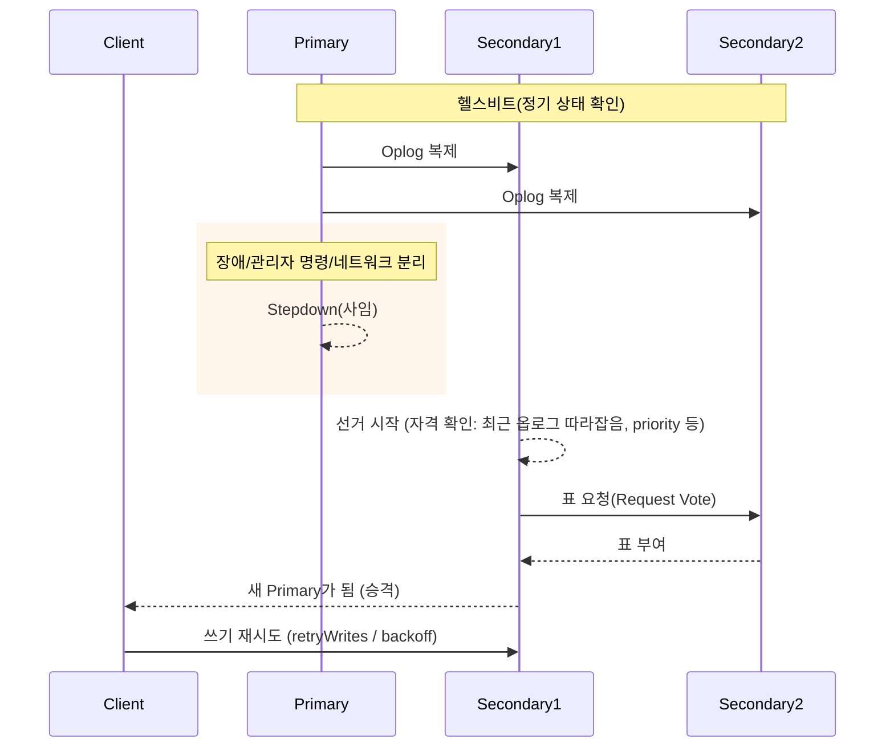

## 핵심 요약
- Primary는 **헬스비트/선거**로 유지되며, 장애/네트워크 분리/관리자 명령 등으로 **Stepdown(사임)**할 수 있음
- Stepdown 중에는 **짧은 쓰기 불가 구간**이 생길 수 있음
  - 드라이버의 `retryWrites`, **서버 선택 타임아웃** 튜닝 필수
- **읽기** : `readPreference=primary`는 새 Primary 선출까지 대기/에러   `secondary`는 계속 가능(정합성 요구에 주의)
- **거버넌스**: `priority`/`votes`로 **누가 Primary가 될지** 통제  Hidden/Delayed 노드는 **선거 제외** 설계에 활용
- **계획 Stepdown 플레이북**: 후보 동기화 확인 → 트래픽 우회/일시 중단 → `rs.stepDown()` → 새 Primary 확인 → 정상화
---

## 구성요소
1. **Primary / Secondary** : 쓰기 허용 노드 / 복제만 수행하는 노드
2. **Oplog** : Primary의 쓰기 연산 로그 / Secondary가 tailing해서 적용
3. **Election(선거)** : Primary 상실/적합 후보 변경 시 투표로 새 Primary 결정
4. **Priority** : Primary 선호도 / 높을수록 Primary가 되기 쉬움 (0이면 Primary 불가)
5. **Votes** : 투표권 수(보통 1) / 합의 필요
6. **Arbiter** : 데이터는 저장하지 않고 **투표만**하는 노드 (요즘은 권장 ❌)
---
## 선거와 Stepdown 동작 개요
- Stepdown 발생 트리거
  - Primary 장애, 네트워크 분리, 디스크 I/O 이슈, 선거 타임아웃
  - 수동 실행 : `rs.stepDown()`, `replSetStepDown` (관리자 점검/배포용)

---
## 애플리케이션 영향

TIP: 드라이버 `serverSelectionTimeoutMS`를 너무 짧게 잡으면 선거 동안 잦은 실패가 발생 ➡️ 워크로드 특성에 맞게 여유주기!

| 항목                              | 영향                                                | 권장 대응                                                   |
| ------------------------------- | ------------------------------------------------- | ------------------------------------------------------- |
| **쓰기 (insert/update/delete)**   | Stepdown 순간 **`NotWritablePrimary`** 류 에러 → 일시 실패 | **`retryWrites=true`**, 백오프 재시도, 서버선택 타임아웃 조정           |
| **읽기 (readPreference=primary)** | 새 Primary 선출까지 **대기/실패**                          | 타임아웃/재시도 전략. 가능하면 일시 `secondaryPreferred` 고려(정합성 요건 확인) |
| **트랜잭션**                        | 진행 중 트랜잭션 **중단** 가능                               | **재시도 가능한 Tx 에러** 처리 루틴(전체 Tx 재시도)                      |
| **Change Streams**              | 스트림 **재연결/Resume** 필요                             | Resume Token 사용, 재구독 루틴 표준화                             |

---
## 선거 제어
1. Priority : 어떤 노드가 Primary가 되길 원하는지 명시
  - ex : 고사양 노드/가용영역 A에 Priority 높게, 백업/지연 노드 O
2. hidden / delayed : 보고/배치용으로 숨김/지연 적용 (선거불참)
  - delayed 노드는 롤백 방지/포렌식 용도로 과거 상태 유지에 도움
3. Votes : 7개 이하 홀수 투표 노드 설계 (동수 방지)
4. election timeout/heartbeat : 선거 민감도/안정성 균형 (기본값 유지 권장)
5. chaining : secondary가 다른 secondary에서 복제 허용 여부 (네트워크 토폴로지에 맞춰 결졍)
---
## Planned Stepdown Playbook
1. 사전 점검
   - `rs.status()`로 복제 지연(oplog optime) 가장 작은 Secondary 후보를 선정
   - 후보 노드 Priority/votes 확인 (Primary 가능 여부)
2. 후보 동기화 확인
   - `rs.printSecondaryReplicationInfo()`로 후보가 최신에 근접하는지 확인
   - 필요 시 일시적으로 쓰기 트래픽 감소 (큐 길이 축소)
3. 셀프-드레인(선택)
   - API 서버/워커에서 쓰기 QPS 줄이기, 배치 일시 중지
4. 실행
   - Primary에서 `rs.stepDown(60)` (예: 60초)
   - 강제가 필요하면 `db.adminCommand({ replSetStepDown: 60, force: true })`
5. 검증
   - `rs.status()`로 새 Primary 확정
   - 애플리케이션 에러 로그에서 재시도 성공 확인
6. 정상화
   - 쓰기/배치 재개, 대시보드 Lag/오류율/선거 횟수 확인

> 주의: 후보가 충분히 따라잡지 못한 상태에서 Stepdown을 하면 선거 지연 + 쓰기 중단 시간이 길어질 수 있음
---
## Stepdown 장애 시 대응

| 단계 | 액션                                                |
| -- | ------------------------------------------------- |
| 탐지 | 모니터링 알람: Primary down, 선거 발생, 쓰기 실패율 급증           |
| 확인 | `rs.status()` / 로그로 원인 분류(노드 다운? 네트워크? 디스크?)      |
| 완화 | 애플리케이션 측 재시도/백오프, 일시 쓰기 셰이핑(큐 압력 완화)              |
| 복구 | 장애 노드 복구 또는 교체, 필요 시 `rs.stepUp()`로 의도 Primary 승격 |
| 사후 | 원인 RCA, `priority`/토폴로지 조정, 테스트 패턴 업데이트           |

---
## 롤백과 정합성
- Primary가 쓰기를 수용한 직후 Stepdown & 새 Primary 미반영이면 과거 Primary의 일부 쓰기가 롤백될 수 있음
- 대응 : 
  - `writeConcern: "majority", j:true` 기본으로 내구성 강화
  - 애플리케이션은 멱등/업서트로 중복,롤백에 안전하도록 설계
  - 중요 인덱스 생성은 `commitQuorum` 고려 (Replica 다수에 커밋)
---
## 드라이버 및 클라이언트 권장 값
- `retryWrites=true` : Stepdown/일시 네트워크 이슈 시 자동 재시도
- `serverSelectionTimeoutMS` : 선거 길이에 맞춰 여유 (너무 짧지 않게)
- 세션/트랜잭션 : Transient Tx Error 전용 재시도 루틴
- 읽기 선호도 : 강한 정합성이 필요하면 `primary` 고정, 그렇지 않으면 `primaryPreferred/secondaryPreferred` 혼합 전략
---
## 운영 및 모니터링
- 복제 지연(초) : 최대/평균 Lag 상시 모니터
- 선거 횟수/빈도 : 급증 시 네트워크/디스크/리소스 이슈 의심
- 상태 변화 : `stateStr` (Primary/Secondary/Recovering) 변동 추적
- 쓰기 실패율 : `NotWritablePrimary` 류 에러 비율
- Oplog 여유 길이 : Oplog 소진 시 재동기화 비용 ⬆️
  - 알람 예 : 
    - Secondary Lag > 임계치 (예: 수십 초 이상 지속)
    - 10분 내 선거 2회 이상
    - Primary 변경 후 쓰기 실패율 > 1% (5분)
---
## 자주쓰이는 명령어
- 버전 별 세부 시그니처/필드명이 조금씩 다를 수 있음 (상위 개념은 동일)
```bash
# 현재 상태
rs.status()

# 복제 지연/용량 정보
rs.printReplicationInfo()
rs.printSecondaryReplicationInfo()

# 계획 Stepdown (N초 동안 재승격 방지)
rs.stepDown(60)

# 강제 Stepdown
db.adminCommand({ replSetStepDown: 60, force: true })

# 의도적 승격 (적합 후보에서 실행)
rs.stepUp()

# 노드 일시 Freeze(선거 참가 방지, N초)
db.adminCommand({ replSetFreeze: 300 })
```
---
## 트러블슈팅

| 증상            | 가능 원인                        | 진단                                | 조치                                                |
| ------------- | ---------------------------- | --------------------------------- | ------------------------------------------------- |
| 선거 오래 걸림      | 후보 동기화 부족, 네트워크 지연           | `rs.status()` optime 비교           | 트래픽 줄여 동기화, 네트워크 점검, 우선순위 조정                      |
| 잦은 Primary 교체 | 리소스 부족, 디스크 I/O, 헬스비트 손실     | 시스템/네트워크/브로커 로그                   | 인스턴스 스펙 상향, 스토리지 교체, 타임아웃 재검토                     |
| 롤백 발생         | majority 미충족 쓰기, 즉시 Stepdown | 롤백 로그/`rs.printReplicationInfo()` | writeConcern 조정, 배치 멱등, 운영 절차 개선                  |
| 쓰기 실패 급증      | Stepdown 중 재시도 미흡            | 애플리케이션 로그/메트릭                     | `retryWrites`, 백오프, `serverSelectionTimeoutMS` 상향 |
| 읽기 지연/타임아웃    | `primary` 고정 & 선거 대기         | 드라이버 메트릭                          | readPreference 전략 점검(요건 맞게 완화)                    |
