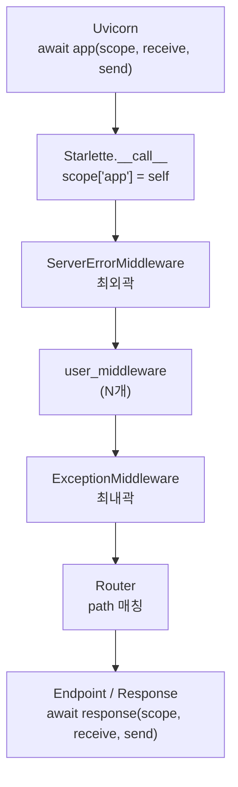

> 기준: Starlette 0.27.0

## 핵심 개념
- ASGI 앱의 본질 = `async (scope, receive, send) -> None` 계약 하나
- `Starlette()`·`FastAPI()` 인스턴스가 곧 **ASGI callable** → 서버가 `await app(...)` 호출
- 모든 `request` 객체는 사실 **scope 딕셔너리의 래퍼(Wrapper)**
- ASGI = 서버(Uvicorn)와 앱(Starlette)이 대화하는 **언어 그 자체**

<Cards cols={3}>
<Card icon="📥" title="scope">연결당 1개 메타데이터 dict</Card>
<Card icon="📨" title="receive">본문 읽는 async 함수</Card>
<Card icon="📤" title="send">응답 쓰는 async 함수</Card>
</Cards>

---

## FastAPI 연결
- `FastAPI`는 `Starlette`를 상속 → 본문의 모든 동작이 그대로 적용
- `app = FastAPI()` 의 `app`이 ASGI callable → `uvicorn main:app`이 이걸 `await`
- `request.state.user = ...` → 내부적으로 `scope['state']['user']` 저장
- `@app.on_event` / `lifespan` → 아래 lifespan 프로토콜로 위임

---

## scope · receive · send
- ASGI 앱이 다루는 3가지 인자 → `types.py`의 타입 정의가 본질

```python
# starlette/types.py
Scope = typing.MutableMapping[str, typing.Any]
Message = typing.MutableMapping[str, typing.Any]

Receive = typing.Callable[[], typing.Awaitable[Message]]
Send = typing.Callable[[Message], typing.Awaitable[None]]

ASGIApp = typing.Callable[[Scope, Receive, Send], typing.Awaitable[None]]
```

- `ASGIApp` 타입 한 줄 = "ASGI 앱이란 무엇인가"의 정답

| 인자 | 타입 | 역할 | 핵심 |
| --- | --- | --- | --- |
| `scope` | `MutableMapping` | 요청 메타데이터 dict | 연결당 1개·`type`/`method`/`path`/`headers`/`state` |
| `receive` | `() -> Awaitable[Message]` | 클라이언트 → 앱 입력 | 큐에서 메시지 1개씩 소비·재호출 시 사라짐 |
| `send` | `(Message) -> Awaitable[None]` | 앱 → 클라이언트 출력 | `response.start` → `response.body` 순서 준수 |

<Note type="warning" title="headers는 bytes">
`scope['headers']` → `[(b'host', b'localhost:8000'), ...]` 형태 · 소문자 bytes 키 튜플 리스트 · 그대로 쓰기 불편 → `Request`가 문자열로 파싱 제공
</Note>

<details>
<summary>➕ Request는 scope의 Wrapper</summary>

- 날것 `scope`는 dict일 뿐 → bytes 헤더·리스트 구조라 파싱 번거로움
- Starlette은 `Request` 클래스로 감싸 편의 메서드 제공

```python
request = Request(scope, receive)
request.headers['host']   # "localhost:8000" (자동 문자열 변환)
await request.body()      # receive() 스트림 소비
```

- 즉 `Request` = "scope를 감싸 사용하기 편하게 만든 도구"
</details>

---

## 소스 발췌 + 분석

### `__call__` — ASGI 진입점
- 서버가 매 요청마다 호출하는 단 하나의 메서드

```python
# starlette/applications.py
async def __call__(self, scope: Scope, receive: Receive, send: Send) -> None:
    scope["app"] = self
    if self.middleware_stack is None:
        self.middleware_stack = self.build_middleware_stack()
    await self.middleware_stack(scope, receive, send)
```

- `scope["app"] = self` → 이후 어디서든 `request.app` 접근 가능
- 미들웨어 스택은 **최초 요청 시 1회만** 빌드 → 이후 캐싱된 `middleware_stack` 재사용
- 마지막 줄 → 스택의 가장 바깥 미들웨어 호출 → 동일한 `(scope, receive, send)` 계약 전파

### `build_middleware_stack` — 양파 조립
```python
# starlette/applications.py
middleware = (
    [Middleware(ServerErrorMiddleware, handler=error_handler, debug=debug)]
    + self.user_middleware
    + [Middleware(ExceptionMiddleware, handlers=exception_handlers, debug=debug)]
)

app = self.router
for cls, options in reversed(middleware):
    app = cls(app=app, **options)
return app
```

- 시작점은 `app = self.router` → 가장 안쪽이 router
- `reversed(...)` 순회로 안 → 밖 감싸기 → 최종 반환값은 최외곽 `ServerErrorMiddleware`
- 항상 자동 포함 2개 → 최외곽 `ServerErrorMiddleware`(미처리 에러)·최내곽 `ExceptionMiddleware`(핸들된 예외)
- 각 미들웨어도 `app=app`을 받는 ASGI callable → **모두 같은 계약**

### `add_middleware` — 스택 시작 후 추가 불가
```python
# starlette/applications.py
def add_middleware(self, middleware_class: type, **options: typing.Any) -> None:
    if self.middleware_stack is not None:  # pragma: no cover
        raise RuntimeError("Cannot add middleware after an application has started")
    self.user_middleware.insert(0, Middleware(middleware_class, **options))
```

- `insert(0, ...)` → 나중에 추가한 미들웨어가 더 바깥에 위치
- 첫 요청 후엔 스택 캐싱됨 → 런타임 추가 시 `RuntimeError`

---

## lifespan — 앱 생명주기
- HTTP 요청과 별개 → 서버 부팅/종료 시 1회 처리 (DB 연결·풀 정리 등)
- `scope['type'] == 'lifespan'` → router가 startup/shutdown 메시지 처리

```python
from contextlib import asynccontextmanager

@asynccontextmanager
async def lifespan(app):
    # startup
    app.state.db = await connect_db()
    yield                      # 이 지점에서 요청 처리
    # shutdown
    await app.state.db.close()

app = FastAPI(lifespan=lifespan)
```

<Note type="note" title="lifespan vs on_startup">
`__init__`의 assert → `lifespan`과 `on_startup`/`on_shutdown` **동시 사용 금지** · 신규 코드는 `lifespan` 단일 권장
</Note>

---

## HTTPEndpoint — 클래스형 뷰
- 함수형 핸들러 대신 메서드(`get`/`post`/...)로 라우팅하는 클래스 기반 뷰
- 인스턴스가 `__await__` 구현 → 그 자체로 awaitable ASGI 객체

```python
# starlette/endpoints.py
class HTTPEndpoint:
    def __init__(self, scope: Scope, receive: Receive, send: Send) -> None:
        assert scope["type"] == "http"
        ...

    async def dispatch(self) -> None:
        request = Request(self.scope, receive=self.receive)
        handler_name = (
            "get"
            if request.method == "HEAD" and not hasattr(self, "head")
            else request.method.lower()
        )
        handler = getattr(self, handler_name, self.method_not_allowed)
        is_async = is_async_callable(handler)
        if is_async:
            response = await handler(request)
        else:
            response = await run_in_threadpool(handler, request)
        await response(self.scope, self.receive, self.send)
```

- `dispatch` → method 소문자로 핸들러 lookup → 없으면 405
- 동기 핸들러면 `run_in_threadpool`로 우회 → 이벤트 루프 블로킹 방지
- 마지막 `await response(...)` → Response도 ASGI callable이라 동일 계약

---

## 시각화

### 요청 진입 흐름
<Stepper>
<StepperItem title="1️⃣ 서버가 app 호출">
- Uvicorn이 요청 파싱 → `scope` 생성 → `await app(scope, receive, send)`
</StepperItem>
<StepperItem title="2️⃣ __call__ 진입">
- `scope["app"] = self` 주입 → `middleware_stack` 없으면 1회 빌드
</StepperItem>
<StepperItem title="3️⃣ 미들웨어 스택 통과">
- 최외곽 `ServerErrorMiddleware` → user 미들웨어 → 최내곽 `ExceptionMiddleware`
</StepperItem>
<StepperItem title="4️⃣ router 위임">
- 가장 안쪽 `router`가 path 매칭 → endpoint/Response 호출
</StepperItem>
<StepperItem title="5️⃣ 응답 전송">
- `send({'type':'http.response.start',...})` → `send({'type':'http.response.body',...})`
</StepperItem>
</Stepper>

### 앱 호출 흐름


---

## 함정
<Note type="danger" title="Body 재사용 불가">
`receive()`는 스트림 → `await request.body()` 두 번 호출 시 두 번째는 빈 본문/멈춤 · 로깅 위해 재사용하려면 읽은 값 캐싱 후 `receive` monkey-patch 필요
</Note>

- **send 순서 강제** → `http.response.start`(상태·헤더) 먼저, `http.response.body` 나중 · 어기면 프로토콜 에러
- **런타임 미들웨어 추가 불가** → 첫 요청 후 `add_middleware` 호출 시 `RuntimeError`
- **scope 변조 주의** → Reverse Proxy 뒤에서 `scope['client']`(IP)·scheme 부정확 가능 → `ProxyHeadersMiddleware`가 보정
- **BaseHTTPMiddleware 오버헤드** → 편하지만 성능 중요 시 순수 ASGI 미들웨어(`scope`/`receive`/`send` 직접) 권장

<Compare>
<CompareCol title="Raw ASGI" color="stone">
```python
async def app(scope, receive, send):
    await send({"type": "http.response.start",
                "status": 200,
                "headers": [(b"content-type", b"text/plain")]})
    await send({"type": "http.response.body",
                "body": b"Hello"})
```
- send를 직접 두 번 호출
</CompareCol>
<CompareCol title="Starlette" color="sky">
```python
from starlette.responses import PlainTextResponse

async def app(scope, receive, send):
    response = PlainTextResponse("Hello")
    await response(scope, receive, send)
```
- Response 객체가 ASGI callable → 내부에서 동일 send 수행
</CompareCol>
</Compare>
