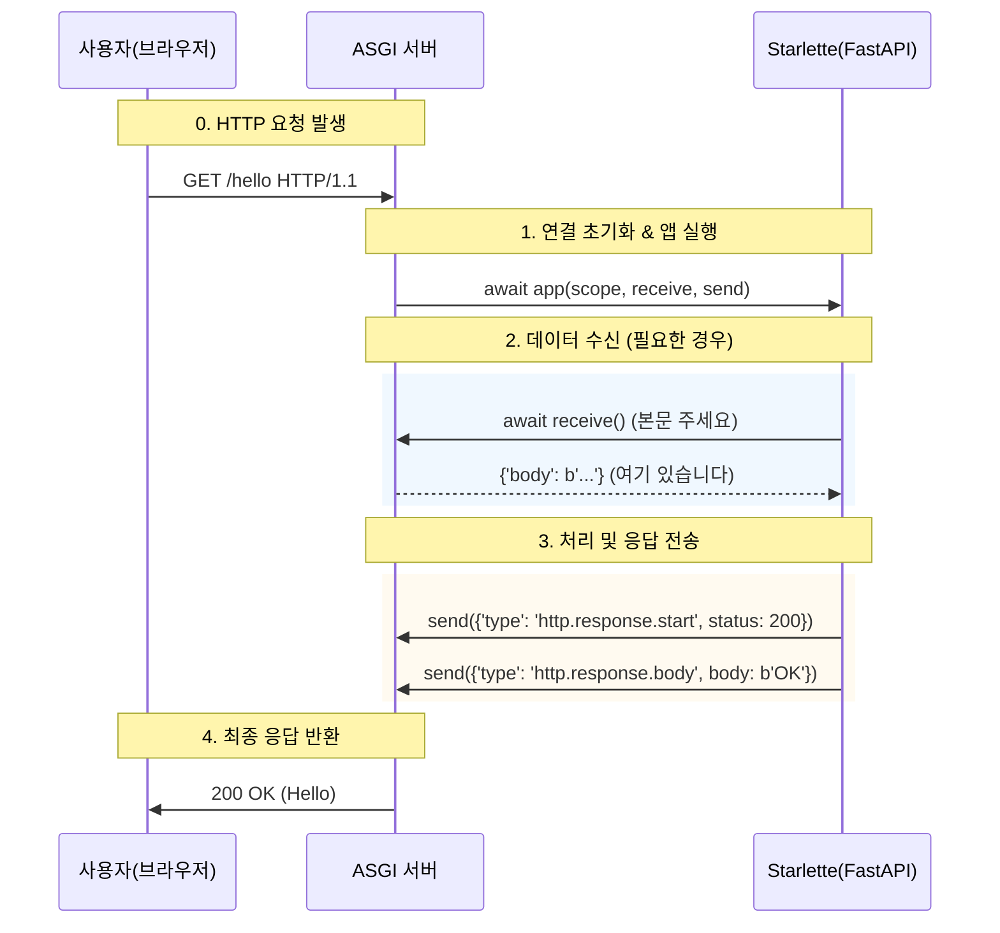

## 핵심개념
- FastAPI의 모든 `request` 는 사실 **scope 딕셔너리의 래퍼(Wrapper)**
- ASGI는 단순한 비동기 스펙이 아니라 서버(Uvicorn)와 앱(Starlette)이 대화하는 언어 그 자체
- Starlette을 이해하기 위해서는 3가지 인자를 먼저 이해해야함

| 개념 | 타입 | 설명 |
|------|------|------|
| **Scope** | `dict` | 요청의 **메타데이터** 저장소 (URL, Method, Headers, State 등), 연결이 끊길 때까지 유지됨 |
| **Receive** | `Awaitable[dict]` | 클라이언트로부터 데이터를 **읽어오는** 비동기 함수 (Body Stream) |
| **Send** | `Awaitable[dict]` | 클라이언트에게 데이터를 **보내는** 비동기 함수 (Response Start/Body) |
| **Lifespan** | `protocol` | 앱의 시작(Startup)과 종료(Shutdown) 시점을 제어하는 문맥(Context) |
---
## 상세 분석
<Stepper>
<StepperItem title="1️⃣ ASGI App의 본질 (The Signature)">
- `Starlette()`이나 `FastAPI()` 클래스 인스턴스는  결국 아래와 같은 시그니처를 가진 **비동기 함수(Callable)** 처럼 동작

```python
async def app(scope, receive, send):
    ...
```
- 서버(Uvicorn)는 요청이 들어올 때마다 이 함수를 `await` 
  - 즉, **미들웨어** 란 이 `app` 함수를 감싸서 `scope`를 조작하거나 `send`를 가로채는 또다른 함수
<details>
  <summary>➕ Wrapper 란?</summary>
  - 말 그대로 **보기 싫은 것을 예쁘게 포장해주는 껍데기**
  - 즉, **"Scope를 감싸서(Wrap) 사용하기 편하게 만든 도구"**가 Request 객체
  - **scope** : `scope`는 그냥 딕셔너리지만 데이터가 복잡하게 들어가 있음
  ```python
  # scope (날것)
  {
    'headers': [
      (b'host', b'localhost:8000'), 
      (b'user-agent', b'Mozilla/5.0...')
    ] 
  } # 헤더가 bytes 타입이고 리스트 형태라 찾기 힘듦 -> 파싱하려면 😵
  ```
  - **Request (wrapper)** : 그래서 starlette은 `request`라는 클래스(껍데기)를 씌움
    - 이 클래스는 내부적으로 `scope`를 가지고 있으면서 개발자가 편하게 쓸 수 있는 **함수(메서드)** 제공
  ```python
  # Request (포장된 것)
  request = Request(scope, receive) 

  # 이제 이렇게 편하게 씀 (이게 래핑의 목적!)
  request.headers['host']  # "localhost:8000" (자동으로 문자열로 바꿔줌)
  ```

</details>


</StepperItem>
<StepperItem title="2️⃣ Scope: 요청의 신분증">
- `scope` 는 연결(Connection) 하나당 생성되는 **Mutable Dictionary**  
- 가장 중요한 점은 **Header 값이 bytes** 로 들어옴
- Deep Dive: FastAPI의 `request.state.user = ...` 는 내부적으로 `scope['state']['user']` 에 저장

| **Key** | **Type** | **예시 데이터** | **설명** |
| --- | --- | --- | --- |
| `type` | `str` | `"http"` | 프로토콜 타입 (http, websocket, lifespan) |
| `method` | `str` | `"GET"` | HTTP 메서드 |
| `path` | `str` | `"/api/users"` | URL 경로 |
| `headers` | `list` | `[(b'host', b'localhost')]` | **바이트** 튜플 리스트 (소문자 키) |
| `state` | `dict` | `{}` | 앱 전역에서 데이터를 공유하는 공간 |
</StepperItem>
<StepperItem title="3️⃣ Receive & Send: 데이터 스트림"> 
- Request 객체 없이 날것의 데이터를 주고받는 방식
- **Receive (Input)** : 큐(Queue)에서 메시지를 하나씩 꺼내는 것
  - 한 번 읽으면(`await receive()`) 사라짐 (Stream 소비)
  - 이 때문에 FastAPI에서 `await request.body()` 를 두 번 호출하면 멈춤
- **Send (Output)** : 반드시 순서를 지켜서 이벤트를 보내야 함
  - `http.response.start` (상태 코드, 헤더)
  - `http.response.body` (실제 데이터)

</StepperItem>
<StepperItem title="4️⃣ Lifespan: 앱의 생명주기"> 
- 서버가 시작될 때 DB를 연결하고, 꺼질 때 닫는 작업은 `lifespan` 스코프에서 처리
- Starlette은 이를 `asynccontextmanager` 로 래핑해서 제공
```python
@asynccontextmanager
async def lifespan(app):
    print("🚀 Startup: DB Connection")
    yield
    print("💤 Shutdown: Clean up")
```
</StepperItem>
</Stepper>
---
## 동작 흐름
- 요청이 들어왔을 때 Uvicorn(Server)와 Starlette(App) 사이의 동작

---
## 코드 레벨 비교
-  실제 Starlette 내부는 매우 얇은 추상화
1. Raw ASGI
```python
async def raw_asgi_app(scope, receive, send):
    assert scope['type'] == 'http'
    
    # 1. 헤더 전송
    await send({
        'type': 'http.response.start',
        'status': 200,
        'headers': [[b'content-type', b'text/plain']],
    })
    # 2. 바디 전송
    await send({
        'type': 'http.response.body',
        'body': b'Hello, raw world!',
    })
```

2. Starlette (우리가 쓰는 방식)
```python
from starlette.responses import PlainTextResponse

async def starlette_app(scope, receive, send):
    # Response 객체 자체가 ASGI App이다!
    response = PlainTextResponse("Hello, Starlette!")
    # 내부적으로 위 Raw 코드와 똑같이 send()를 호출함
    await response(scope, receive, send)
```
---
## Tips
1. **미들웨어 작성 시 주의** 
  - `BaseHTTPMiddleware` 는 편리하지만 성능 오버헤드가 있음
  - 성능이 중요하다면 `scope`, `receive`, `send` 를 직접 다루는 Pure ASGI Middleware 패턴을 익혀야함
2. **Body 재사용 불가**
  - `receive()`는 스트림
  - 만약 로깅을 위해 Body를 읽어야한다면 읽은 내용을 메모리에 저장해두고 receive 함수를 덮어 씌워서(Monkey patch) 다시 내뱉게 만드는 복잡한 과정 필요
3. **Scope 변조**
  - Reverse Proxy 뒤에 있다면 `scope['schema']` 나 `scope['client']`(IP) 정보가 부정확 할 수 있음
  - 이때는 `ProxyHeaderMiddleware` 가 `scope` 를 수정해줌