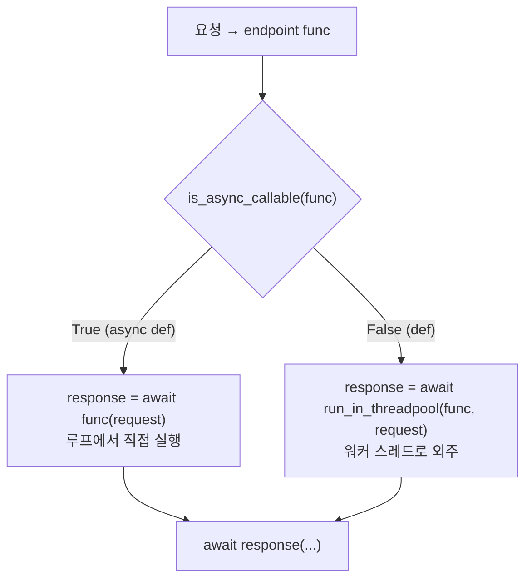

> 기준: Starlette 0.27.0

## 핵심개념
- 이벤트 루프 = **한 명의 셰프** · 단일 스레드에서 모든 요청을 번갈아 처리
  - `async def` + `await` = 셰프가 오븐 돌려놓고 다른 주문 처리 → 논블로킹
  - blocking 호출(DB 드라이버 · `time.sleep` · `requests`) = 셰프가 한 냄비 앞에 굳어버림 → 그동안 모든 요청 정지
- 그런데 **`def`(sync) 엔드포인트는 왜 루프를 안 막나** → Starlette가 sync 함수를 **워커 스레드**로 외주
  - 비유 → 동기 작업은 **주방 보조(threadpool worker)** 에게 넘기고 셰프는 계속 주문 받음
- 판별 기준 = `is_async_callable(func)` → async면 직접 `await` · sync면 `run_in_threadpool` 위임

| 엔드포인트 | 판정 | 실행 위치 |
|------------|------|-----------|
| `async def` | `is_async_callable → True` | 이벤트 루프(메인 스레드)에서 직접 `await` |
| `def` | `is_async_callable → False` | anyio threadpool 워커 스레드 |

---

## ① 정의 / 비유 — 외주의 원리
- 셰프(루프)는 한 명 → 한 작업이 막으면 전체가 막힘
- sync `def`는 `await` 지점이 없음 → 루프에서 직접 돌리면 끝날 때까지 점유
- 해결 → sync 함수를 워커 스레드로 보내고, 루프는 그 결과를 `await` → 결과 나올 때까지 다른 요청 처리



---

## ② FastAPI 연결 — `def` vs `async def` 라우트
- FastAPI `@app.get` 으로 등록한 함수 → Starlette `request_response`가 ASGI App으로 래핑
- 래핑 **시점에 단 한 번** `is_async_callable`로 판별 → 요청마다 재판정 안 함

```python
def request_response(func: typing.Callable) -> ASGIApp:
    """
    Takes a function or coroutine `func(request) -> response`,
    and returns an ASGI application.
    """
    is_coroutine = is_async_callable(func)        # 래핑 시점 1회 판별

    async def app(scope: Scope, receive: Receive, send: Send) -> None:
        request = Request(scope, receive=receive, send=send)
        if is_coroutine:
            response = await func(request)                    # async def → 직접 await
        else:
            response = await run_in_threadpool(func, request) # def → 워커 스레드 위임
        await response(scope, receive, send)

    return app
```

- 분석 → 분기가 `app` **밖**(`is_coroutine`)에 있음 → 클로저로 캡처 · 요청 핫패스에서 재계산 없음
- 어느 쪽이든 바깥은 `await` → 호출부(`Router.handle`)는 sync/async 차이를 신경 안 씀

---

## ③ 소스 발췌 + 분석

### `is_async_callable` — async 판별
```python
def is_async_callable(obj: typing.Any) -> bool:
    while isinstance(obj, functools.partial):     # partial이면 원본 func까지 벗김
        obj = obj.func

    return asyncio.iscoroutinefunction(obj) or (
        callable(obj) and asyncio.iscoroutinefunction(obj.__call__)
    )
```
- `functools.partial` 래핑 → `while`로 풀어 실제 함수 확인
- 두 번째 조건 → `__call__`이 `async def`인 **클래스 인스턴스**(호출 가능 객체)도 async로 인정
- 즉 `async def` 또는 async `__call__` → True · 평범한 `def` → False

### `run_in_threadpool` — anyio 워커로 위임
```python
async def run_in_threadpool(
    func: typing.Callable[P, T], *args: P.args, **kwargs: P.kwargs
) -> T:
    if kwargs:  # pragma: no cover
        # run_sync doesn't accept 'kwargs', so bind them in here
        func = functools.partial(func, **kwargs)      # kwargs는 partial로 미리 바인딩
    return await anyio.to_thread.run_sync(func, *args)
```
- 본질 = `anyio.to_thread.run_sync` 한 줄 래핑 → sync 함수를 워커 스레드에서 실행 후 결과를 `await`
- `to_thread.run_sync`는 `*args`만 받음 → `kwargs`는 `partial`로 묶어 위치인자화

### `iterate_in_threadpool` — 동기 제너레이터를 비동기로
```python
class _StopIteration(Exception):
    pass

def _next(iterator: typing.Iterator[T]) -> T:
    # We can't raise `StopIteration` from within the threadpool iterator
    # and catch it outside that context, so we coerce them into a different
    # exception type.
    try:
        return next(iterator)
    except StopIteration:
        raise _StopIteration

async def iterate_in_threadpool(
    iterator: typing.Iterator[T],
) -> typing.AsyncIterator[T]:
    while True:
        try:
            yield await anyio.to_thread.run_sync(_next, iterator)   # next() 한 번도 스레드로
        except _StopIteration:
            break
```
- 동기 `Iterator`의 `next()` 호출 자체가 blocking일 수 있음 → 매 스텝을 워커 스레드로 위임
- `StopIteration`을 스레드 경계 밖으로 그대로 못 던짐 → `_StopIteration`으로 **치환**해서 전파 후 루프 종료
- 용도 → 동기 파일 read · DB cursor 등을 `StreamingResponse`로 흘릴 때

<details>
<summary>➕ `run_until_first_complete` (deprecated)</summary>

- `anyio.create_task_group`으로 여러 코루틴을 띄우고 **하나라도 끝나면** `cancel_scope.cancel()`로 나머지 취소
- 0.27.0에서 `DeprecationWarning` → 향후 제거 예정 · 신규 코드에서 사용 금지
</details>

---

## ④ 시각화 — async def vs def 처리

<Compare>
<CompareCol color="sky">

**`async def` 엔드포인트**
- `is_async_callable → True`
- 이벤트 루프(메인 스레드)에서 직접 `await func()`
- 스레드 전환 비용 0
- 내부에서 반드시 비동기 라이브러리 사용 (async DB · httpx)
- blocking 호출 섞으면 → **루프 전체 정지**

</CompareCol>
<CompareCol color="amber">

**`def` 엔드포인트**
- `is_async_callable → False`
- `run_in_threadpool` → 워커 스레드로 외주
- 스레드 전환 + 풀 한도 제약
- sync 라이브러리(requests · 동기 ORM) 그냥 써도 루프 안 막음
- 워커 풀 소진 시 → **대기 큐 적체**

</CompareCol>
</Compare>

```python
# 같은 일을 두 방식으로
@app.get("/sync")
def sync_view():          # 워커 스레드행 → sync 코드 OK
    rows = legacy_orm.query(...)   # blocking 이어도 루프 무사
    return rows

@app.get("/async")
async def async_view():   # 루프 직행 → 반드시 async I/O
    rows = await async_db.fetch(...)
    return rows
```

---

## ⑤ 함정

<Note type="danger">
**async 함수 안의 blocking 호출 = 루프 정지**

- `async def` 안에서 `time.sleep(3)` · `requests.get(...)` · 동기 ORM 호출 → 그 3초간 **모든 요청 멈춤**
- sync 라이브러리를 꼭 써야 하면 → `await run_in_threadpool(blocking_fn, ...)` 로 감싸 외주
- 확신 없으면 차라리 `def`로 선언 → Starlette가 알아서 threadpool로 보냄
</Note>

<Note type="warning">
**threadpool 워커 한도**

- anyio 기본 워커 토큰 = **40개** (`to_thread`의 default limiter)
- sync `def` 엔드포인트가 느리면 → 40개 다 점유 시 이후 요청은 워커 빌 때까지 **대기**
- 즉 sync 엔드포인트의 동시성 상한 = 워커 수 · async는 루프가 받는 만큼 동시 처리
</Note>

<Note type="note">
**CPU 바운드는 threadpool로도 안 풀림**

- threadpool은 **I/O 바운드** blocking 회피용 → GIL 때문에 CPU 연산은 워커로 보내도 병렬화 안 됨
- 무거운 CPU 작업(이미지 처리 · 암호화 루프) → `ProcessPoolExecutor` · 별도 워커 서비스(Celery 등)로 분리
</Note>
