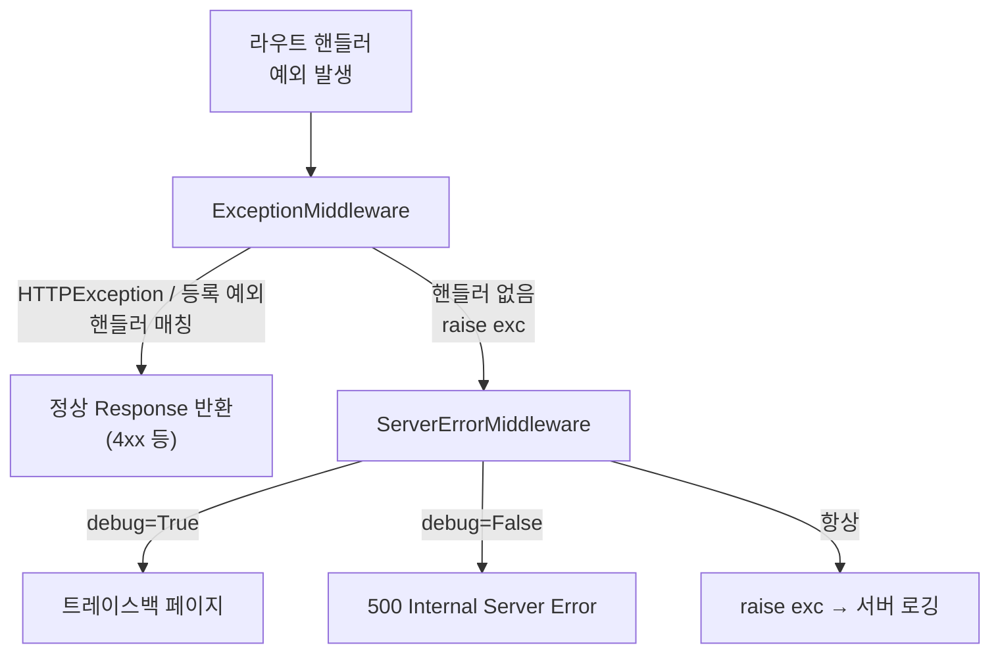

> 기준: Starlette 0.27.0

## 핵심개념
- 예외 처리는 **두 개의 미들웨어가 스택 양 끝단**에서 나눠 담당
- `ExceptionMiddleware` (스택 **최내곽**) → 의도된 예외(`HTTPException` 등)를 정상 응답으로 변환
- `ServerErrorMiddleware` (스택 **최외곽**) → 미처리 예외를 잡아 **500** 반환 + debug 트레이스백
- 비유 → `ExceptionMiddleware`는 **고객 응대 데스크**(예상된 민원 처리), `ServerErrorMiddleware`는 **건물 비상벨**(아무도 못 막은 사고의 최후 방어)

| 개념 | 위치 | 역할 |
|------|------|------|
| **HTTPException** | `starlette.exceptions` | 상태코드 + detail 담은 의도된 예외 |
| **ExceptionMiddleware** | 스택 최내곽 (router 직전) | `HTTPException`/등록 예외 → `Response` 변환 |
| **ServerErrorMiddleware** | 스택 최외곽 (가장 바깥) | 미처리 예외 → 500, debug 시 트레이스백 |

---
## FastAPI 연결
- `@app.exception_handler(...)` 로 등록한 핸들러가 위 미들웨어로 흘러들어감
```python
from fastapi import FastAPI, Request
from fastapi.responses import JSONResponse

app = FastAPI()

# 상태코드 키 등록 → ExceptionMiddleware._status_handlers
@app.exception_handler(404)
async def not_found(request: Request, exc):
    return JSONResponse({"msg": "없는 경로"}, status_code=404)

# 예외 타입 키 등록 → ExceptionMiddleware._exception_handlers
@app.exception_handler(ValueError)
async def value_err(request: Request, exc):
    return JSONResponse({"msg": str(exc)}, status_code=400)
```
- 등록 키가 `int`면 상태코드 핸들러, `Exception` 서브클래스면 타입 핸들러로 분기

---
## 소스 발췌 & 분석

### HTTPException 구조
```python
# starlette/exceptions.py
class HTTPException(Exception):
    def __init__(self, status_code, detail=None, headers=None):
        if detail is None:
            detail = http.HTTPStatus(status_code).phrase  # detail 없으면 표준 문구 자동
        self.status_code = status_code
        self.detail = detail
        self.headers = headers
```
- `detail` 생략 시 `status_code`에 맞는 표준 문구(`"Not Found"` 등) 자동 채움
- `headers` → 응답 헤더로 그대로 전달 (`WWW-Authenticate` 등에 활용)
- `WebSocketException`은 별도 → `code` + `reason` 보유

### 핸들러 해석 (lookup)
```python
# starlette/middleware/exceptions.py
except Exception as exc:
    handler = None
    if isinstance(exc, HTTPException):
        handler = self._status_handlers.get(exc.status_code)  # ① 상태코드 우선
    if handler is None:
        handler = self._lookup_exception_handler(exc)          # ② 예외 타입
    if handler is None:
        raise exc                                              # ③ 위로 재전파
```
```python
def _lookup_exception_handler(self, exc):
    for cls in type(exc).__mro__:        # MRO 따라 상위 클래스까지 탐색
        if cls in self._exception_handlers:
            return self._exception_handlers[cls]
    return None
```
- `__mro__` 순회 → 정확한 타입이 없으면 **부모 클래스 핸들러로 fallback**
- 핸들러 못 찾으면 `raise exc` → 바깥의 `ServerErrorMiddleware`로 전파

| 우선순위 | 조건 | 조회 대상 |
|:---:|------|------|
| ① | `HTTPException` & `status_code` 매칭 | `_status_handlers` |
| ② | 예외 타입(MRO) 매칭 | `_exception_handlers` |
| ③ | 둘 다 실패 | `raise exc` → 외곽 위임 |

<Note type="warning">
응답이 이미 시작된 뒤(`response_started`) 예외 발생 → 핸들러 적용 불가, `RuntimeError` 발생 → 스트리밍 중 예외 주의
</Note>

### ServerErrorMiddleware (최후 방어선)
```python
# starlette/middleware/errors.py
except Exception as exc:
    request = Request(scope)
    if self.debug:
        response = self.debug_response(request, exc)   # HTML/텍스트 트레이스백
    elif self.handler is None:
        response = self.error_response(request, exc)    # "Internal Server Error" 500
    else:
        response = await self.handler(request, exc)     # 등록된 500 핸들러
    if not response_started:
        await response(scope, receive, send)
    raise exc   # 항상 재전파 → 서버 로깅·테스트가 잡을 수 있게
```
- 응답을 보낸 뒤에도 `raise exc` → Uvicorn 로그/테스트 클라이언트가 원본 예외 확인 가능
- `debug=True` → `Accept: text/html`이면 접을 수 있는 트레이스백 HTML 페이지 반환

---
## 미들웨어 스택 위치
- `applications.py`의 `build_middleware_stack` → 양 끝단 배치 확정
```python
# starlette/applications.py
for key, value in self.exception_handlers.items():
    if key in (500, Exception):
        error_handler = value          # 500/Exception → ServerError로
    else:
        exception_handlers[key] = value

middleware = (
    [Middleware(ServerErrorMiddleware, handler=error_handler, debug=debug)]  # 최외곽
    + self.user_middleware
    + [Middleware(ExceptionMiddleware, handlers=exception_handlers, debug=debug)]  # 최내곽
)
```
- **`500`/`Exception` 키 핸들러만** 떼어내 `ServerErrorMiddleware`로, 나머지는 `ExceptionMiddleware`로 분배

<Compare>
<CompareCol color="amber" title="ServerErrorMiddleware (최외곽)">
- 스택 **가장 바깥** → 모든 것을 감쌈
- 대상 → **미처리 예외 전부** (500)
- debug 시 트레이스백 페이지
- 항상 `raise exc` 재전파 (로깅용)
- `500`/`Exception` 핸들러 담당
</CompareCol>
<CompareCol color="sky" title="ExceptionMiddleware (최내곽)">
- 스택 **가장 안쪽** (router 직전)
- 대상 → **의도된 예외** (`HTTPException` 등)
- 상태코드/타입별 핸들러로 정상 응답 변환
- 핸들러 없으면 바깥으로 `raise`
- 사용자 등록 핸들러 대부분 담당
</CompareCol>
</Compare>

---
## 예외 전파 경로


---
## 함정
1. **`@app.exception_handler(Exception)`은 ExceptionMiddleware가 아닌 ServerErrorMiddleware로 감**
  - `Exception`/`500` 키는 빌드 단계에서 분리 → 일반 예외 핸들러처럼 동작 안 함
2. **MRO fallback 주의**
  - `@app.exception_handler(Exception)`을 일반 핸들러로 기대해도 `_exception_handlers`엔 안 들어감 → 광범위 catch는 의도대로 안 될 수 있음
3. **204/304는 본문 없는 응답**
  - `http_exception` → `204`/`304`는 `PlainTextResponse` 아닌 빈 `Response` 반환 (본문 금지 상태코드)
4. **스트리밍 중 예외**
  - 응답 시작 후 예외 → 핸들러 적용 불가, `RuntimeError("...response already started")`
5. **debug=True는 운영 금지**
  - 트레이스백에 `capture_locals=True` → 지역 변수(시크릿 포함 가능) 노출 위험

<Note type="danger">
운영 환경 → 반드시 `debug=False` 유지, 트레이스백 페이지로 내부 코드·변수 유출 차단
</Note>
