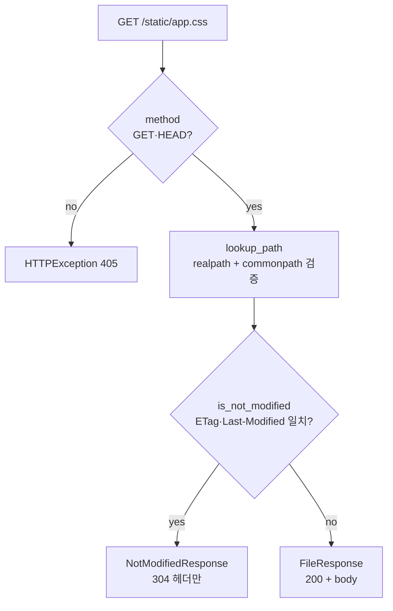

> 기준: Starlette 0.27.0

## 핵심개념
- Starlette 본체(Routing·Response) 외곽의 **실무 편의 3종** -> `StaticFiles` · `Jinja2Templates` · `Config`
- 비유 -> 건물 본체(앱) 주변의 **부대시설** -> 주차장(정적파일)·안내데스크(템플릿)·전기배선도(설정)
- 셋 다 독립 모듈 -> 필요한 것만 골라 mount/주입
- FastAPI 연결 -> 세 가지 모두 `from starlette.X import Y` 그대로 재사용 (FastAPI가 별도 래핑 안 함)

---

<Tabs defaultValue="static">
<TabsList>
<TabsTrigger value="static">StaticFiles</TabsTrigger>
<TabsTrigger value="tpl">Jinja2Templates</TabsTrigger>
<TabsTrigger value="config">Config</TabsTrigger>
</TabsList>

<TabsContent value="static">

### 정의
- `StaticFiles` -> 디렉터리를 통째로 서빙하는 **ASGI 앱** (`__call__(scope, receive, send)` 보유)
- `GET`·`HEAD`만 허용 -> 그 외 메서드는 `405`
- `ETag`·`Last-Modified` 기반 조건부 요청 -> 변경 없으면 `304 NotModified` (body 미전송)

### FastAPI 연결
```python
from fastapi import FastAPI
from starlette.staticfiles import StaticFiles

app = FastAPI()
app.mount("/static", StaticFiles(directory="assets"), name="static")
```
- `mount` -> 서브 ASGI 앱으로 위임 -> `/static/...` 경로는 라우터 거치지 않고 직접 처리

### 소스 발췌 — `is_not_modified` (304 판정)
```python
def is_not_modified(self, response_headers, request_headers) -> bool:
    try:
        if_none_match = request_headers["if-none-match"]
        etag = response_headers["etag"]
        if if_none_match == etag:
            return True
    except KeyError:
        pass
    try:
        if_modified_since = parsedate(request_headers["if-modified-since"])
        last_modified = parsedate(response_headers["last-modified"])
        if (if_modified_since is not None and last_modified is not None
                and if_modified_since >= last_modified):
            return True
    except KeyError:
        pass
    return False
```
- `If-None-Match` == 응답 `ETag` -> 동일하면 `304`
- `If-Modified-Since` >= `Last-Modified` -> 수정 안 됐으면 `304`
- 둘 중 하나라도 만족 -> `NotModifiedResponse` 반환 (헤더만, body 없음)

### 소스 발췌 — `lookup_path` (디렉터리 탈출 차단)
```python
full_path = os.path.realpath(joined_path)
directory = os.path.realpath(directory)
if os.path.commonpath([full_path, directory]) != directory:
    # Don't allow misbehaving clients to break out of the static files directory.
    continue
```
- `realpath` 로 심볼릭링크·`..` 해소 후 -> `commonpath` 가 기준 디렉터리와 일치하는지 검증
- 불일치 -> 해당 경로 skip -> `../../etc/passwd` 같은 **path traversal** 차단

</TabsContent>

<TabsContent value="tpl">

### 정의
- `Jinja2Templates` -> Jinja2 `Environment` 래퍼 -> `.html` 렌더 후 `text/html` 응답
- `TemplateResponse(name, context)` -> `context`에 **`request` 키 필수**
- `autoescape=True` 기본 -> XSS 방지용 HTML 이스케이프

### FastAPI 연결
```python
from starlette.templating import Jinja2Templates

templates = Jinja2Templates(directory="templates")

@app.get("/")
def index(request: Request):
    return templates.TemplateResponse("index.html", {"request": request, "name": "yoona"})
```

### 소스 발췌 — `TemplateResponse` (request 강제)
```python
def TemplateResponse(self, name, context, status_code=200, ...):
    if "request" not in context:
        raise ValueError('context must include a "request" key')
    request = typing.cast(Request, context["request"])
    for context_processor in self.context_processors:
        context.update(context_processor(request))
    template = self.get_template(name)
    return _TemplateResponse(template, context, ...)
```
- `request` 없으면 즉시 `ValueError` -> 템플릿 내 `url_for`가 `request` 의존하기 때문
- `context_processors` -> 매 렌더마다 공통 컨텍스트 주입 훅

### 소스 발췌 — `url_for` 전역 등록
```python
@pass_context
def url_for(context: dict, name: str, **path_params) -> URL:
    request = context["request"]
    return request.url_for(name, **path_params)

env.globals["url_for"] = url_for
```
- 템플릿에서 `url_for('static', path='x.css')` -> 라우트 이름 기반 역방향 URL 생성
- `@pass_context` -> Jinja 렌더 컨텍스트에서 `request` 추출

</TabsContent>

<TabsContent value="config">

### 정의
- `Config` -> 환경변수 + `.env` 파일 통합 로드 -> 타입 캐스팅·기본값 지원
- 우선순위 -> `environ`(OS 환경변수) > `file_values`(`.env`) > `default`
- `Secret` 으로 감싸면 `repr`·`str(log)` 노출 시 마스킹

### FastAPI 연결
```python
from starlette.config import Config
from starlette.datastructures import Secret, CommaSeparatedStrings

config = Config(".env")
DEBUG = config("DEBUG", cast=bool, default=False)
DB_PASSWORD = config("DB_PASSWORD", cast=Secret)
ALLOWED = config("ALLOWED_HOSTS", cast=CommaSeparatedStrings)
```

### 소스 발췌 — `get` (3단 우선순위)
```python
def get(self, key, cast=None, default=undefined):
    key = self.env_prefix + key
    if key in self.environ:
        return self._perform_cast(key, self.environ[key], cast)
    if key in self.file_values:
        return self._perform_cast(key, self.file_values[key], cast)
    if default is not undefined:
        return self._perform_cast(key, default, cast)
    raise KeyError(f"Config '{key}' is missing, and has no default.")
```
- `default`를 `undefined` 센티넬로 -> `None` 을 명시적 기본값으로 구분 가능
- 셋 다 없고 `default` 미지정 -> `KeyError` (조용한 누락 방지)

### 소스 발췌 — `_perform_cast` (bool 특수처리)
```python
elif cast is bool and isinstance(value, str):
    mapping = {"true": True, "1": True, "false": False, "0": False}
    value = value.lower()
    if value not in mapping:
        raise ValueError(f"Config '{key}' has value '{value}'. Not a valid bool.")
    return mapping[value]
```
- `bool("false")` == `True` 함정 회피 -> 문자열 `"false"`·`"0"` 을 `False` 로 정확 매핑
- 매핑 외 값 -> `ValueError` -> 오타(`"yes"`) 조기 발견

</TabsContent>
</Tabs>

---

## 동작 흐름 — StaticFiles 304
- 조건부 헤더 일치 -> body 없이 `304` -> 네트워크·렌더 비용 절감



---

## 환경변수 우선순위
| 출처 | 키워드 | 비고 |
|------|--------|------|
| OS 환경변수 | `environ` | 최우선 -> 배포 환경 주입값 |
| `.env` 파일 | `file_values` | `KEY=VALUE` 파싱, `#` 주석·따옴표 제거 |
| 코드 기본값 | `default` | 위 둘 없을 때만 사용 |

---

## 함정
<Note type="danger">
- `StaticFiles` 보안 -> `directory` 에 **민감 파일 두지 말 것** -> 디렉터리 내부는 전부 공개
- `follow_symlink=True` -> 링크 추적 허용 -> 외부 경로 노출 위험 -> 기본 `False` 유지 권장
- traversal 차단은 `lookup_path` 가 담당하나 -> 애초에 공개 전용 디렉터리 분리가 안전
</Note>

<Note type="warning">
- `Secret` 으로 감싸도 **값 자체는 평문** -> `repr` 마스킹(`Secret('**********')`)일 뿐 -> `str(secret)` 호출 시 원문 노출
- 로그·예외 메시지에 `Config` 값 직접 출력 금지 -> `cast=Secret` 으로 실수 방어
</Note>

<Note type="note">
- `Environ` 은 **읽은 키 재할당 차단** -> 한 번 `config("KEY")` 한 뒤 `environ["KEY"]=...` 하면 `EnvironError`
- 의도 -> 설정 읽기 시점 이후 변경 방지 -> 설정 일관성 보장
</Note>

<details>
<summary>➕ TemplateResponse가 request를 강제하는 이유</summary>
- `url_for` 가 `context["request"]` 에 의존 -> `request.url_for(name)` 로 라우트 역방향 URL 생성
- `request` 누락 시 렌더 도중 `KeyError` 대신 -> 진입점에서 `ValueError` 로 조기 차단
- `_TemplateResponse.__call__` -> `http.response.debug` 확장 있으면 template·context 디버그 전송
</details>

<details>
<summary>➕ undefined 센티넬을 쓰는 이유</summary>
- `default=None` 을 **유효한 기본값**으로 받기 위함 -> `None` 과 "기본값 없음"을 구분
- `if default is not undefined` -> `None` 이어도 통과 -> 명시적 `None` 기본값 허용
</details>
