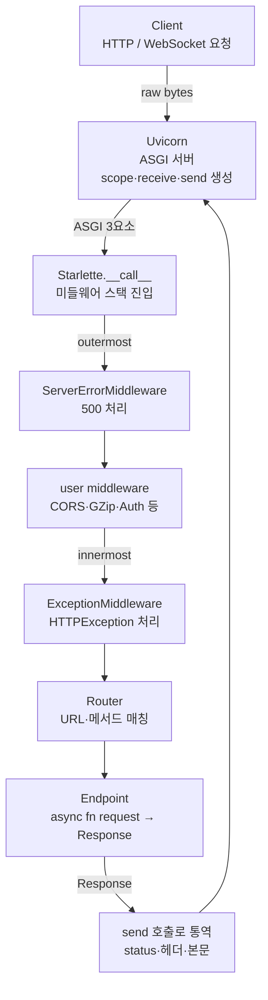

> 기준: Starlette 0.27.0

## 한 줄 정의

- **Starlette** → ASGI 표준 위에서 동작하는 경량 비동기 웹 툴킷
  - HTTP/WebSocket 요청을 받아 → 라우팅 → 핸들러 실행 → 응답 반환까지 담당
  - FastAPI가 상속·확장하는 **하위 레이어** (FastAPI는 Starlette 없이 못 돎)

### 비유 — Uvicorn ↔ 앱 사이 "통역·교통정리"

- **Uvicorn(ASGI 서버)** → 소켓에서 raw 바이트 받아 `scope/receive/send` 3요소로 변환
- **Starlette** → 그 3요소를 받아
  - URL 보고 어느 핸들러로 보낼지 정리(라우팅)
  - raw `receive`를 다루기 쉬운 `Request` 객체로 통역
  - 핸들러가 만든 `Response`를 다시 ASGI `send` 호출로 통역
- **내 앱 코드** → `request` 받아 `response`만 만들면 됨 (ASGI 프로토콜 직접 안 만짐)
- 즉 서버와 앱 사이에서 프로토콜 통역 + 흐름 교통정리를 하는 **ASGI 미들 레이어**

<Note type="note" title="ASGI란?">
- **ASGI** = Asynchronous Server Gateway Interface
- 동기 전용이던 WSGI의 비동기 후속 규약 → `async/await`·WebSocket·long-lived 연결 지원
- 서버↔앱 사이 약속: 앱은 `async def app(scope, receive, send)` 형태의 콜러블
  - `scope` → 연결 메타데이터(타입·경로·헤더 등) dict
  - `receive` → 이벤트(본문 chunk 등) 받는 async 함수
  - `send` → 응답 이벤트(status·헤더·본문) 보내는 async 함수
- Starlette의 `Starlette` 인스턴스가 바로 이 ASGI 콜러블 (`__call__`이 `scope/receive/send` 받음)
</Note>

## 무엇을 하는가 — 제공 기능

<Cards cols={3}>
  <Card icon="🧭" title="Routing">
    URL·HTTP 메서드 → 핸들러 매핑 · 경로 파라미터 변환 · Mount로 서브앱 합성
  </Card>
  <Card icon="📥" title="Request / Response">
    raw ASGI를 `Request`로 파싱 · `JSON/HTML/Plain/File/Streaming/Redirect` 응답 제공
  </Card>
  <Card icon="🧅" title="Middleware">
    요청/응답을 감싸는 ASGI 미들웨어 스택 · CORS·GZip·Session·TrustedHost 내장
  </Card>
  <Card icon="📡" title="WebSocket">
    `WebSocket` 객체·`WebSocketRoute`·`WebSocketEndpoint`로 실시간 양방향 통신
  </Card>
  <Card icon="🔄" title="Background Task">
    응답 반환 후 실행되는 후속 작업 (`BackgroundTask`)
  </Card>
  <Card icon="🔐" title="Authentication">
    `AuthenticationMiddleware`·`requires` 데코레이터로 인증/스코프 가드
  </Card>
  <Card icon="📁" title="Static / Templating">
    `StaticFiles`로 정적 파일 서빙 · `Jinja2Templates`로 HTML 렌더
  </Card>
  <Card icon="⚙️" title="Config">
    `Config`로 환경변수·`.env` 타입 캐스팅 로드
  </Card>
  <Card icon="🧪" title="TestClient">
    `httpx` 기반 동기 테스트 클라이언트 (실서버 없이 앱 직접 호출)
  </Card>
</Cards>

### 제공하지 않는 것 → FastAPI 몫

- ❌ 요청 본문 **데이터 검증/직렬화** → FastAPI가 Pydantic으로 추가
- ❌ **의존성 주입(DI)** → FastAPI `Depends`
- ❌ **자동 문서화** (OpenAPI/Swagger UI) → FastAPI가 타입 힌트 기반 자동 생성
- ❌ 타입 힌트 기반 **파라미터 파싱**(query/path/body 자동 매핑) → FastAPI
- ⚠️ `schemas.py`에 OpenAPI 골격이 있으나 → 수동 docstring 방식, FastAPI 자동화와 다름

## FastAPI와의 관계

- `class FastAPI(Starlette)` → FastAPI는 Starlette을 **상속**
  - 라우팅·미들웨어·WebSocket·백그라운드·ASGI 실행 → 전부 Starlette 코드 그대로 사용
  - 그 위에 검증·DI·문서화 레이어만 얹음

<Compare>
  <CompareCol title="Starlette" subtitle="하위 ASGI 레이어" color="stone">
    - ASGI 통역 + 라우팅 + 요청/응답 골격
    - 검증·DI·문서화 없음 → 직접 처리
    - 경량 마이크로서비스·WebSocket 서버에 적합
    - 핸들러: `async def fn(request) -> Response`
  </CompareCol>
  <CompareCol title="FastAPI" subtitle="Starlette 상속·확장" color="sky">
    - Starlette 기능 전부 + 검증·DI·자동 문서
    - Pydantic 모델로 요청/응답 검증
    - `Depends` 의존성 주입 · Swagger/ReDoc 자동
    - 핸들러: 타입 힌트로 파라미터 자동 주입
  </CompareCol>
</Compare>

| 영역 | Starlette | FastAPI가 더하는 것 |
|------|-----------|----------------------|
| 라우팅 | `Route`·`Router` | `APIRouter` + 타입 기반 파라미터 파싱 |
| 요청 파싱 | `Request`(raw 접근) | Pydantic 모델 자동 검증·역직렬화 |
| 응답 | `JSONResponse` 등 | `response_model` 직렬화·필터링 |
| 미들웨어 | `add_middleware` | 동일 (Starlette 것 그대로) |
| WebSocket | `WebSocket`·`WebSocketRoute` | 동일 + DI 지원 |
| 문서화 | 없음(수동 `schemas`) | OpenAPI·Swagger UI 자동 |

## 소스맵 — 파일별 역할

<Note type="note" title="읽는 법">
- 아래는 `site-packages/starlette/` 디렉토리 기준 · 공부 시 까볼 핵심 파일들
</Note>

| 파일 | 역할 |
|------|------|
| `applications.py` | `Starlette` 클래스 — ASGI 진입점 · 미들웨어 스택 빌드 · `__call__(scope, receive, send)` |
| `routing.py` | `Route`·`WebSocketRoute`·`Mount`·`Router` — URL→핸들러 매칭 · 경로 파라미터 |
| `convertors.py` | 경로 파라미터 타입 변환기 (`int`·`str`·`uuid`·`path` 등) |
| `requests.py` | `Request`·`HTTPConnection` — raw ASGI를 헤더·쿼리·본문·폼으로 파싱 |
| `responses.py` | `Response`·`JSONResponse`·`HTMLResponse`·`FileResponse`·`StreamingResponse`·`RedirectResponse` |
| `datastructures.py` | `URL`·`Headers`·`QueryParams`·`FormData`·`State`·`UploadFile` 등 불변 자료구조 |
| `middleware/` | `Middleware` 래퍼 + 내장: `cors`·`gzip`·`sessions`·`trustedhost`·`httpsredirect`·`base`(BaseHTTPMiddleware)·`errors`·`exceptions` |
| `exceptions.py` | `HTTPException`·`WebSocketException` 정의 |
| `websockets.py` | `WebSocket` 객체 · 연결 상태 · `accept`/`receive`/`send`/`close` |
| `endpoints.py` | 클래스 기반 핸들러 `HTTPEndpoint`·`WebSocketEndpoint` |
| `authentication.py` | `requires` 데코레이터 · `AuthCredentials` · 스코프 검사 |
| `background.py` | `BackgroundTask`·`BackgroundTasks` — 응답 후 실행 |
| `concurrency.py` | `run_in_threadpool` — 동기 함수를 스레드풀로 오프로드 |
| `testclient.py` | `TestClient` — `httpx` 기반 동기 테스트 클라이언트 |
| `staticfiles.py` | `StaticFiles` — 정적 파일 ASGI 앱 · ETag·Not-Modified 처리 |
| `templating.py` | `Jinja2Templates` — Jinja2 HTML 렌더 |
| `config.py` | `Config`·`Environ` — 환경변수/`.env` 타입 캐스팅 로드 |

- `schemas.py` → OpenAPI 스키마 수동 생성기(`SchemaGenerator`) · FastAPI 자동화와 별개
- `status.py` → `HTTP_200_OK` 등 HTTP 상태코드 상수 모음

## 요청이 통과하는 레이어

- 핵심: 미들웨어가 **양파(onion) 구조** → 바깥에서 안으로 진입, 응답은 역순으로 빠져나감
- `ServerErrorMiddleware`(최외곽)·`ExceptionMiddleware`(최내곽)은 Starlette이 **자동 삽입** (`build_middleware_stack`)

## 이 섹션 공부 순서

- 소스를 까볼 순서 → 의존성이 흐르는 방향대로
  1. **ASGI & Application** (`applications.py`) — 진입점·`__call__`·미들웨어 스택 빌드
  2. **Routing** (`routing.py`·`convertors.py`) — URL→핸들러 매칭
  3. **Request / Response** (`requests.py`·`responses.py`·`datastructures.py`) — 데이터 통역
  4. **Middleware** (`middleware/`) — 양파 구조·내장 미들웨어
  5. **Exceptions** (`exceptions.py`) — 에러→응답 변환
  6. **WebSocket / Endpoints** (`websockets.py`·`endpoints.py`) — 실시간·클래스 핸들러
  7. **Background / Concurrency** (`background.py`·`concurrency.py`) — 후속 작업·스레드풀
  8. **Auth / Static / Templating / Config** — 부가 기능
  9. **TestClient** (`testclient.py`) — 앱 검증

<Note type="success" title="요약">
- Starlette → ASGI 서버와 내 앱 사이의 통역·교통정리 레이어
- 라우팅·요청/응답·미들웨어·WebSocket·백그라운드의 **골격** 제공
- 검증·DI·문서화는 안 함 → FastAPI가 상속해 그 위에 추가
- FastAPI를 깊게 이해하려면 → 먼저 Starlette 소스를 까보는 게 지름길
</Note>
