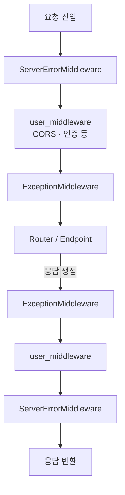

> 기준: Starlette 0.27.0

## 핵심개념
- 미들웨어 = `app(scope, receive, send)` 를 한 겹 더 감싸는 또 다른 ASGI app
- 양파(onion) 구조 — 여러 미들웨어가 동심원처럼 중첩
  - 요청(request) 흐름 → 바깥 → 안 (껍질 → 심지)
  - 응답(response) 흐름 → 안 → 바깥 (심지 → 껍질)
- 같은 미들웨어가 요청·응답을 모두 한 번씩 통과 → 전/후 처리 한 곳에 작성
- 두 가지 작성 방식 존재 → Pure ASGI / `BaseHTTPMiddleware`

```python
# 미들웨어의 본질 — app을 받아 감싼 새 app 반환
class SomeMiddleware:
    def __init__(self, app):
        self.app = app  # 안쪽(다음) 레이어
    async def __call__(self, scope, receive, send):
        # ...요청 전처리...
        await self.app(scope, receive, send)  # 안쪽으로 위임
        # ...응답 후처리...
```

---

## FastAPI 연결 — add_middleware
- `app.add_middleware(cls, **opts)` → `user_middleware` 리스트 맨 앞에 `insert(0, ...)`
- 즉 **나중에 추가한 미들웨어가 가장 바깥** → 가장 먼저 요청을 받음
- 스택은 첫 요청 직전 단 1회 조립(`build_middleware_stack`) → 이후 변경 불가

```python
# applications.py — add_middleware
def add_middleware(self, middleware_class, **options):
    if self.middleware_stack is not None:  # 시작 후엔 차단
        raise RuntimeError("Cannot add middleware after an application has started")
    self.user_middleware.insert(0, Middleware(middleware_class, **options))
```

- `Middleware` 는 단순 `(cls, options)` 보관용 래퍼 → 조립 시점까지 인스턴스화 지연

```python
# middleware/__init__.py
class Middleware:
    def __init__(self, cls, **options):
        self.cls = cls
        self.options = options
    def __iter__(self):                       # cls, options = middleware 언패킹 지원
        return iter((self.cls, self.options))
```

---

## 소스 분석 — build_middleware_stack
- 스택은 항상 양 끝에 내장 미들웨어 2개를 자동 부착
  - 최외곽 → `ServerErrorMiddleware` (모든 미처리 예외 → 500)
  - 최내곽 → `ExceptionMiddleware` (라우팅·핸들러 예외 처리)
- 가운데에만 `user_middleware` 배치

```python
# applications.py — build_middleware_stack
middleware = (
    [Middleware(ServerErrorMiddleware, handler=error_handler, debug=debug)]
    + self.user_middleware
    + [Middleware(ExceptionMiddleware, handlers=exception_handlers, debug=debug)]
)

app = self.router                          # 가장 안쪽 = router
for cls, options in reversed(middleware):  # 안쪽부터 거꾸로 감싸 올라감
    app = cls(app=app, **options)
return app                                  # 최종 = 가장 바깥 ServerErrorMiddleware
```

- `reversed` + `app = cls(app=app)` → 리스트 끝(`ExceptionMiddleware`)부터 감싸 안→밖 누적
- 최종 반환값은 가장 바깥 껍질(`ServerErrorMiddleware`) → 요청이 여기로 진입

<Layers>
<Layer title="ServerErrorMiddleware (최외곽)" color="rose">
- 모든 미처리 예외 catch → 500 응답 보장 · 항상 가장 바깥
</Layer>
<Layer title="user_middleware [N] (나중 추가)" color="amber">
- add_middleware 로 마지막에 넣은 것 → insert(0) 효과로 바깥쪽
</Layer>
<Layer title="user_middleware [1] (먼저 추가)" color="sky">
- CORS · GZip · 인증 등 사용자 정의 레이어
</Layer>
<Layer title="ExceptionMiddleware (최내곽)" color="violet">
- HTTPException · 핸들러 예외 → 적절한 응답 변환
</Layer>
<Layer title="Router / Endpoint (심지)" color="green">
- 실제 경로 매칭 + 비즈니스 로직 실행
</Layer>
</Layers>

---

## 두 가지 미들웨어 방식

<Compare>
<CompareCol title="Pure ASGI" color="sky">
- `app(scope, receive, send)` 시그니처 직접 구현
- `scope` · `send` 를 가로채 조작
- Request/Response 객체 생성 비용 없음
- 추가 task·스트림 없음 → 오버헤드 최소
- WebSocket·lifespan scope 도 직접 처리 가능
- 코드가 다소 저수준·verbose
</CompareCol>
<CompareCol title="BaseHTTPMiddleware" color="amber">
- `dispatch(request, call_next)` 만 구현 → 직관적
- `Request` 객체 + `Response` 반환 → 고수준 API
- 내부적으로 anyio memory stream + task group 사용
- http scope 만 처리 (그 외는 그대로 통과)
- call_next 가 응답을 스트림으로 재조립 → 비용·제약 발생
</CompareCol>
</Compare>

### Pure ASGI — send 가로채기 패턴
```python
class AddHeaderMiddleware:
    def __init__(self, app):
        self.app = app
    async def __call__(self, scope, receive, send):
        if scope["type"] != "http":
            await self.app(scope, receive, send)
            return

        async def send_wrapper(message):           # send를 감싸 헤더 주입
            if message["type"] == "http.response.start":
                message["headers"].append((b"x-custom", b"1"))
            await send(message)

        await self.app(scope, receive, send_wrapper)
```

### BaseHTTPMiddleware — anyio memory stream 트릭
- 안쪽 app 은 여전히 `send(message)` 로 ASGI 메시지를 흘려보냄
- 하지만 `dispatch` 는 `Response` 객체를 원함 → 둘 사이 변환 필요
- `call_next` 가 **memory object stream** 으로 send 메시지를 받아 `_StreamingResponse` 로 재구성

```python
# middleware/base.py — call_next 내부 (발췌)
async def call_next(request: Request) -> Response:
    app_exc = None
    send_stream, recv_stream = anyio.create_memory_object_stream()

    async def coro() -> None:                 # 안쪽 app을 별도 task로 실행
        nonlocal app_exc
        async with send_stream:
            try:
                await self.app(scope, receive_or_disconnect, send_no_error)
            except Exception as exc:
                app_exc = exc

    task_group.start_soon(close_recv_stream_on_response_sent)
    task_group.start_soon(coro)

    message = await recv_stream.receive()     # 첫 메시지 = response.start 대기
    assert message["type"] == "http.response.start"

    async def body_stream():                  # 이후 body 메시지를 스트림으로 흘림
        async with recv_stream:
            async for message in recv_stream:
                yield message.get("body", b"")
        if app_exc is not None:
            raise app_exc

    response = _StreamingResponse(status_code=message["status"], content=body_stream())
    response.raw_headers = message["headers"]
    return response
```

- 핵심 트릭 → 안쪽 app 을 `task_group.start_soon(coro)` 로 동시 실행
  - 안쪽이 `send` 한 메시지를 `send_stream` 에 밀어넣고 `recv_stream` 으로 꺼냄
- `dispatch` 에서 발생/전파된 예외는 `app_exc` 에 담아 `body_stream` 소비 시 재발생
- 이 메모리 스트림 + task group 왕복이 곧 BaseHTTP 의 추가 비용

---

## 동작 흐름 — 요청/응답 통과


- 같은 레이어를 요청 시 1번·응답 시 1번 통과 → 양파를 들어갔다 되돌아 나오는 구조

---

## 함정

<Note type="warning">
**BaseHTTPMiddleware 스트리밍 제약** — `call_next` 가 안쪽 응답을 `_StreamingResponse` 로 다시 감쌈 → 진짜 스트리밍 응답(SSE·대용량 파일)에서 백프레셔(backpressure) 가 깨지거나 버퍼링·지연 발생 가능. 스트리밍·성능 민감 경로는 Pure ASGI 권장
</Note>

<Note type="info">
**BackgroundTask 실행 시점** — BaseHTTP 경로에서는 응답 본문이 모두 흘러간 뒤 background task 가 도는 구조 → 기대 시점과 어긋날 수 있음. 정밀 제어 필요 시 Pure ASGI
</Note>

- `scope["type"]` 체크 필수 → BaseHTTP 는 http 외 scope 를 그냥 통과시킴 (WebSocket 미들웨어로 부적합)
- 추가 순서 헷갈림 주의 → `add_middleware` 는 `insert(0)` → **나중에 추가 = 더 바깥 = 더 먼저 실행**
- 스택은 첫 요청 시 1회 동결 → 런타임 중 `add_middleware` 호출 시 `RuntimeError`

<details>
<summary>왜 ServerErrorMiddleware 가 항상 최외곽인가</summary>

- 안쪽 어디서 예외가 터지든 최종적으로 잡아 500 응답을 보장해야 함
- `__call__` 에서 `response_started` 플래그로 이미 헤더가 나갔는지 확인 후 응답
- 예외는 잡은 뒤에도 `raise exc` 로 재전파 → 서버 로깅·테스트 클라이언트가 재포착 가능

```python
# middleware/errors.py — ServerErrorMiddleware.__call__ (발췌)
try:
    await self.app(scope, receive, _send)
except Exception as exc:
    request = Request(scope)
    if self.debug:
        response = self.debug_response(request, exc)
    elif self.handler is None:
        response = self.error_response(request, exc)   # 기본 "Internal Server Error" 500
    else:
        ...
    if not response_started:                            # 헤더 미전송 시에만 응답
        await response(scope, receive, send)
    raise exc                                           # 항상 재전파
```
</details>
