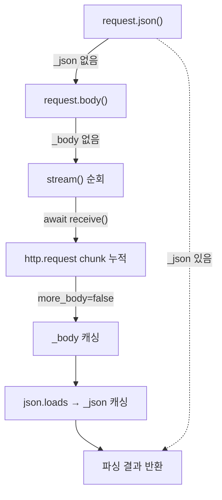

> 기준: Starlette 0.27.0

## 핵심개념

- `Request` = `scope` + `receive` 를 감싼 **편의 래퍼(Wrapper)**
  - **scope** → 우편함에 도착한 **날것의 봉투** (bytes 헤더·query_string 그대로)
  - **Request** → 봉투를 **뜯어 정리한 편지** (str 변환·메서드 제공)
- 메타데이터(헤더·쿼리)는 scope에 이미 존재 → **즉시 접근**
- 본문(body)은 아직 네트워크에 있음 → `receive()` 로 **lazy 소비**

<Cards cols={3}>
<Card icon="🔌" title="HTTPConnection">
scope 기반 공통 베이스 · Request/WebSocket 공유 · `headers`·`query_params`·`cookies`·`state`
</Card>
<Card icon="✉️" title="Request">
HTTPConnection 상속 + `receive`/`send` 보유 · `body`·`stream`·`json`·`form` 추가
</Card>
<Card icon="📦" title="Datastructures">
`Headers`·`QueryParams`·`URL`·`UploadFile` · bytes↔str 변환·불변 멀티딕트
</Card>
</Cards>

---

## ① 정의 / 비유

- `HTTPConnection(scope, receive)` → `scope` 만 보관, scope가 곧 데이터 원천
  - `self.scope = scope` → 모든 property가 scope를 읽어 가공
- `Request(scope, receive, send)` → 여기서부터 `receive`·`send` 채널 보유
  - `receive` 없이 `body()` 호출 시 `empty_receive` → `RuntimeError` 발생

```python
# requests.py — Request.__init__
def __init__(self, scope, receive=empty_receive, send=empty_send):
    super().__init__(scope)
    assert scope["type"] == "http"
    self._receive = receive
    self._send = send
    self._stream_consumed = False   # 스트림 1회 소비 플래그
    self._is_disconnected = False
    self._form = None
```

---

## ② FastAPI 연결

- FastAPI 엔드포인트 `request: Request` → 이 Starlette `Request` 그대로
- 자주 쓰는 진입점 매핑

| FastAPI 호출 | 내부 동작 | 소비 방식 |
| --- | --- | --- |
| `request.headers["x"]` | `Headers(scope=scope)` → bytes 디코드 | 즉시 (scope) |
| `request.query_params["q"]` | `QueryParams(scope["query_string"])` | 즉시 (scope) |
| `await request.body()` | `stream()` 전부 모아 `_body` 캐싱 | **lazy** (receive) |
| `await request.json()` | `body()` → `json.loads` → `_json` 캐싱 | **lazy** (receive) |
| `await request.form()` | content-type 보고 Form/MultiPart 파서 | **lazy** (receive) |

---

## ③ 소스 발췌 + 분석

### scope 기반 — 즉시 접근

- `headers` / `query_params` 는 `hasattr` 로 **1회 생성 후 캐싱** (lazy property)
- scope에 데이터가 이미 있으므로 네트워크 대기 없음

```python
# requests.py — HTTPConnection
@property
def headers(self) -> Headers:
    if not hasattr(self, "_headers"):
        self._headers = Headers(scope=self.scope)
    return self._headers

@property
def query_params(self) -> QueryParams:
    if not hasattr(self, "_query_params"):
        self._query_params = QueryParams(self.scope["query_string"])
    return self._query_params
```

### body — stream을 모아 캐싱

- `stream()` → `receive()` 를 돌며 chunk를 yield 하는 **async generator**
- `_stream_consumed` 플래그 → **두 번째 소비 시 `RuntimeError("Stream consumed")`**
- 단 `_body` 가 이미 있으면(=`body()` 호출 후) 캐시를 다시 yield → 재호출 안전

```python
# requests.py — Request.stream
async def stream(self):
    if hasattr(self, "_body"):       # 이미 body() 호출됨 → 캐시 재생
        yield self._body
        yield b""
        return
    if self._stream_consumed:        # 캐시 없이 두 번째 소비 → 금지
        raise RuntimeError("Stream consumed")
    self._stream_consumed = True
    while True:
        message = await self._receive()
        if message["type"] == "http.request":
            body = message.get("body", b"")
            if body:
                yield body
            if not message.get("more_body", False):
                break
        elif message["type"] == "http.disconnect":
            self._is_disconnected = True
            raise ClientDisconnect()
    yield b""
```

```python
# requests.py — body / json (캐싱)
async def body(self) -> bytes:
    if not hasattr(self, "_body"):           # 최초 1회만 receive 소비
        chunks = [chunk async for chunk in self.stream()]
        self._body = b"".join(chunks)
    return self._body

async def json(self):
    if not hasattr(self, "_json"):
        body = await self.body()             # body() 캐시 재사용
        self._json = json.loads(body)
    return self._json
```

- 핵심 → `body()` 는 한 번 `receive` 를 비우고 `_body` 에 저장
  - 이후 `json()`·`form()`·`stream()` 모두 캐시 재사용 → 재호출 안전
  - 단 `body()` **없이** `stream()` 을 두 번 직접 돌리면 막힘

### Headers — bytes 멀티딕트, 조회 시 디코드

- 내부 `_list` 는 `(bytes, bytes)` 튜플 그대로 보관
- 조회(`__getitem__`)할 때마다 **소문자 키로 인코딩 후 비교**, 값은 `latin-1` 디코드
- 대소문자 무시 + 동일 키 다중 값(`getlist`) → **case-insensitive multidict**

```python
# datastructures.py — Headers.__getitem__
def __getitem__(self, key: str) -> str:
    get_header_key = key.lower().encode("latin-1")
    for header_key, header_value in self._list:
        if header_key == get_header_key:
            return header_value.decode("latin-1")   # bytes → str
    raise KeyError(key)
```

<details>
  <summary>➕ 헤더가 왜 bytes 인가</summary>

  - ASGI scope의 `headers` → `[(b'host', b'localhost'), ...]` **bytes 튜플 리스트**
  - `Headers(scope=...)` 는 이 리스트를 **그대로 `_list` 에 보관** (변환 비용 미루기)

  ```python
  # datastructures.py — Headers.__init__ (scope 분기)
  elif scope is not None:
      self._list = scope["headers"] = list(scope["headers"])
  ```

  - `keys()`·`items()` 호출 시점에야 `latin-1` 디코드 → **str 반환**
  - `Headers` 는 set 불가(불변), 응답 헤더 수정은 `MutableHeaders` 로 분리
    - `MutableHeaders.__setitem__` → 중복 제거 후 삽입 순서 유지
</details>

### QueryParams — query_string(bytes) → str 멀티딕트

- `bytes` 면 `latin-1` 디코드 후 `parse_qsl` → `?a=1&a=2` 같은 **중복 키 보존**
- 최종적으로 key·value 모두 `str` 강제 캐스팅

```python
# datastructures.py — QueryParams.__init__
if isinstance(value, bytes):
    super().__init__(parse_qsl(value.decode("latin-1"), keep_blank_values=True))
...
self._list = [(str(k), str(v)) for k, v in self._list]   # 전부 str
```

- `ImmutableMultiDict` 상속 → `getlist("a")` 로 `["1", "2"]` 다중 값 조회

### form / multipart 파싱

- `content-type` 헤더로 분기 → 적합한 파서 선택, 둘 다 `stream()` 을 소비

```python
# requests.py — Request._get_form
content_type, _ = parse_options_header(self.headers.get("Content-Type"))
if content_type == b"multipart/form-data":
    multipart_parser = MultiPartParser(self.headers, self.stream(), ...)
    self._form = await multipart_parser.parse()
elif content_type == b"application/x-www-form-urlencoded":
    form_parser = FormParser(self.headers, self.stream())
    self._form = await form_parser.parse()
else:
    self._form = FormData()
```

- `FormParser` → `QuerystringParser` 콜백으로 `name=value` 누적 → `FormData(items)`
- `MultiPartParser` → boundary 단위로 part 분리
  - `filename` 옵션 있으면 → `SpooledTemporaryFile` 기반 `UploadFile` 생성 (`max_files` 초과 시 `MultiPartException`)
  - 없으면 → 일반 텍스트 필드
  - 파일 데이터 쓰기는 `run_in_threadpool` → **이벤트 루프 블로킹 방지**

```python
# datastructures.py — UploadFile.read (in-memory vs disk)
async def read(self, size: int = -1) -> bytes:
    if self._in_memory:
        return self.file.read(size)
    return await run_in_threadpool(self.file.read, size)
```

---

## ④ 시각화

- `await request.json()` 한 번의 lazy 소비 흐름



<Compare>
<CompareCol title="⚡ 즉시 소비" subtitle="scope 기반" color="sky">
- `headers` · `query_params` · `cookies` · `path_params`
- 데이터가 scope에 이미 존재
- 네트워크 대기 없음 → 동기 property
- 여러 번 읽어도 안전 (캐싱)
</CompareCol>
<CompareCol title="⏳ lazy 소비" subtitle="receive 기반" color="amber">
- `body()` · `json()` · `form()` · `stream()`
- 데이터가 아직 네트워크 큐에 있음
- `await receive()` 로 끌어옴 → 비동기
- 최초 1회만 소비, 이후 `_body` 캐시 재사용
</CompareCol>
</Compare>

---

## ⑤ 함정

<Note type="warning">
**Body 재소비 — `stream()` 두 번 직접 돌리면 멈춤**
- `body()`/`json()` 은 `_body` 캐싱 → 재호출 안전
- 그러나 `body()` 거치지 않고 `stream()` 을 두 번 직접 순회 → `_stream_consumed` True → `RuntimeError("Stream consumed")`
- 미들웨어에서 body 로깅 후 핸들러로 흘려보내려면 → `await request.body()` 로 **먼저 캐싱**해두기
</Note>

<Note type="info">
**`request.state` — 요청 단위 공유 공간**
- `state` property → `scope.setdefault("state", {})` 후 `State` 래핑
- `request.state.user = ...` → 내부적으로 `scope["state"]["user"]` 저장
- `__getattr__` 가 KeyError를 `AttributeError` 로 변환 → 없는 키 접근 시 일반 속성 오류처럼 동작
- 미들웨어에서 인증 결과를 핸들러로 넘길 때 주로 사용
</Note>

<Note type="warning">
**session·auth·user 는 미들웨어 필수**
- `request.session`·`request.auth`·`request.user` → scope에 키 없으면 `assert` 실패
- 각각 `SessionMiddleware`·`AuthenticationMiddleware` 설치 전제
</Note>
