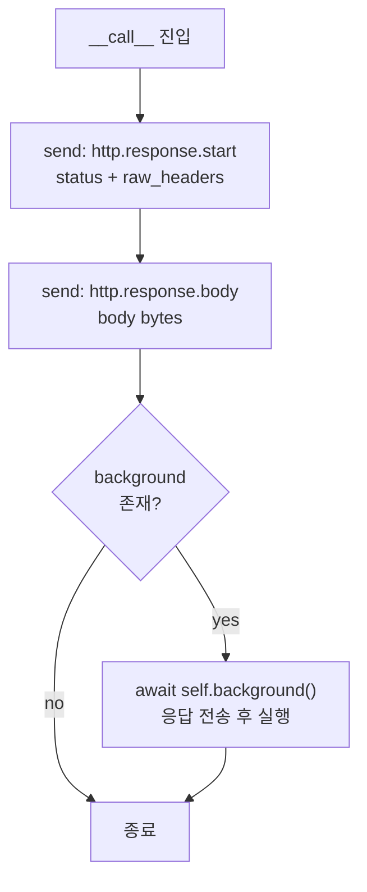

> 기준: Starlette 0.27.0

## 핵심개념
- `Response` 는 **ASGI Callable** -> `await response(scope, receive, send)` 형태로 직접 호출 가능
- 비유: Response = **택배 박스** -> 내용물(`body`)·송장(`raw_headers`)·배송 후 처리(`background`)를 한 묶음으로 포장
- 모든 응답 종류(JSON/HTML/File 등)는 `Response` 를 상속 -> `render()` 와 `__call__` 만 다르게 구현
- FastAPI 연결: `path operation` 의 `return` 값 -> 내부적으로 `JSONResponse` 로 래핑 후 `send`

---
## Response 계층
- 공통 시그니처: `content` · `status_code` · `headers` · `media_type` · `background`
- 차이 -> `media_type` 기본값 + `render()` 동작 + `__call__` 전송 방식

<Cards>
<Card title="JSONResponse">
- `media_type` = `application/json`
- `render` -> `json.dumps(ensure_ascii=False, separators=(",",":"))`
- 한글 그대로 출력 + 공백 없는 압축 직렬화
</Card>
<Card title="HTMLResponse / PlainTextResponse">
- `text/html` · `text/plain`
- `render` 미오버라이드 -> 부모 `Response.render` 그대로 (`str` -> `encode`)
</Card>
<Card title="RedirectResponse">
- 기본 `status_code` = `307`
- `body` = `b""` + `Location` 헤더에 `quote` 처리 URL
</Card>
<Card title="StreamingResponse">
- `body_iterator` 로 청크 단위 전송
- `async generator` 또는 sync iterator(threadpool 변환) 수용
</Card>
<Card title="FileResponse">
- `anyio` 로 파일을 64KB 청크 비동기 전송
- `etag` · `last-modified` · `content-disposition` 자동 세팅
</Card>
</Cards>

| 종류 | media_type | body 방식 | 특이점 |
|------|-----------|-----------|--------|
| `Response` | `None` | `render(content)` | 기본 베이스 |
| `JSONResponse` | `application/json` | `json.dumps` | `ensure_ascii=False` |
| `HTMLResponse` | `text/html` | 부모 `render` | charset 자동 부착 |
| `PlainTextResponse` | `text/plain` | 부모 `render` | charset 자동 부착 |
| `RedirectResponse` | - | 빈 body | `Location` 헤더 |
| `StreamingResponse` | 지정값 | `body_iterator` | `more_body=True` 청크 |
| `FileResponse` | 추론값 | `anyio` 파일 | `HEAD`면 헤더만 |

---
## 소스 분석
<Stepper>
<StepperItem title="1️⃣ Response.__call__ — send 2단계">
- 응답의 본질 -> `start`(상태·헤더) 보낸 뒤 `body`(데이터) 전송

```python
async def __call__(self, scope: Scope, receive: Receive, send: Send) -> None:
    await send(
        {
            "type": "http.response.start",
            "status": self.status_code,
            "headers": self.raw_headers,
        }
    )
    await send({"type": "http.response.body", "body": self.body})

    if self.background is not None:
        await self.background()
```
- `start` 와 `body` 는 **반드시 순서대로** -> ASGI 규약
- `background` 는 `body` **전송 이후** 호출 -> 실행 시점 포인트
</StepperItem>
<StepperItem title="2️⃣ init_headers — content-length·content-type 자동 채움">
- 헤더는 모두 `latin-1` 인코딩 -> bytes 튜플로 보관

```python
raw_headers = [
    (k.lower().encode("latin-1"), v.encode("latin-1"))
    for k, v in headers.items()
]
```
- `content-length` -> body 있고 `status` 가 `1xx`·`204`·`304` 아니면 자동 추가
- `content-type` -> `text/` 로 시작하면 `; charset=utf-8` 부착
- 사용자가 직접 준 헤더에 키가 있으면 `populate_*` = `False` -> 중복 방지
</StepperItem>
<StepperItem title="3️⃣ StreamingResponse — 청크 + disconnect 감시">
- `stream_response` -> `start` 후 `body_iterator` 순회하며 `more_body=True` 로 흘려보냄

```python
async for chunk in self.body_iterator:
    if not isinstance(chunk, bytes):
        chunk = chunk.encode(self.charset)
    await send({"type": "http.response.body", "body": chunk, "more_body": True})

await send({"type": "http.response.body", "body": b"", "more_body": False})
```
- 마지막에 빈 body + `more_body=False` -> 종료 신호
- `__call__` 은 `anyio` task group 으로 전송과 `listen_for_disconnect` 를 동시 실행 -> 한쪽 끝나면 `cancel`
</StepperItem>
<StepperItem title="4️⃣ FileResponse — anyio 비동기 파일 읽기">
- `os.stat` 도 `anyio.to_thread.run_sync` 로 -> 이벤트 루프 블로킹 방지

```python
async with await anyio.open_file(self.path, mode="rb") as file:
    more_body = True
    while more_body:
        chunk = await file.read(self.chunk_size)
        more_body = len(chunk) == self.chunk_size
        await send({"type": "http.response.body", "body": chunk, "more_body": more_body})
```
- `chunk_size` = `64 * 1024` (64KB) 단위
- `HEAD` 요청(`send_header_only`)이면 빈 body 한 번만 전송
</StepperItem>
</Stepper>

---
## 동작 흐름
- `send` 호출 순서 -> `start` 가 먼저, 그다음 `body`, 끝으로 `background`



---
## BackgroundTask
- 정의: 응답을 **보낸 뒤** 실행되는 후처리 작업 (이메일 발송·로그 적재 등)
- 비유: 택배 배달 완료 후 기사님이 작성하는 **배송 완료 리포트**

```python
class BackgroundTask:
    def __init__(self, func, *args, **kwargs) -> None:
        self.func = func
        self.args = args
        self.kwargs = kwargs
        self.is_async = is_async_callable(func)

    async def __call__(self) -> None:
        if self.is_async:
            await self.func(*self.args, **self.kwargs)
        else:
            await run_in_threadpool(self.func, *self.args, **self.kwargs)
```
- `is_async_callable` 로 코루틴 여부 판별 -> 동기 함수면 `run_in_threadpool` 로 위임 -> 루프 블로킹 방지
- `BackgroundTasks` -> 여러 작업을 `list` 로 모아 `add_task` 후 순서대로 `await`

```python
class BackgroundTasks(BackgroundTask):
    async def __call__(self) -> None:
        for task in self.tasks:
            await task()
```

<Compare color="amber">
- `__call__` 안에서 `body` 전송이 끝난 **다음 줄**에 `await self.background()` 호출
- 즉, 클라이언트는 background 완료를 기다리지 않음 -> 단, 같은 이벤트 루프라 **응답 latency 와 무관하지 않음** (작업이 무거우면 워커 점유)
</Compare>

---
## 함정
<Note type="warning">
- background 는 **별도 프로세스/큐가 아님** -> 같은 요청 핸들러 컨텍스트에서 `await`
- 무거운 작업(대용량 처리·외부 API 폴링)은 Celery·SQS 등 외부 큐로 분리
</Note>

<Note type="info">
- 헤더는 `latin-1` 인코딩 -> 한글·비ASCII 헤더 값 직접 넣으면 `UnicodeEncodeError`
- 한글 파일명은 `FileResponse` 가 `filename*=utf-8''...` (RFC 5987) 형식으로 자동 처리
</Note>

<Note type="info">
- `status.py` -> `HTTP_200_OK` 같은 상수 모음 -> 매직 넘버 대신 `status.HTTP_201_CREATED` 권장
</Note>

<details>
<summary>➕ JSONResponse가 한글을 깨지 않는 이유</summary>
- `render` 에서 `ensure_ascii=False` -> `\uXXXX` 이스케이프 대신 원문 UTF-8 바이트 유지
- `separators=(",",":")` -> 공백 제거로 payload 크기 축소
- `allow_nan=False` -> `NaN`·`Infinity` 직렬화 시 `ValueError` (비표준 JSON 방지)
</details>
