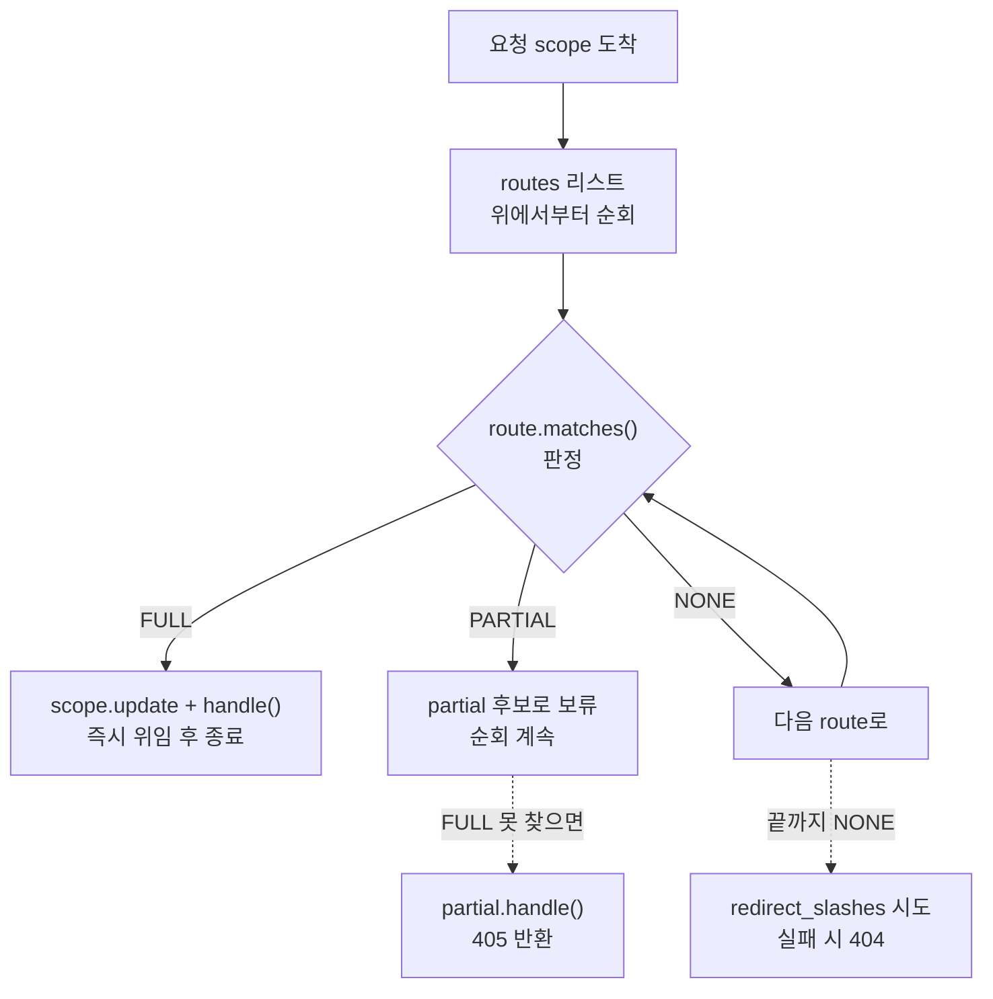

> 기준: Starlette 0.27.0

## 핵심개념
- 라우팅 = **우편물 분류소**
  - 요청 `scope["path"]` = 봉투에 적힌 주소
  - `routes` 리스트 = 분류함 칸들 → 위에서부터 주소 매칭 순회
  - 매칭된 칸 = endpoint, 위임(handle) → 실제 배달
- FastAPI `@app.get("/items/{id}")` → 내부적으로 `Route` 객체 1개 생성 후 `routes`에 append
- 매칭 결과는 boolean이 아닌 **3단계 enum** → 405 같은 미묘한 케이스 구분

| 종류 | 역할 | 매칭 대상 |
|------|------|-----------|
| `Route` | 단일 HTTP endpoint | `scope["type"] == "http"` |
| `WebSocketRoute` | WebSocket endpoint | `scope["type"] == "websocket"` |
| `Mount` | 서브 애플리케이션 위임 | path prefix + 나머지 경로 통째 |

---

## ① 정의 / 비유 — Match 3단계
- 분류소 직원은 봉투를 보고 세 가지로 판정

| Match | 값 | 의미 |
|-------|----|------|
| `NONE` | 0 | 경로 자체가 안 맞음 → 다음 칸으로 |
| `PARTIAL` | 1 | 경로는 맞지만 method 불일치 → 405 후보로 보류 |
| `FULL` | 2 | 경로 + method 완전 일치 → 즉시 배달 |

```python
class Match(Enum):
    NONE = 0
    PARTIAL = 1
    FULL = 2
```

- `PARTIAL` 존재 이유 → "주소는 이 칸이 맞는데 GET만 받는 칸에 POST가 옴" → 404가 아닌 **405 Method Not Allowed** 반환용

---

## ② FastAPI 연결 — `@app.get`이 `Route`로
- 데코레이터는 설탕(sugar), 본질은 `Route` 생성 → `routes`에 등록
- `Route.__init__`에서 endpoint가 함수면 `request_response`로 ASGI App 래핑 · method 기본값 `["GET"]`

```python
# Route.__init__ 발췌
if inspect.isfunction(endpoint_handler) or inspect.ismethod(endpoint_handler):
    self.app = request_response(endpoint)   # func(request)->response 를 ASGI로 래핑
    if methods is None:
        methods = ["GET"]
...
self.methods = {method.upper() for method in methods}
if "GET" in self.methods:
    self.methods.add("HEAD")   # GET 등록 시 HEAD 자동 추가
...
self.path_regex, self.path_format, self.param_convertors = compile_path(path)
```

- 핵심 → 생성 시점에 **path를 정규식으로 미리 컴파일** · 요청마다 재파싱 안 함

---

## ③ 소스 발췌 — convertor & `compile_path`

### convertor 종류
- `{id:int}` 의 `int` 부분이 convertor 타입 키 · 각 convertor는 `regex` + `convert()` 보유

| 키 | Convertor | regex | convert 결과 |
|----|-----------|-------|--------------|
| `str` | StringConvertor | `[^/]+` | str (슬래시 제외 · 기본값) |
| `int` | IntegerConvertor | `[0-9]+` | int |
| `float` | FloatConvertor | `[0-9]+(\.[0-9]+)?` | float |
| `uuid` | UUIDConvertor | `[0-9a-f]{8}-...-[0-9a-f]{12}` | uuid.UUID |
| `path` | PathConvertor | `.*` | str (**슬래시 포함** 통째) |

```python
class StringConvertor(Convertor):
    regex = "[^/]+"          # / 미포함 → /users/{name} 에서 name이 경로 경계 넘지 않음

class PathConvertor(Convertor):
    regex = ".*"             # / 포함 → /static/{path:path} 로 하위 전체 캡처

CONVERTOR_TYPES = {
    "str": StringConvertor(), "path": PathConvertor(),
    "int": IntegerConvertor(), "float": FloatConvertor(), "uuid": UUIDConvertor(),
}
```

### `{id:int}` → 정규식 변환 과정
- `PARAM_REGEX`로 `{이름:타입}` 패턴을 훑으며 한 조각씩 정규식 조립

```python
PARAM_REGEX = re.compile("{([a-zA-Z_][a-zA-Z0-9_]*)(:[a-zA-Z_][a-zA-Z0-9_]*)?}")

def compile_path(path):
    path_regex = "^"
    idx = 0
    param_convertors = {}
    for match in PARAM_REGEX.finditer(path):
        param_name, convertor_type = match.groups("str")   # 타입 생략 시 기본 "str"
        convertor_type = convertor_type.lstrip(":")
        convertor = CONVERTOR_TYPES[convertor_type]

        path_regex += re.escape(path[idx : match.start()])         # 파라미터 앞 리터럴
        path_regex += f"(?P<{param_name}>{convertor.regex})"       # named group 삽입
        param_convertors[param_name] = convertor
        idx = match.end()

    path_regex += re.escape(path[idx:]) + "$"
    return re.compile(path_regex), path_format, param_convertors
```

- 분석 → `"/items/{id:int}"` 입력 시
  - 리터럴 `/items/` → `re.escape` 처리
  - `{id:int}` → IntegerConvertor.regex 사용 → `(?P<id>[0-9]+)`
  - 최종 `^/items/(?P<id>[0-9]+)$`
- `(?P<id>...)` = named group → 매칭 후 `match.groupdict()["id"]` 로 값 추출
- 끝에 `$` → **부분 매칭 차단** · 끝까지 정확히 일치해야 함

---

## ④ 시각화

### `Route.matches` 로직 — 정규식 → convert → Match
```python
def matches(self, scope):
    if scope["type"] == "http":
        match = self.path_regex.match(scope["path"])
        if match:
            matched_params = match.groupdict()
            for key, value in matched_params.items():
                matched_params[key] = self.param_convertors[key].convert(value)  # str->int 등
            child_scope = {"endpoint": self.endpoint, "path_params": ...}
            if self.methods and scope["method"] not in self.methods:
                return Match.PARTIAL, child_scope     # 경로O method X
            return Match.FULL, child_scope            # 완전 일치
    return Match.NONE, {}
```

### `Router.__call__` — 순회 → 매칭 → 위임


```python
# Router.__call__ 발췌
partial = None
for route in self.routes:
    match, child_scope = route.matches(scope)
    if match == Match.FULL:
        scope.update(child_scope)
        await route.handle(scope, receive, send)   # 첫 FULL에서 즉시 종료
        return
    elif match == Match.PARTIAL and partial is None:
        partial = route                            # 첫 PARTIAL만 기억
        partial_scope = child_scope
if partial is not None:
    scope.update(partial_scope)
    await partial.handle(scope, receive, send)     # 405 처리
    return
```

- 핵심 → **첫 FULL 매칭에서 즉시 return** · 그래서 라우트 등록 순서가 결과를 좌우

### 요청 → 매칭 → endpoint
<Stepper>
<StepperItem title="1️⃣ 요청 도착">
- Uvicorn → `scope["path"]="/items/42"`, `scope["method"]="GET"` 으로 `Router.__call__` 진입
</StepperItem>
<StepperItem title="2️⃣ 순회 & 정규식 매칭">
- `routes` 위에서부터 `route.matches(scope)` 호출
- `^/items/(?P<id>[0-9]+)$` 에 `/items/42` 매칭 성공
</StepperItem>
<StepperItem title="3️⃣ convert & Match 판정">
- `IntegerConvertor.convert("42")` → `42` (int) → `path_params={"id": 42}`
- method GET ∈ methods → `Match.FULL`
</StepperItem>
<StepperItem title="4️⃣ endpoint 위임">
- `scope.update(child_scope)` 후 `route.handle()` → `self.app(scope, receive, send)` 실행
</StepperItem>
</Stepper>

---

## Mount — 서브 애플리케이션 위임
- prefix만 떼어내고 **나머지 경로를 통째로** 서브앱에 넘김
- 비유 → "이 건물 3층 우편물은 3층 관리실에 통째로 전달" · 3층 내부 분류는 관리실 몫

```python
# Mount.__init__ : prefix + {path:path} 로 컴파일
self.path = path.rstrip("/")
self.path_regex, self.path_format, self.param_convertors = compile_path(
    self.path + "/{path:path}"      # path convertor = .* → 하위 전부 캡처
)

# Mount.matches : prefix 매칭 후 remaining_path 재계산
remaining_path = "/" + matched_params.pop("path")
matched_path = path[: -len(remaining_path)]
child_scope = {
    "root_path": root_path + matched_path,   # 떼어낸 prefix 누적
    "path": remaining_path,                  # 서브앱이 볼 새 path
    "endpoint": self.app,
}
return Match.FULL, child_scope
```

<Compare color="sky">
<div>

**Route**
- path 전체를 `^...$` 로 정확 매칭
- method 검사 → FULL / PARTIAL 구분
- endpoint 함수 직접 실행

</div>
<div>

**Mount**
- prefix만 매칭 · 항상 `Match.FULL` 또는 `NONE`
- `path:path` 로 나머지 통째 캡처
- `scope["path"]` 재작성 후 서브앱에 재위임

</div>
</Compare>

```python
# FastAPI에서 서브앱 마운트
sub = FastAPI()
app.mount("/admin", sub)   # /admin/* → sub 앱이 처리, sub은 path="/..." 만 봄
```

---

## ⑤ 함정

<Note type="warning">
**라우트 순서 — 첫 FULL이 이김**

- `/users/{id}` 를 `/users/me` 보다 먼저 등록하면 `/users/me` 요청도 `{id}="me"` 로 먹힘
- 구체적(static) 경로를 **먼저**, 동적(`{param}`) 경로를 나중에 등록
</Note>

<Note type="info">
**trailing slash 리다이렉트**

- `redirect_slashes=True`(기본) → `/items` 매칭 실패 시 `/items/` 로 재시도 후 307 redirect
- `scope["path"] != "/"` 일 때만 동작 · POST 요청의 redirect는 body 유실 주의
</Note>

<details>
<summary>➕ `int` convertor는 음수 · 소수 거부</summary>

- `IntegerConvertor.regex = "[0-9]+"` → `-1`, `1.5` 는 매칭 자체 실패 → `Match.NONE` → 404
- `to_string`에서도 `assert value >= 0` → 음수 url 생성 차단
</details>

<details>
<summary>➕ `{path:path}` 의 위험</summary>

- PathConvertor regex `.*` → 슬래시 포함 전부 흡수 → static file 서빙용
- 일반 파라미터에 쓰면 `^/files/(?P<p>.*)$` 가 너무 탐욕적 → 뒤 라우트가 묻힐 수 있음
</details>
