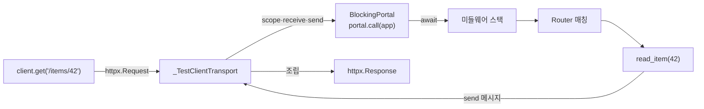

> 기준: Starlette 0.27.0

## 핵심 개념
- "Uvicorn 같은 실서버 없이 어떻게 앱에 요청이 가나" → **소켓·TCP 없이 함수 호출 하나로** 처리
- `TestClient`는 `httpx.Client` 상속 → 익숙한 `get`/`post` API 그대로 사용
- 비밀은 `transport` → 네트워크 대신 `_TestClientTransport`가 httpx 요청을 **ASGI scope/receive/send로 번역**해 앱을 직접 `await`
- async 앱을 sync 테스트 코드에서 돌리는 다리 = **anyio BlockingPortal**
- 이 페이지 = 캡스톤 → 앞 [application](/backend/framework/fast-api/starlette/application)·[routing](/backend/framework/fast-api/starlette/routing)·[requests](/backend/framework/fast-api/starlette/requests)에서 본 파이프라인을 한 번에 통과

<Cards cols={3}>
<Card icon="🧪" title="TestClient">httpx.Client 상속 · sync API</Card>
<Card icon="🔌" title="_TestClientTransport">httpx ↔ ASGI 번역기</Card>
<Card icon="🌉" title="BlockingPortal">sync → async 실행 다리</Card>
</Cards>

---

## FastAPI 연결
- `from fastapi.testclient import TestClient` → 실체는 `starlette.testclient.TestClient`
- `client = TestClient(app)` → `app` = `FastAPI()` 인스턴스 = ASGI callable
- 테스트가 실제로 보는 것은 네트워크 응답이 아니라 **앱이 `send`로 내보낸 ASGI 메시지를 조립한 `httpx.Response`**

```python
from fastapi import FastAPI
from fastapi.testclient import TestClient

app = FastAPI()

@app.get("/items/{item_id}")
def read_item(item_id: int):
    return {"item_id": item_id}

client = TestClient(app)

def test_read_item():
    response = client.get("/items/42")
    assert response.status_code == 200
    assert response.json() == {"item_id": 42}
```

---

## 소스 ① TestClient = httpx.Client
- `__init__`에서 앱을 ASGI3로 판별 → `transport`에 `_TestClientTransport` 주입 후 부모 초기화

```python
# starlette/testclient.py
class TestClient(httpx.Client):
    __test__ = False  # pytest가 테스트 클래스로 오인하지 않도록

    def __init__(self, app, base_url="http://testserver", ...):
        if _is_asgi3(app):
            asgi_app = app
        else:
            asgi_app = _WrapASGI2(app)   # 구형 ASGI2 → 3 어댑터
        self.app = asgi_app
        transport = _TestClientTransport(
            self.app, portal_factory=self._portal_factory, ...
        )
        super().__init__(app=self.app, base_url=base_url,
                         transport=transport, follow_redirects=True, ...)
```

- `base_url="http://testserver"` → 상대 경로 `/items/42` 가 절대 URL로 join
- `_is_asgi3` → `is_async_callable(app)` 로 async 여부 판별 → 시그니처 검사로 ASGI 버전 구분

<Note type="note" title="왜 httpx.Client 상속">
`get`·`post`·`request` 메서드를 새로 만들 필요 없음 · httpx의 요청 빌드(헤더·쿠키·redirect·json) 전부 재사용 → 오직 `transport` 한 곳만 갈아끼움
</Note>

---

## 소스 ② Transport = httpx → ASGI 번역기
- httpx는 요청을 `transport.handle_request(request)`로 위임 → 보통은 TCP 소켓 · 여기선 ASGI scope 빌드

```python
# starlette/testclient.py — _TestClientTransport.handle_request
scope = {
    "type": "http",
    "http_version": "1.1",
    "method": request.method,
    "path": unquote(path),
    "raw_path": raw_path,
    "root_path": self.root_path,
    "scheme": scheme,
    "query_string": query.encode(),
    "headers": headers,                 # [(b'host', b'testserver'), ...]
    "client": ["testclient", 50000],
    "server": [host, port],
    "state": self.app_state.copy(),
}
```

- httpx `Request` → ASGI `scope` dict로 손수 매핑 → [application](/backend/framework/fast-api/starlette/application)에서 본 scope 구조 그대로
- 같은 함수 안에서 `receive`(요청 body 공급)·`send`(응답 수집) 클로저 정의 → 앱에 넘김

```python
async def send(message):
    if message["type"] == "http.response.start":
        raw_kwargs["status_code"] = message["status"]
        raw_kwargs["headers"] = [...]      # bytes → str 디코드
        response_started = True
    elif message["type"] == "http.response.body":
        raw_kwargs["stream"].write(message.get("body", b""))
        if not message.get("more_body", False):
            response_complete.set()
```

- 앱이 보낸 `http.response.start` + `http.response.body` 메시지를 모아 `httpx.Response`로 재조립 → 테스트가 받는 응답

---

## 소스 ③ BlockingPortal — sync에서 async 앱 실행
- 테스트 함수는 sync · ASGI 앱은 `async def` → 직접 `await` 불가 → portal이 별도 이벤트 루프 스레드에서 코루틴 실행

```python
# starlette/testclient.py — handle_request 끝부분
try:
    with self.portal_factory() as portal:
        response_complete = portal.call(anyio.Event)
        portal.call(self.app, scope, receive, send)   # 앱을 await
except BaseException as exc:
    if self.raise_server_exceptions:
        raise exc
```

- `portal.call(self.app, scope, receive, send)` → sync 컨텍스트에서 async 앱 호출을 블로킹 실행
- `raise_server_exceptions=True`(기본) → 앱 내부 예외가 테스트로 그대로 전파 → 디버깅 쉬움

<Note type="warning" title="raise_server_exceptions=False">
실서버처럼 동작시키려면 `TestClient(app, raise_server_exceptions=False)` → 예외 시 500 응답 받음 · 기본값에선 예외가 테스트로 튀어 스택트레이스 노출
</Note>

---

## ⭐ 캡스톤 — 요청 생명주기 전체 흐름
- 한 줄 `client.get("/items/42")` 가 앞 #1~#9 파이프라인을 전부 통과

<Stepper>

### httpx 요청 빌드
`TestClient.get` → `base_url` join → `httpx.Request` 생성 → `transport.handle_request` 호출

### Transport가 ASGI scope 생성
`_TestClientTransport` → httpx Request → `scope`/`receive`/`send` 변환 → `portal.call(app, ...)`

### 미들웨어 스택 통과
ASGI 앱(`FastAPI`) `__call__` → ServerError → 사용자 미들웨어 → ExceptionMiddleware → [application](/backend/framework/fast-api/starlette/application) 참고

### 라우팅 매칭
`Router` → 등록 `Route`들 `matches(scope)` → path convertor로 `{item_id}` 추출 → [routing](/backend/framework/fast-api/starlette/routing)

### 엔드포인트 실행
`Request`(scope 래퍼) 주입 → 의존성 해석 → `read_item(item_id=42)` 호출 → [requests](/backend/framework/fast-api/starlette/requests)

### 응답 송신
`JSONResponse` → `send({"type":"http.response.start"})` → `http.response.body` → transport가 수집

### httpx.Response 조립
모인 메시지 → `httpx.Response(status_code, headers, stream)` → `response.json()` / `status_code` 검증

</Stepper>



---

## WebSocketTestSession
- `client.websocket_connect("/ws")` → scheme `ws` scope 빌드 → `_Upgrade` 예외로 세션 반환
- HTTP와 달리 **양방향** → 별도 스레드(`portal.start_task_soon(self._run)`)에서 앱 실행 · 두 개의 `queue.Queue`로 송수신 중계

```python
# starlette/testclient.py — WebSocketTestSession
def __enter__(self):
    self.portal = self.exit_stack.enter_context(self.portal_factory())
    self.portal.start_task_soon(self._run)      # 별도 태스크로 앱 실행
    self.send({"type": "websocket.connect"})
    message = self.receive()
    self._raise_on_close(message)               # 거부 시 WebSocketDisconnect
    return self
```

- `send_*`/`receive_*` → `_receive_queue`·`_send_queue`에 ASGI 메시지 push/pop → 동기 테스트에서 비동기 ws 검증

```python
def test_ws():
    with client.websocket_connect("/ws") as ws:
        ws.send_text("hello")
        assert ws.receive_text() == "echo: hello"
```

---

## with 블록 — lifespan
- `with TestClient(app) as client:` → `__enter__`에서 portal 띄우고 **lifespan startup** 실행 → 블록 종료 시 shutdown

```python
# starlette/testclient.py
async def lifespan(self):
    scope = {"type": "lifespan", "state": self.app_state}
    await self.app(scope, self.stream_receive.receive, self.stream_send.send)
```

- `@app.on_event("startup")` / `lifespan` 핸들러를 테스트에서 실제 트리거 → DB 풀 초기화 등 검증
- `with` 없이 쓰면 lifespan 미실행 → startup 의존 코드가 안 도는 함정

<Note type="danger" title="lifespan 의존 테스트는 with 필수">
`client = TestClient(app)` 만으로는 startup 핸들러가 안 돈다 · `with TestClient(app) as client:` 로 감싸야 lifespan startup/shutdown 트리거
</Note>

---

## 함정

| 증상 | 원인 | 해결 |
| --- | --- | --- |
| startup 핸들러 미실행 | `with` 블록 안 씀 | `with TestClient(app) as client:` |
| 앱 예외가 500 아닌 raise | `raise_server_exceptions=True`(기본) | 실서버 흉내면 `False` |
| `pytest`가 TestClient를 테스트로 수집 | 클래스명 `Test*` | 내부 `__test__ = False`로 이미 차단 |
| ws 응답 영영 대기 | 앱이 `accept` 안 함 | 핸들러에서 `await ws.accept()` 확인 |
| 상대 URL 404 | `base_url` 미스매치 | 기본 `http://testserver` 기준 경로 사용 |

<details>
<summary>➕ TestClient는 진짜 네트워크를 안 탄다</summary>

- `client="testclient"`, port `50000` → scope에 박힌 가짜 값 · 실제 소켓 미사용
- 장점 → 빠름·포트 충돌 없음·앱 예외 그대로 노출
- 한계 → 실제 TCP/TLS·Uvicorn 워커 동작·타임아웃은 검증 못 함 → 통합 테스트는 별도 실서버 필요
</details>

<details>
<summary>➕ 왜 portal 두 종류인가</summary>

- HTTP 요청 → `handle_request` 안에서 매번 `portal_factory()`로 임시 portal (없을 때)
- `with TestClient` → `__enter__`에서 만든 **공유 portal** 재사용 → lifespan·ws가 같은 루프에서 동작
- `_portal_factory` → `self.portal` 있으면 그걸 yield, 없으면 새로 `start_blocking_portal`
</details>
