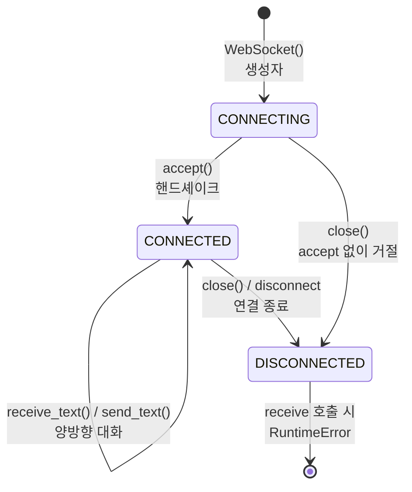

> 기준: Starlette 0.27.0

## 핵심개념
- WebSocket = HTTP와 동일하게 `scope` + `receive` + `send` 3인자를 감싼 **래퍼**
  - 차이점 → HTTP는 요청·응답 1회성, WebSocket은 **연결 유지 + 양방향 스트림**
- 전화 통화 비유
  - **핸드셰이크** → 수화기 들고 연결 (`accept`)
  - **대화** → 양쪽이 자유롭게 말하기 (`receive` / `send`)
  - **끊기** → 한쪽이 수화기 내려놓기 (`close` / `disconnect`)
- 핵심 = **두 개의 상태 머신**으로 잘못된 순서의 메시지 차단

| 개념 | 설명 |
|------|------|
| `WebSocketState` | `CONNECTING` → `CONNECTED` → `DISCONNECTED` 3단계 enum |
| `client_state` | 클라이언트→앱 방향 상태 (`receive`가 추적) |
| `application_state` | 앱→클라이언트 방향 상태 (`send`가 추적) |
| `accept` | `websocket.accept` 송신 → 핸드셰이크 완료 |

---

## FastAPI 연결
- `@app.websocket` 데코레이터로 핸들러 등록 → 인자로 `WebSocket` 객체 주입
- 반드시 `accept()` 먼저 → 이후 송수신 가능

```python
from fastapi import FastAPI, WebSocket

app = FastAPI()

@app.websocket("/ws")
async def echo(ws: WebSocket):
    await ws.accept()              # 핸드셰이크
    while True:
        data = await ws.receive_text()   # 수신
        await ws.send_text(f"echo: {data}")  # 송신
```

---

## 소스 분석
### 1. 생성자 — scope 검증 + 두 상태 초기화
```python
class WebSocket(HTTPConnection):
    def __init__(self, scope, receive, send):
        super().__init__(scope)
        assert scope["type"] == "websocket"   # http 아님
        self._receive = receive
        self._send = send
        self.client_state = WebSocketState.CONNECTING
        self.application_state = WebSocketState.CONNECTING
```
- `HTTPConnection` 상속 → `scope` 기반 url·headers 접근은 HTTP와 공유
- 단방향 상태 1개가 아니라 **방향별 2개** 유지가 포인트

### 2. `receive` — 상태별 허용 메시지 타입 검증
```python
async def receive(self):
    if self.client_state == WebSocketState.CONNECTING:
        message = await self._receive()
        if message["type"] != "websocket.connect":
            raise RuntimeError('Expected ASGI message "websocket.connect", ...')
        self.client_state = WebSocketState.CONNECTED   # 상태 전이
        return message
    elif self.client_state == WebSocketState.CONNECTED:
        message = await self._receive()
        if message["type"] not in {"websocket.receive", "websocket.disconnect"}:
            raise RuntimeError(...)
        if message["type"] == "websocket.disconnect":
            self.client_state = WebSocketState.DISCONNECTED
        return message
    else:
        raise RuntimeError('Cannot call "receive" once a disconnect ...')
```
- `CONNECTING` 상태 → 오직 `websocket.connect`만 허용
- `CONNECTED` 상태 → `websocket.receive` / `websocket.disconnect`만 허용
- `DISCONNECTED` 이후 `receive` 호출 → 즉시 `RuntimeError`

### 3. `send` — 송신 방향도 동일 패턴
```python
async def send(self, message):
    if self.application_state == WebSocketState.CONNECTING:
        if message["type"] not in {"websocket.accept", "websocket.close"}:
            raise RuntimeError(...)
        # accept면 CONNECTED, close면 DISCONNECTED 전이
    elif self.application_state == WebSocketState.CONNECTED:
        if message["type"] not in {"websocket.send", "websocket.close"}:
            raise RuntimeError(...)
```
- 연결 전 → `accept` 또는 `close`만 가능 (아직 `send` 불가)
- 그래서 `accept()`는 결국 `send({"type": "websocket.accept", ...})` 한 줄

### 4. `receive_text` / `receive_json` — accept 검증 + disconnect 변환
```python
async def receive_text(self):
    if self.application_state != WebSocketState.CONNECTED:
        raise RuntimeError('WebSocket is not connected. Need to call "accept" first.')
    message = await self.receive()
    self._raise_on_disconnect(message)   # disconnect면 WebSocketDisconnect 발생
    return message["text"]
```
- `accept` 안 했으면 `application_state`가 `CONNECTED`가 아니라서 바로 차단
- `_raise_on_disconnect` → `websocket.disconnect` 수신 시 `WebSocketDisconnect` 예외로 변환
- `receive_json`은 동일 흐름 + `json.loads(text)`

---

## 동작 흐름
- `accept` 전후로 두 상태가 어떻게 전이되는지



<Stepper>
<StepperItem title="1️⃣ 연결 (Handshake)">
- 클라이언트 → `websocket.connect` 전송
- 앱 → `accept()` 호출 → `websocket.accept` 송신
- `client_state` / `application_state` 모두 `CONNECTED`로 전이
- accept 누락 시 → `receive_text` 단계에서 `RuntimeError`
</StepperItem>
<StepperItem title="2️⃣ 송수신 (Stream)">
- `receive_text` / `receive_json` → 클라이언트 메시지 읽기
- `send_text` / `send_json` → 클라이언트로 응답
- `CONNECTED` 상태가 유지되는 한 무한 반복 가능
</StepperItem>
<StepperItem title="3️⃣ 종료 (Close)">
- 앱이 먼저 → `close(code)` 호출 → `DISCONNECTED` 전이
- 클라이언트가 먼저 → `websocket.disconnect` 수신 → `WebSocketDisconnect` 예외
- 이후 `receive` / `send` 호출 → 모두 `RuntimeError`
</StepperItem>
</Stepper>

---

## WebSocketEndpoint — 콜백 기반 추상화
- 저수준 루프를 직접 짜는 대신 콜백 3개만 오버라이드
- `encoding` 속성 → `"text"` / `"bytes"` / `"json"` 자동 디코딩

```python
class WebSocketEndpoint:
    encoding = None   # "text" | "bytes" | "json"

    async def dispatch(self):
        websocket = WebSocket(self.scope, receive=self.receive, send=self.send)
        await self.on_connect(websocket)        # 1. 연결
        close_code = status.WS_1000_NORMAL_CLOSURE
        try:
            while True:
                message = await websocket.receive()
                if message["type"] == "websocket.receive":
                    data = await self.decode(websocket, message)
                    await self.on_receive(websocket, data)   # 2. 메시지마다
                elif message["type"] == "websocket.disconnect":
                    close_code = int(message.get("code") or ...)
                    break
        finally:
            await self.on_disconnect(websocket, close_code)   # 3. 종료 보장
```
- `on_connect` 기본 구현 → `await websocket.accept()` (오버라이드 시 직접 accept 필요)
- `on_disconnect` → `finally` 블록 → 예외가 나도 **항상 호출**
- `decode` → `encoding="json"`인데 파싱 실패 시 `WS_1003_UNSUPPORTED_DATA`로 close

| 콜백 | 호출 시점 | 기본 동작 |
|------|----------|----------|
| `on_connect(ws)` | 연결 직후 | `await ws.accept()` |
| `on_receive(ws, data)` | 메시지 수신마다 | 비어 있음 (오버라이드용) |
| `on_disconnect(ws, code)` | 종료 시 (finally) | 비어 있음 |

---

## 함정
<Note type="warning">
**accept 누락** — `accept()` 없이 `receive_text()` / `send_text()` 호출 시 `application_state`가 `CONNECTED`가 아니라 `RuntimeError: WebSocket is not connected. Need to call "accept" first.` 발생
</Note>

<Note type="danger">
**상태 위반** — `DISCONNECTED` 이후 `receive` / `send` 호출 → `RuntimeError` · close를 보낸 뒤 다시 `send_text` 같은 실수가 대표적
</Note>

<Note type="info">
`WebSocketEndpoint`에서 `on_connect`를 오버라이드하면 기본 `accept()`가 사라짐 → 직접 `await websocket.accept()` 호출 필수
</Note>

<Note type="info">
클라이언트 측 종료는 예외(`WebSocketDisconnect`)로 전달됨 → `@app.websocket` 핸들러의 `while True` 루프는 `try/except WebSocketDisconnect`로 감싸야 안전
</Note>
