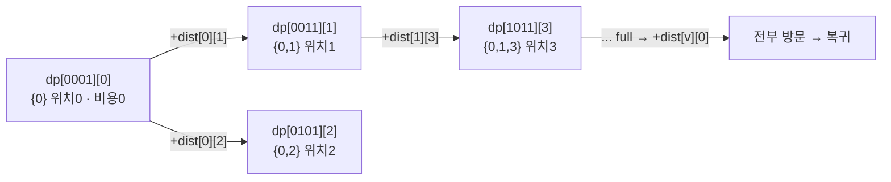

- 작은 집합의 상태를 정수 한 개의 비트로 압축해 DP 상태에 욱여넣기
- 대표 → 외판원 문제(TSP) · 상태 = (방문한 도시 집합, 현재 도시)
- 집합 크기 N 작을 때만 실용 → 상태 수 2ⁿ × N

## 택배 최단 순회 · 방문한 곳을 비트로 기억

- 택배 기사 → 모든 집 한 번씩 들르고 출발지 복귀하는 최단 경로
- "어디어디 들렀나" 를 비트 N자리 정수로 기록 → `1011` = 0,1,3번 방문
- 같은 (방문집합, 현재위치) 상태면 이전에 어떤 순서로 왔든 미래 최적 동일 → DP

<KeyPoint title="비유에서 가져갈 것">
방문 집합을 정수 비트로 표현 → `mask & (1<<i)` 로 방문 확인 ·
`mask | (1<<i)` 로 방문 추가 → 상태 dp[mask][cur] 로 중복 계산 제거
</KeyPoint>

<Stats>
<Stat value="2ⁿ·N" label="상태 수" sub="마스크 × 현재위치" />
<Stat value="O(2ⁿ·N²)" label="TSP 시간" sub="전이까지 포함" />
<Stat value="N ≤ 20" label="실용 한계" sub="그 이상 폭발" />
</Stats>

## 비트 연산 기본기

| 연산 | 의미 | 식 |
| --- | --- | --- |
| i번 방문? | i번째 비트 켜짐 | `mask & (1 << i)` |
| i번 추가 | i번째 비트 set | `mask \| (1 << i)` |
| i번 제거 | i번째 비트 clear | `mask & ~(1 << i)` |
| 전체 방문 | 비트 N개 다 켜짐 | `mask == (1 << n) - 1` |
| 켜진 비트 수 | popcount | `bin(mask).count('1')` |

<Note type="note" title="마스크 = 부분집합 인코딩">
- N비트 정수 한 개 → 원소 N개 집합의 부분집합 하나
- 정수 0 ~ 2ⁿ-1 순회 → 모든 부분집합 열거
- 작은 마스크 → 작은 집합 → 보통 먼저 채워야 할 부분문제
</Note>

## TSP — 상태 채우는 과정

- 도시 4개(0~3) · 0번 출발 → 모두 방문 → 0번 복귀 최소 거리
- `dp[mask][u]` → mask 도시들을 방문했고 현재 u에 있을 때 최소 비용
- 기저 → `dp[1][0] = 0` (0번만 방문, 0번 위치)

| mask(이진) | 방문 집합 | 의미 |
| --- | --- | --- |
| `0001` | {0} | 출발만 · 기저 |
| `0011` | {0,1} | 0→1 이동 후 |
| `0111` | {0,1,2} | 세 도시 방문 |
| `1111` | {0,1,2,3} | 전부 방문 → 복귀 계산 |

- 전이 → `dp[mask|(1<<v)][v] = min(..., dp[mask][u] + dist[u][v])`
- 답 → `min( dp[full][v] + dist[v][0] )` → 마지막 도시 v 에서 출발지 복귀



## TSP 구현

```python
def tsp(dist):                     # dist[i][j] 거리 행렬, 0번 출발/복귀
    n = len(dist)
    INF = float('inf')
    dp = [[INF] * n for _ in range(1 << n)]
    dp[1][0] = 0                   # {0}만 방문, 위치 0
    for mask in range(1 << n):     # 작은 마스크부터 → 부분문제 선행
        for u in range(n):
            if dp[mask][u] == INF:
                continue
            if not (mask & (1 << u)):   # u 미방문 상태면 무효
                continue
            for v in range(n):
                if mask & (1 << v):     # 이미 방문 → skip
                    continue
                nm = mask | (1 << v)
                dp[nm][v] = min(dp[nm][v], dp[mask][u] + dist[u][v])
    full = (1 << n) - 1
    return min(dp[full][v] + dist[v][0] for v in range(1, n))
# 시간 O(2^N · N²) · 공간 O(2^N · N)
```

<Note type="warning" title="간선 없을 때·복귀 불가">
- dist[u][v] 가 0 또는 음수로 "간선 없음" 을 인코딩하면 별도 INF 분기
- 마지막 dp[full][v] 가 INF 면 그 v 로 끝나는 경로 없음 → min 에서 자연 배제
- 출발지로 복귀 못 하면(dist[v][0] 없음) 그 항 INF
</Note>

## 메모이제이션 버전 — 필요한 상태만

- 도달 가능한 상태만 방문 → 희소한 경우 더 빠름
- top-down 재귀 + 캐시 → 코드 직관적

```python
from functools import lru_cache

def tsp_memo(dist):
    n = len(dist)
    full = (1 << n) - 1
    @lru_cache(maxsize=None)
    def go(mask, u):               # u에서 시작, mask 미방문 도시 남음
        if mask == 0:
            return dist[u][0]      # 다 돌았으면 출발지 복귀
        best = float('inf')
        v = 0
        while v < n:
            if mask & (1 << v):
                best = min(best, dist[u][v] + go(mask & ~(1 << v), v))
            v += 1
        return best
    start_mask = full & ~1         # 0번 제외한 나머지
    return go(start_mask, 0)
# 시간 O(2^N · N²) · 공간 캐시 O(2^N · N)
```

<Compare>
<CompareCol title="타뷸레이션" subtitle="Bottom-Up 마스크 순회" color="sky">
- 0→2ⁿ-1 정수 순회 → 작은 마스크 선행
- 모든 상태 채움 · 루프 단순
- 캐시 미스 없음 · 상수 빠름
</CompareCol>
<CompareCol title="메모이제이션" subtitle="Top-Down 재귀" color="green">
- 도달 가능한 상태만 계산
- 희소 그래프·제약 많을 때 유리
- 재귀 + 캐시 → 직관적 · 깊이 주의
</CompareCol>
</Compare>

## 다른 비트마스크 DP 예

- **작업 할당** → N명에 N작업 1:1 배정 비용 최소 · `dp[mask]` = 처리한 작업 집합
- **집합 분할/커버** → 원소 집합을 그룹으로 나누는 최적 분할
- **부분집합 합 DP** → `dp[mask]` 에 켜진 원소들의 합 누적

```python
def assignment(cost):              # cost[i][j] = i번째 사람이 j작업 비용
    n = len(cost)
    INF = float('inf')
    dp = [INF] * (1 << n)
    dp[0] = 0
    for mask in range(1 << n):
        i = bin(mask).count('1')   # 다음 배정할 사람 인덱스
        if i >= n:
            continue
        for j in range(n):
            if not (mask & (1 << j)):       # j작업 미배정
                nm = mask | (1 << j)
                dp[nm] = min(dp[nm], dp[mask] + cost[i][j])
    return dp[(1 << n) - 1]
# 시간 O(2^N · N) · 공간 O(2^N)
```

## 대표 문제

<Cards cols={2}>
<Card icon="🚚" title="백준 2098 외판원 순회">
- TSP 정석 · dp[mask][cur]
- N ≤ 16 → 2¹⁶·16² 통과
</Card>
<Card icon="👥" title="백준 1102 발전소">
- 켜진 발전소 집합을 마스크로 · 비용 최소
</Card>
<Card icon="🧩" title="백준 1014 컨닝">
- 행 단위 비트마스크 DP · 인접 제약
</Card>
<Card icon="📋" title="백준 14391 종이 조각">
- 비트로 가로/세로 분할 상태 표현
</Card>
</Cards>

<Note type="pink" title="최적화 트레이드오프">
- N ≤ 20 정도까지만 실용 → 2²⁰ ≈ 100만 상태 · 그 이상은 메모리·시간 폭발
- 상태 폭발 시 → 분기한정·근사(2-opt)·MST 기반 휴리스틱 고려
- 부분집합 순회 필요하면 `sub = (sub-1) & mask` 트릭으로 O(3ⁿ) 전체 부분집합쌍 열거
- popcount 반복 호출 비싸면 → 미리 배열에 캐시
- 타뷸레이션이 캐시 친화적·상수 빠름 · 도달 상태 희소하면 메모이제이션
</Note>
