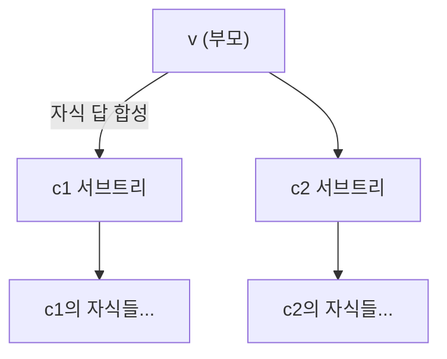

- 구간 DP → 작은 구간의 답을 합쳐 큰 구간으로 · 분할점을 모두 시도
- 트리 DP → 자식 서브트리 답을 부모에서 합성 · 후위 순회로 아래에서 위로
- 둘 다 "부분 구조의 답을 모아 전체 답" 이라는 DP 본질을 구조 위에 얹은 것

## 작은 조각부터 합치며 비용 최소로

- **구간 DP** → 종이 띠를 자르고 붙이는 비용 · 어디서 나누느냐로 총비용 달라짐
- **트리 DP** → 조직도에서 부서별 합계를 잎부터 올려 사장까지 누적
- 공통 → "전체를 한 번에" 가 아니라 "작은 부분 답을 모아 합성"

<KeyPoint title="비유에서 가져갈 것">
구간 DP = "구간 [i,j] 최적값" 을 길이 짧은 것부터 채우고 분할점 k 전부 시도 ·
트리 DP = "노드 v의 서브트리 답" 을 자식 답에서 합성 → 후위 순회
</KeyPoint>

## 행렬 연쇄곱 — 구간 DP 표 채우기

- 곱셈 순서(괄호 위치)에 따라 연산 횟수 크게 차이 · 결과는 같음
- 차원 `p = [10, 20, 5, 30]` → 행렬 A(10×20)·B(20×5)·C(5×30)
- `dp[i][j]` → i..j 행렬을 곱하는 최소 곱셈 횟수

| 분할 | 계산 | 곱셈 횟수 |
| --- | --- | --- |
| (AB)C | 10·20·5 + 10·5·30 = 1000+1500 | **2500** |
| A(BC) | 20·5·30 + 10·20·30 = 3000+6000 | 9000 |

- 같은 결과인데 순서만으로 2500 vs 9000 → 구간 DP 로 최소 탐색
- `dp[i][j] = min_k( dp[i][k] + dp[k+1][j] + p[i-1]·p[k]·p[j] )`

<Timeline>
<TimelineItem title="1. 길이 1 구간">
행렬 하나 → 곱셈 0 · 대각선 dp[i][i]=0 기저
</TimelineItem>
<TimelineItem title="2. 길이 2부터 증가">
짧은 구간이 먼저 채워져야 긴 구간이 참조 가능
</TimelineItem>
<TimelineItem title="3. 분할점 k 전부 시도">
`i ≤ k < j` 모든 지점에서 좌·우 구간 합 + 합치는 비용 min
</TimelineItem>
<TimelineItem title="4. dp[1][n] 정답">
전체 구간 최소 비용 → 우상단 칸
</TimelineItem>
</Timeline>

```python
def matrix_chain(p):               # p: 차원 배열, 행렬 n개면 길이 n+1
    n = len(p) - 1
    dp = [[0] * (n + 1) for _ in range(n + 1)]
    for length in range(2, n + 1):         # 구간 길이 짧은 것부터
        for i in range(1, n - length + 2):
            j = i + length - 1
            dp[i][j] = float('inf')
            for k in range(i, j):           # 분할점 모두 시도
                cost = dp[i][k] + dp[k+1][j] + p[i-1]*p[k]*p[j]
                dp[i][j] = min(dp[i][j], cost)
    return dp[1][n]
# 시간 O(N³) · 공간 O(N²)
```

<Note type="note" title="구간 DP 채우는 순서가 핵심">
- 길이(length) 바깥 루프 → 짧은 구간이 항상 먼저 완성
- 시작점 i 안쪽 루프 → j 는 i+length-1 로 자동 결정
- 분할점 k → 두 부분구간이 이미 채워져 있어야 valid
</Note>

## 돌 합치기 — 같은 골격 변형

- 인접한 돌 더미를 합칠 때 두 더미 무게 합이 비용 · 전부 하나로 합치는 최소 비용
- 행렬 연쇄곱과 동일 구조 · 합치는 비용만 "구간 합" 으로 교체

```python
def merge_stones(w):               # w: 각 돌 무게
    n = len(w)
    prefix = [0] * (n + 1)
    for i in range(n):
        prefix[i+1] = prefix[i] + w[i]      # 구간 합 빠르게
    dp = [[0] * n for _ in range(n)]
    for length in range(2, n + 1):
        for i in range(n - length + 1):
            j = i + length - 1
            dp[i][j] = float('inf')
            seg = prefix[j+1] - prefix[i]    # 구간 [i,j] 합 = 합치는 비용
            for k in range(i, j):
                dp[i][j] = min(dp[i][j], dp[i][k] + dp[k+1][j] + seg)
    return dp[0][n-1]
# 시간 O(N³) · 공간 O(N²)
```

## 트리 DP — 서브트리 합성

- 트리의 각 노드에서 "그 서브트리의 답" 을 자식 답으로 조립
- 후위 순회(post-order) → 자식 먼저 계산 후 부모
- 상태가 "노드 선택/미선택" 2개면 `dp[v][0/1]` 형태



- 대표 예 → 트리에서 인접하지 않게 노드 골라 가중치 합 최대(트리 독립집합)
- `dp[v][0]` → v 안 뽑음 → 자식은 뽑든 안 뽑든 자유 → `sum(max(c0, c1))`
- `dp[v][1]` → v 뽑음 → 자식 못 뽑음 → `w[v] + sum(c0)`

```python
import sys
sys.setrecursionlimit(300000)

def tree_max_independent(adj, weight, root=0):
    dp = {}                        # dp[v] = (안뽑음 최선, 뽑음 최선)
    def dfs(v, parent):
        not_take, take = 0, weight[v]
        for c in adj[v]:
            if c == parent:
                continue
            c0, c1 = dfs(c, v)
            not_take += max(c0, c1)    # v 안뽑음 → 자식 자유
            take += c0                 # v 뽑음 → 자식 못뽑음
        dp[v] = (not_take, take)
        return dp[v]
    a, b = dfs(root, -1)
    return max(a, b)
# 시간 O(V) · 공간 O(V) (재귀 깊이 주의)
```

<Note type="warning" title="트리 DP 재귀 깊이">
- 노드 수십만이면 기본 재귀 한계 초과 → `setrecursionlimit` 상향 또는 명시적 스택
- 부모 인덱스 넘겨 역방향 재방문 차단 → 방문 배열 대체 가능
</Note>

## 구간 DP vs 트리 DP

<Compare>
<CompareCol title="구간 DP" subtitle="선형 구조 위" color="sky">
- 상태 `dp[i][j]` → 구간
- 길이 짧은 것부터 채움
- 분할점 k 전부 시도 → O(N³) 흔함
- 행렬곱·돌합치기·팰린드롬 분할
</CompareCol>
<CompareCol title="트리 DP" subtitle="트리 구조 위" color="green">
- 상태 `dp[v][상태]` → 서브트리
- 후위 순회로 자식→부모 합성
- 보통 O(V) ~ O(V·상태수)
- 트리 독립집합·트리 지름·서브트리 합
</CompareCol>
</Compare>

## 대표 문제

<Cards cols={2}>
<Card icon="✖️" title="백준 11049 행렬 곱셈 순서">
- 구간 DP 정석 · 최소 곱셈 횟수
- 오버플로 주의(큰 정수)
</Card>
<Card icon="🪨" title="백준 11066 파일 합치기">
- 돌 합치기형 · 구간 합 prefix
- O(N³), Knuth 최적화로 O(N²) 가능
</Card>
<Card icon="🌳" title="백준 2533 사회망 서비스(SNS)">
- 트리 DP · 최소 얼리어답터(지배집합형)
</Card>
<Card icon="🏠" title="백준 1949 우수 마을">
- 트리 독립집합 변형 · dp[v][0/1]
</Card>
</Cards>

<Note type="pink" title="최적화 트레이드오프">
- 구간 DP O(N³) → 사각부등식 성립 시 Knuth optimization 으로 O(N²) 단축
- 구간 합 반복 계산 → prefix sum 으로 상수 시간화 필수
- 트리 DP → 자식 상태 조합이 많으면 그룹 단위 그리디·합성으로 차수 관리
- 트리가 매우 깊으면 재귀 → 명시 스택 또는 작은 서브트리 먼저 합치는 small-to-large
</Note>
