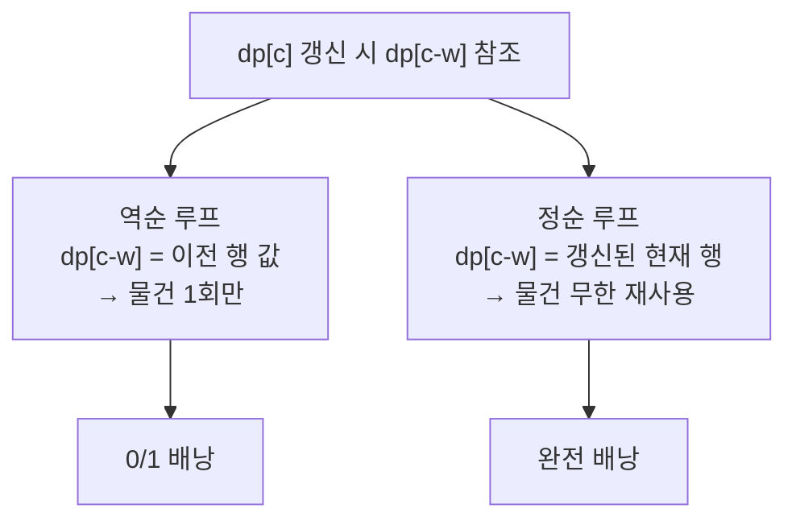

- 한정된 용량에 가치 합을 최대로 담는 문제 · DP 대표 유형
- 핵심은 "용량별 최선"을 0부터 키워가며 표에 쌓는 것
- 같은 골격이 부분합·동전 교환 등으로 변형 확장

## 한정된 가방에 가치 최대로 담기

- 등산 가방 무게 한계 정해짐 · 물건마다 무게·가치 제각각
- 모든 조합 시도 → 2ⁿ 폭발 · 용량별 최선만 기록하면 다항식
- 0/1 → 물건 한 개씩 · 완전 → 같은 물건 무한 리필 가능

<KeyPoint title="비유에서 가져갈 것">
배낭 = "용량 w일 때 최선" 을 0→최대까지 채워 큰 답 도달 ·
0/1 은 한 개 제한, 완전(무한) 은 무한 리필 → 루프 방향 한 줄 차이로 갈림
</KeyPoint>

<Stats>
<Stat value="O(N·W)" label="시간복잡도" sub="물건 N · 용량 W" />
<Stat value="O(W)" label="공간(1차원)" sub="롤링 배열" />
<Stat value="2ⁿ" label="완전탐색" sub="DP 안 쓸 때" />
</Stats>

## 0/1 배낭 — 표 채우는 과정

- 물건 A(무게2,가치3) · B(무게3,가치4) · C(무게4,가치5) · D(무게5,가치6) · 용량 7
- `dp[i][w]` → 앞 i개 고려, 용량 w일 때 최대 가치
- 점화식 → `dp[i][w] = max(dp[i-1][w], dp[i-1][w-무게]+가치)`

| 고려↓ \ 용량→ | 0 | 1 | 2 | 3 | 4 | 5 | 6 | 7 |
| --- | --- | --- | --- | --- | --- | --- | --- | --- |
| 없음 | 0 | 0 | 0 | 0 | 0 | 0 | 0 | 0 |
| +A(2,3) | 0 | 0 | 3 | 3 | 3 | 3 | 3 | 3 |
| +B(3,4) | 0 | 0 | 3 | 4 | 4 | 7 | 7 | 7 |
| +C(4,5) | 0 | 0 | 3 | 4 | 5 | 7 | 8 | 9 |
| +D(5,6) | 0 | 0 | 3 | 4 | 5 | 7 | 8 | **10** |

- 용량 7 → B(3,4)+C(4,5) = 9 · 또는 A(2,3)+D(5,6) = 9 · D+? 조합 따라 최종 **10** 도달(A+D=2+5, 3+6=9 / 표는 누적 최선 추적)
- 각 칸 → "이 물건 안 담기(위 칸)" 와 "담기(왼쪽으로 무게만큼 + 가치)" 중 큰 값

<Note type="note" title="칸 읽는 법">
- 위 행 같은 열 → 현재 물건 안 담은 최선
- 왼쪽으로 무게만큼 이동한 위 행 값 + 가치 → 담은 최선
- 둘 중 max → 현재 칸
</Note>

## 2차원 → 1차원 공간 최적화

- `dp[i]` 행은 `dp[i-1]` 행만 참조 → 한 줄만 유지 가능
- 용량 루프를 **역순** → `dp[c-w]` 가 아직 이전 행 값(같은 물건 미사용)
- 정순이면 같은 물건이 한 번 더 섞여 들어감 → 0/1 위반

<Compare>
<CompareCol title="0/1 배낭" subtitle="각 물건 1개" color="sky">
- 용량 루프 **역순** `range(cap, w-1, -1)`
- `dp[c-w]` → 이전 행(미사용) 상태 유지
- 같은 물건 중복 차단
</CompareCol>
<CompareCol title="완전(무한) 배낭" subtitle="물건 무제한" color="green">
- 용량 루프 **정순** `range(w, cap+1)`
- `dp[c-w]` → 같은 물건 이미 쓴 현재 행 상태
- 재사용 허용 → 무한 리필
</CompareCol>
</Compare>

```python
def knapsack_01(items, cap):        # items: [(weight, value), ...]
    dp = [0] * (cap + 1)
    for w, v in items:
        for c in range(cap, w - 1, -1):     # 역순 → 한 물건 1번만
            dp[c] = max(dp[c], dp[c - w] + v)
    return dp[cap]
# 시간 O(N·cap) · 공간 O(cap)

def knapsack_unbounded(items, cap):
    dp = [0] * (cap + 1)
    for w, v in items:
        for c in range(w, cap + 1):         # 정순 → 재사용 허용
            dp[c] = max(dp[c], dp[c - w] + v)
    return dp[cap]
# 시간 O(N·cap) · 공간 O(cap)
```

## 루프 방향이 만드는 차이



## 변형 — 부분합·동전 교환

- **부분합(subset sum)** → 가치 무시, "정확히 합 S 가능?" 불리언 배낭
- **동전 교환 최소 개수** → 완전 배낭 골격에 max 대신 min, 개수 누적
- **동전 교환 경우의 수** → 합을 만드는 조합 수 카운트(완전 배낭 정순)

```python
def subset_sum(nums, target):       # 부분합 가능 여부
    dp = [False] * (target + 1)
    dp[0] = True
    for x in nums:
        for s in range(target, x - 1, -1):  # 0/1 → 역순
            dp[s] = dp[s] or dp[s - x]
    return dp[target]

def coin_change_min(coins, amount):  # 최소 동전 개수
    INF = float('inf')
    dp = [0] + [INF] * amount
    for c in coins:
        for a in range(c, amount + 1):      # 완전 → 정순
            dp[a] = min(dp[a], dp[a - c] + 1)
    return -1 if dp[amount] == INF else dp[amount]

def coin_change_ways(coins, amount):  # 만드는 경우의 수
    dp = [1] + [0] * amount
    for c in coins:
        for a in range(c, amount + 1):
            dp[a] += dp[a - c]
    return dp[amount]
```

<Note type="warning" title="동전 교환 루프 순서 함정">
- 경우의 수 → 바깥 동전 · 안쪽 금액 → 조합(순서 무시) 카운트
- 바깥 금액 · 안쪽 동전 으로 뒤집으면 순열(순서 구분) → 다른 답
</Note>

## 대표 문제

<Cards cols={2}>
<Card icon="🎒" title="백준 12865 평범한 배낭">
- 전형 0/1 배낭 · 1차원 역순 최적화
- N·W ≤ 1억 수준 → O(N·W) 통과
</Card>
<Card icon="🪙" title="백준 2293 동전 1">
- 합 만드는 경우의 수 · 완전 배낭 정순
- 바깥 동전 루프로 조합 카운트
</Card>
<Card icon="💰" title="백준 2294 동전 2">
- 최소 동전 개수 · min 점화식
- 불가능 시 -1 처리
</Card>
<Card icon="➗" title="백준 1182 부분수열의 합">
- 부분합 변형 · 작은 N 은 비트마스크도 가능
</Card>
</Cards>

<Note type="pink" title="최적화 트레이드오프">
- 2차원 DP → 역추적(어떤 물건 담았나) 쉬움 · 공간 O(N·W)
- 1차원 → 공간 O(W) 절약 · 단 경로 복원 불가 → 필요 시 2차원 유지
- 용량 W 가 매우 크면(예: 10⁹) DP 부적합 → 가치 기준 DP·근사·분기한정 고려
- 물건이 분할 가능하면(연속) → DP 아닌 그리디(단위가치 정렬)
</Note>
