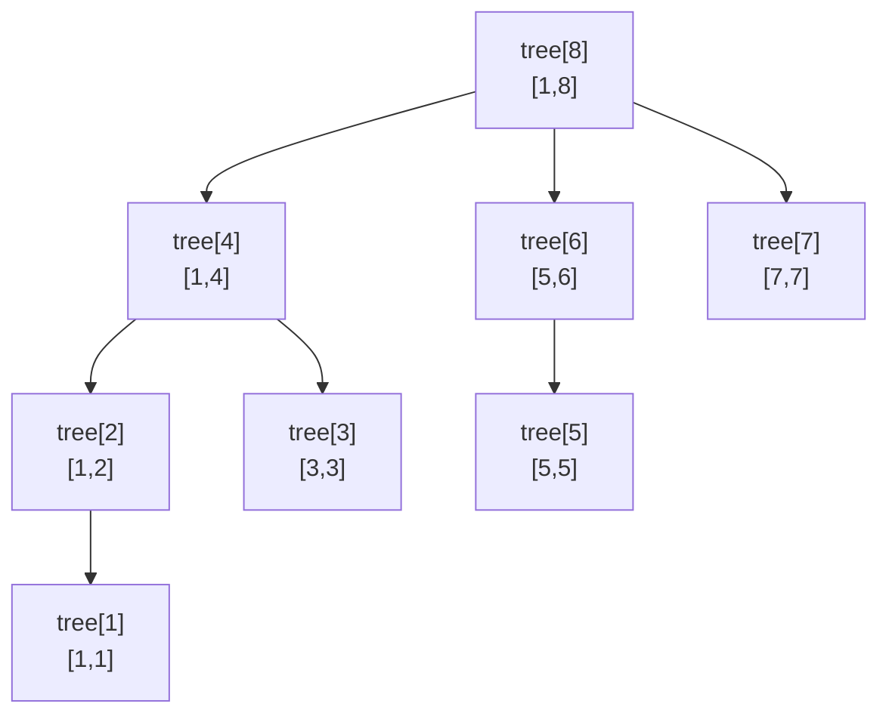

- **펜윅 트리(Fenwick Tree, Binary Indexed Tree)** → 누적합 질의와 점 갱신을 둘 다 O(log n)
- 핵심 → 인덱스를 이진수로 보고 **마지막 켜진 비트** 단위로 구간을 묶음
- 트레이드오프 → 세그먼트 트리와 같은 O(log n)이지만 코드가 훨씬 짧고 상수가 작음 · 대신 합·xor 같은 가역 연산에 주로 적합

## 눈금자 비트 점프로 보는 펜윅 트리

- 자(눈금자) 위에서 위치를 옮길 때 → 1cm·2cm·4cm·8cm 같은 2의 거듭제곱 단위로 점프
- "처음부터 13까지 합" → `13 → 12 → 8 → 0` 처럼 켜진 비트를 하나씩 떼며 큰 구간 결과를 모음
- 각 노드는 "자기 인덱스 바로 아래 2의 거듭제곱 길이 구간"의 합만 담당
- 비트 한 칸씩 점프하니 13까지 가도 3~4번이면 끝 → O(log n)

<KeyPoint title="이 비유에서 가져갈 것">
펜윅 트리 = 인덱스의 이진 비트를 단위로 구간을 나눠 저장 ·
누적합은 켜진 비트를 떼며 합산 · 갱신은 비트를 더하며 올라감 · 둘 다 O(log n) · 세그트리보다 간결
</KeyPoint>

## 핵심 연산 `i & -i`

- `i & -i` → i의 **최하위 켜진 비트(LSB)** · 펜윅의 모든 점프가 이 한 줄로 결정
- 누적합 → `i -= i & -i` 반복 (켜진 비트 제거하며 왼쪽으로)
- 갱신 → `i += i & -i` 반복 (켜진 비트 더하며 오른쪽 부모로)

| i | 이진수 | `i & -i` | 담당 구간 길이 |
| --- | --- | --- | --- |
| 1 | 0001 | 1 | 1 → [1,1] |
| 2 | 0010 | 2 | 2 → [1,2] |
| 4 | 0100 | 4 | 4 → [1,4] |
| 6 | 0110 | 2 | 2 → [5,6] |
| 8 | 1000 | 8 | 8 → [1,8] |
| 12 | 1100 | 4 | 4 → [9,12] |

## 트리 구조와 담당 구간 시각화

- 1-indexed 배열 위 · 각 노드 `tree[i]`가 덮는 원본 구간 길이 = `i & -i`



- `sum(1..7)` → `tree[7] + tree[6] + tree[4]` (7→6→4→0 비트 떼기) → 세 노드만 더함
- `update(5, +k)` → `tree[5] → tree[6] → tree[8]` (5→6→8 비트 더하기) → 세 노드만 수정

## 누적합 질의 단계 (1..13)

| 단계 | i | 이진수 | 동작 | 누적 |
| --- | --- | --- | --- | --- |
| 1 | 13 | 1101 | `tree[13]` 더함 | + [13,13] |
| 2 | 12 | 1100 | `tree[12]` 더함 | + [9,12] |
| 3 | 8 | 1000 | `tree[8]` 더함 | + [1,8] |
| 4 | 0 | 0000 | 종료 | 합 완성 |

- 13 → 12 → 8 → 0 · 켜진 비트 3개 → 3번 합산 → O(log n)

## Python 구현

```python
class Fenwick:
    def __init__(self, n):
        self.n = n
        self.tree = [0] * (n + 1)        # 1-indexed

    def update(self, i, delta):          # i 위치에 delta 더하기 O(log n)
        while i <= self.n:
            self.tree[i] += delta
            i += i & -i                  # 부모로 점프

    def prefix(self, i):                 # 1..i 누적합 O(log n)
        s = 0
        while i > 0:
            s += self.tree[i]
            i -= i & -i                  # 켜진 비트 제거
        return s

    def range_sum(self, l, r):           # [l, r] 구간 합
        return self.prefix(r) - self.prefix(l - 1)


def build(data):                          # data는 1-indexed 가정 O(n log n)
    fw = Fenwick(len(data) - 1)
    for i in range(1, len(data)):
        fw.update(i, data[i])
    return fw
# 구간 합은 두 누적합의 차 · 점 갱신은 delta(증분)로
```

<Stats>
<Stat value="O(n log n)" label="구축" sub="update 반복" />
<Stat value="O(log n)" label="누적합 질의" sub="비트 떼기" />
<Stat value="O(log n)" label="점 갱신" sub="비트 더하기" />
<Stat value="n+1" label="공간" sub="배열 한 개" />
</Stats>

## 세그먼트 트리 vs 펜윅 트리

<Compare>
<CompareCol title="세그먼트 트리" subtitle="범용 구간 연산" color="amber">
- 합·min·max·gcd 등 결합 연산 일반화
- lazy로 구간 갱신까지
- 코드 길고 노드 ~2n
- 비가역 연산(min/max)도 OK
</CompareCol>
<CompareCol title="펜윅 트리 (BIT)" subtitle="누적합 특화" color="green">
- 합·xor 등 가역 연산에 적합
- 배열 한 개·코드 10줄 안팎
- 상수 작아 실측 빠름
- min/max는 기본형으로 어려움
</CompareCol>
</Compare>

<ProsCons>
<Pros title="펜윅이 유리할 때">
- 연산이 합·xor처럼 역연산 존재
- 코드 짧고 메모리 빠듯한 경우
- 누적합·역수 카운팅(inversion count)
</Pros>
<Cons title="펜윅이 불리할 때">
- 구간 최솟값·최댓값 질의
- 구간 전체 갱신(lazy 필요)
- 복잡한 결합 연산 → 세그트리로
</Cons>
</ProsCons>

## 대표 문제

<Cards cols={2}>
<Card icon="📝" title="백준 2042 구간 합 구하기">
점 갱신 + 구간 합 · 펜윅 정석 적용
</Card>
<Card icon="🔁" title="백준 1517 버블 소트">
inversion count · 펜윅으로 O(n log n)
</Card>
<Card icon="✖️" title="백준 1655 가운데를 말해요">
순서 통계 · 펜윅/세그트리 응용
</Card>
<Card icon="🔢" title="LeetCode 315 Count of Smaller Numbers After Self">
좌표 압축 + 펜윅 누적 카운트
</Card>
</Cards>

<Note type="tip" title="2D·구간 갱신 확장">
펜윅은 2차원(`update`·`prefix` 중첩)으로 확장 가능 · 차분 배열 기법 더하면 구간 갱신+점 질의도 처리 ·
다만 구간 갱신+구간 질의 둘 다 잦으면 lazy 세그트리가 더 깔끔
</Note>
