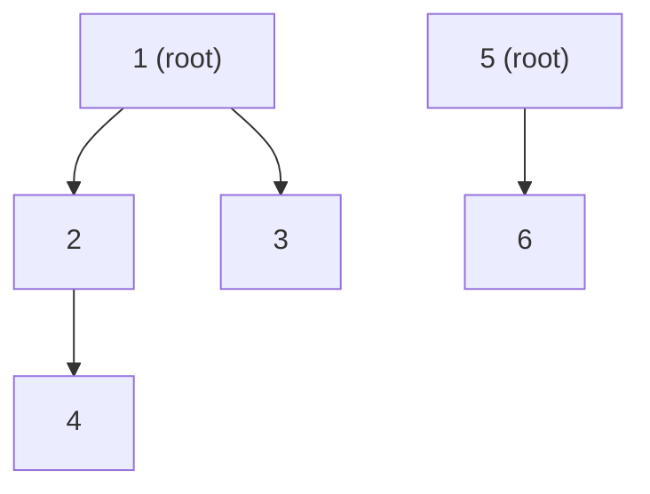
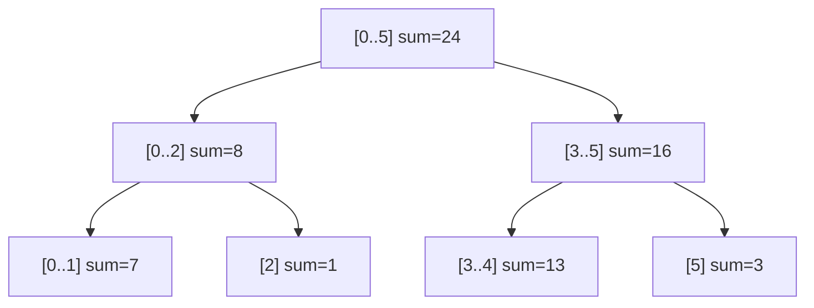

- **고급 자료구조** → "특정 연산을 빠르게" 하려고 데이터를 특수하게 배치
- 그룹 묶기·합치기 → 유니온파인드 · 구간 합/최솟값 갱신 → 세그먼트/펜윅 트리
- 최근 쓴 것 빨리 찾고 오래된 것 버리기 → LRU 캐시

## 친구의 친구는 같은 그룹

- A-B 친구 · B-C 친구 → A·B·C는 한 무리 · "A와 D가 같은 무리인가?" 빠르게 판정
- 각 무리의 **대표(root)**를 정해두고 "대표가 같으면 같은 그룹"으로 판단
- 이게 **유니온파인드(Disjoint Set Union)** · 연결 여부 판정의 핵심 도구

<KeyPoint title="이 비유에서 가져갈 것">
고급 자료구조 = "자주 하는 연산을 빠르게 하려고 모양을 바꾼 것" ·
DSU는 그룹 대표로 연결 판정 · 세그/펜윅은 트리로 구간 연산 가속 · LRU는 순서 추적으로 만료 결정
</KeyPoint>

## 자료구조 한눈에

<Cards cols={2}>
<Card icon="🤝" title="유니온파인드 (DSU)">
원소 그룹 합치기·같은 그룹인지 판정 · 거의 O(1)
</Card>
<Card icon="🌳" title="세그먼트 트리">
구간 합·최솟값·최댓값 + 점 갱신 · O(log N)
</Card>
<Card icon="📊" title="펜윅 트리 (BIT)">
구간 합 + 점 갱신 · 세그트리보다 가볍고 짧은 코드
</Card>
<Card icon="🗃️" title="LRU 캐시">
오래 안 쓴 항목부터 제거 · 해시맵+이중연결리스트로 O(1)
</Card>
</Cards>

## 유니온파인드 — 네트워크 연결 판정

- 두 노드가 같은 네트워크에 속하는가 · 사이클 탐지(크루스칼 MST에서 사용)
- 최적화 둘 → **경로 압축**(찾을 때 바로 루트에 붙임) · **랭크 합치기**(작은 트리를 큰 쪽에)
- 실무 → 네트워크 연결성·소셜 그룹·이미지 영역 묶기(연결 요소)



- 위 → `{1,2,3,4}` 한 그룹·`{5,6}` 다른 그룹 · `union(4,6)` 하면 두 트리 대표가 합쳐짐

```python
class DSU:
    def __init__(self, n):
        self.parent = list(range(n))
        self.rank = [0] * n

    def find(self, x):                 # 경로 압축
        while self.parent[x] != x:
            self.parent[x] = self.parent[self.parent[x]]
            x = self.parent[x]
        return x

    def union(self, a, b):             # 랭크 합치기
        ra, rb = self.find(a), self.find(b)
        if ra == rb:
            return False               # 이미 같은 그룹 → 합치면 사이클
        if self.rank[ra] < self.rank[rb]:
            ra, rb = rb, ra
        self.parent[rb] = ra
        if self.rank[ra] == self.rank[rb]:
            self.rank[ra] += 1
        return True
# find·union 거의 O(α(N)) ≈ O(1), α는 역아커만 함수
```

## 세그먼트 트리 — 구간 질의와 갱신

- 배열 `[2,5,1,4,9,3]`에서 "3~5번 구간 합" 같은 질의를 O(log N)에
- 단순 배열 → 구간 합 매번 O(N) · 누적합은 갱신이 O(N) → 둘 다 빠른 게 세그트리
- 트리 각 노드 = 한 구간의 집계값(합·최솟값 등) · 점 갱신 시 부모만 타고 올라가며 수정



```python
class SegTree:
    def __init__(self, data):
        self.n = len(data)
        self.tree = [0] * (2 * self.n)
        for i in range(self.n):        # 리프 채우기
            self.tree[self.n + i] = data[i]
        for i in range(self.n - 1, 0, -1):
            self.tree[i] = self.tree[2*i] + self.tree[2*i+1]

    def update(self, i, val):          # i번 값 변경
        i += self.n
        self.tree[i] = val
        while i > 1:
            i //= 2
            self.tree[i] = self.tree[2*i] + self.tree[2*i+1]

    def query(self, l, r):             # [l, r) 구간 합
        res = 0
        l += self.n; r += self.n
        while l < r:
            if l & 1:
                res += self.tree[l]; l += 1
            if r & 1:
                r -= 1; res += self.tree[r]
            l //= 2; r //= 2
        return res
# 구축 O(N) · 갱신·질의 O(log N)
```

## 펜윅 트리(BIT) — 가벼운 구간 합

- 세그트리보다 코드 짧고 메모리 적음 · 단, 합/누적 계열 연산에 특화
- 비트 연산 `i & -i`(최하위 1비트)로 책임 구간을 점프하며 누적
- 실무 → 누적 빈도·실시간 랭킹·구간 합 카운팅

```python
class Fenwick:
    def __init__(self, n):
        self.tree = [0] * (n + 1)      # 1-indexed

    def update(self, i, delta):        # i번에 delta 더함
        while i < len(self.tree):
            self.tree[i] += delta
            i += i & -i                # 다음 책임 구간으로
    def prefix(self, i):               # 1..i 누적 합
        s = 0
        while i > 0:
            s += self.tree[i]
            i -= i & -i                # 이전 책임 구간으로
        return s
    def range_sum(self, l, r):         # l..r 합
        return self.prefix(r) - self.prefix(l - 1)
# 갱신·질의 O(log N)
```

<Compare>
<CompareCol title="세그먼트 트리" subtitle="범용 구간 연산" color="sky">
- 합·최솟값·최댓값·GCD 등 다양한 집계 지원
- 구간 갱신(lazy propagation)까지 확장 가능
- 메모리 약 2~4N · 코드 길다
</CompareCol>
<CompareCol title="펜윅 트리(BIT)" subtitle="합 특화 경량" color="green">
- 주로 누적 합·역연산 가능한 연산
- 메모리 N · 코드 매우 짧다
- 최솟값/최댓값엔 부적합(역연산 불가)
</CompareCol>
</Compare>

## LRU 캐시 — 오래된 것부터 만료

- 캐시 용량 꽉 차면 **가장 오래 안 쓴 항목(Least Recently Used)** 제거
- 핵심 → 접근 순서를 빠르게 추적 + 임의 항목 빠르게 이동·삭제
- 해시맵(키→노드 O(1) 접근) + 이중 연결 리스트(순서 O(1) 이동) 조합
- 실무 → DB 쿼리 캐시·CDN·OS 페이지 교체·브라우저 캐시

<Timeline>
<TimelineItem title="1. get(key)">
해시맵으로 노드 즉시 찾기 → 그 노드를 리스트 맨 앞(최근)으로 이동
</TimelineItem>
<TimelineItem title="2. put(key, val) — 여유 있음">
새 노드를 맨 앞에 추가 + 해시맵에 등록
</TimelineItem>
<TimelineItem title="3. put — 용량 초과">
리스트 맨 뒤(가장 오래됨) 노드 제거 + 해시맵에서도 삭제 → 새 노드 추가
</TimelineItem>
</Timeline>

```python
from collections import OrderedDict

class LRUCache:
    def __init__(self, capacity):
        self.cap = capacity
        self.cache = OrderedDict()     # 삽입·접근 순서 유지

    def get(self, key):
        if key not in self.cache:
            return -1
        self.cache.move_to_end(key)    # 최근 사용 → 맨 뒤로
        return self.cache[key]

    def put(self, key, value):
        if key in self.cache:
            self.cache.move_to_end(key)
        self.cache[key] = value
        if len(self.cache) > self.cap:
            self.cache.popitem(last=False)   # 맨 앞(가장 오래됨) 제거
# get·put 모두 O(1)
```

## 복잡도 비교표

| 자료구조 | 주 연산 | 시간복잡도 | 대표 용도 |
| --- | --- | --- | --- |
| 유니온파인드 | union·find | ~O(1) | 연결 판정·MST |
| 세그먼트 트리 | 구간 질의·점 갱신 | O(log N) | 구간 합·최솟값 |
| 펜윅 트리 | 구간 합·점 갱신 | O(log N) | 누적 빈도·랭킹 |
| LRU 캐시 | get·put | O(1) | 캐시 만료 |

<Note type="pink" title="실무에서 고르기">
- 그룹 합치기·연결 여부·사이클 탐지 → 유니온파인드
- 합 외 최솟값/최댓값·구간 갱신까지 → 세그먼트 트리
- 단순 구간 합·메모리 빠듯·짧은 코드 → 펜윅 트리
- 자주 쓰는 것 빨리·오래된 것 버리기 → LRU 캐시
</Note>
