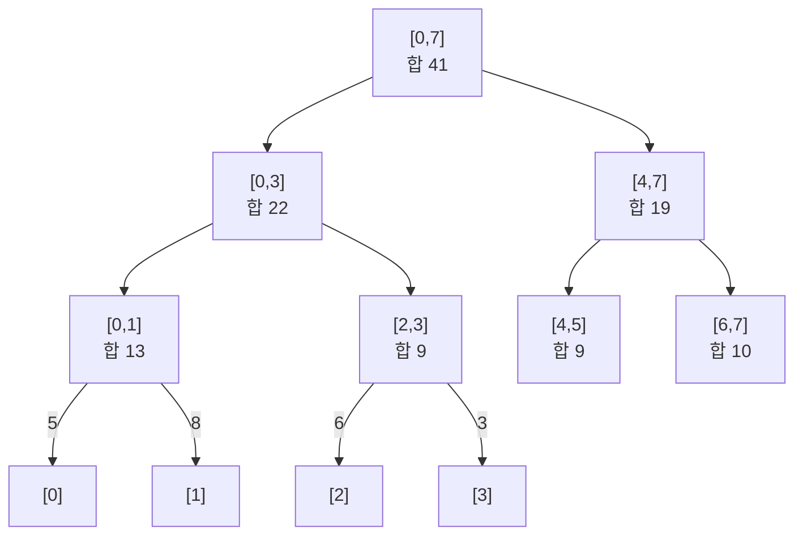
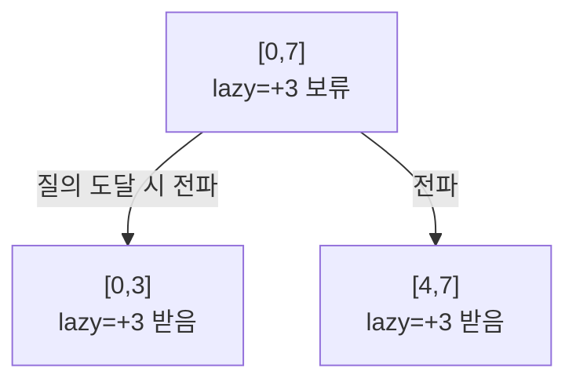

- **세그먼트 트리** → 배열 구간 질의(합·최솟값·최댓값)와 점 갱신을 둘 다 O(log n)으로 처리
- 핵심 아이디어 → 구간을 반씩 쪼개 미리 묶어둔 결과를 트리에 저장
- 트레이드오프 → 단순 배열은 질의 O(n)·갱신 O(1) · 누적합은 질의 O(1)·갱신 O(n) · 세그트리는 둘 다 O(log n)

## 토너먼트 대진표로 보는 세그먼트 트리

- 8개 팀(원소) → 2팀씩 묶어 승자(구간 결과) 결정 → 또 묶어 상위 라운드 → 최종 1위(전체 구간)
- 대진표를 미리 짜두면 → "3~6번 팀 중 최강" 같은 구간 질문에 몇 단계만 타고 답
- 한 팀 전력 바뀌면(점 갱신) → 그 팀이 거쳐온 대진 경로만 다시 계산 → log n개 노드만 수정
- 매번 전부 비교하지 않고 미리 묶어둔 중간 결과를 재활용하는 게 핵심

<KeyPoint title="이 비유에서 가져갈 것">
세그먼트 트리 = 구간 결과를 토너먼트처럼 반씩 묶어 미리 저장 ·
구간 질의는 겹치는 노드만 타고 내려가 O(log n) · 점 갱신은 잎에서 루트까지 경로만 O(log n) 수정
</KeyPoint>

## 트리 구조 한눈에

- 배열 `[5, 8, 6, 3, 2, 7, 9, 1]` (인덱스 0~7) · 각 노드는 자식 구간의 합을 보관
- 리프 = 원소 하나 · 내부 노드 = 두 자식 구간을 합친 값



- 높이 → O(log n) · 노드 수 → 약 2n · 1차원 배열에 `node`, 자식은 `2*node`, `2*node+1`로 저장

## 구간 합 질의 과정

- `query(2, 5)` → 구간 `[2,5]` 합 요청 · 트리를 타고 내려가며 세 경우 분기
- 완전 포함 → 노드 값 그대로 사용 · 완전 불포함 → 0 반환 · 일부 겹침 → 양쪽 자식 재귀

| 방문 노드 | 구간 | 질의구간 `[2,5]`와 관계 | 처리 |
| --- | --- | --- | --- |
| 루트 | [0,7] | 일부 겹침 | 양쪽 재귀 |
| 좌 | [0,3] | 일부 겹침 | 양쪽 재귀 |
| 좌좌 | [0,1] | 불포함 | 0 |
| 좌우 | [2,3] | 완전 포함 | 9 채택 |
| 우 | [4,7] | 일부 겹침 | 양쪽 재귀 |
| 우좌 | [4,5] | 완전 포함 | 9 채택 |
| 우우 | [6,7] | 불포함 | 0 |

- 채택 노드 → `[2,3]=9` + `[4,5]=9` = 18 · 방문은 O(log n)개 노드로 제한

## Python 구현 (점 갱신 + 구간 합)

```python
class SegmentTree:
    def __init__(self, data):
        self.n = len(data)
        self.tree = [0] * (2 * self.n)      # 0-indexed iterative 방식
        for i in range(self.n):             # 리프 채우기
            self.tree[self.n + i] = data[i]
        for i in range(self.n - 1, 0, -1):  # 내부 노드 = 두 자식 합
            self.tree[i] = self.tree[2 * i] + self.tree[2 * i + 1]

    def update(self, idx, val):             # 점 갱신 O(log n)
        i = idx + self.n
        self.tree[i] = val
        i //= 2
        while i >= 1:
            self.tree[i] = self.tree[2 * i] + self.tree[2 * i + 1]
            i //= 2

    def query(self, l, r):                  # [l, r] 구간 합 O(log n)
        res = 0
        l += self.n
        r += self.n + 1
        while l < r:
            if l & 1:                       # l이 오른쪽 자식이면 채택 후 우측 이동
                res += self.tree[l]
                l += 1
            if r & 1:                        # r이 오른쪽 자식이면 좌측 채택
                r -= 1
                res += self.tree[r]
            l //= 2
            r //= 2
        return res
# 구축 O(n) · query·update 각각 O(log n)
```

<Stats>
<Stat value="O(n)" label="구축" sub="리프+내부 노드" />
<Stat value="O(log n)" label="구간 질의" sub="겹치는 노드만" />
<Stat value="O(log n)" label="점 갱신" sub="리프→루트 경로" />
<Stat value="~2n" label="공간" sub="노드 수" />
</Stats>

## lazy propagation 개요 — 구간 갱신까지

- 문제 → "구간 `[l,r]` 전체에 +k" 갱신을 매번 잎까지 내리면 O(n) · 느림
- 해법 → 노드에 **밀린 갱신값(lazy)**을 적어두고 필요할 때만 자식에 전파
- 효과 → 구간 갱신·구간 질의 모두 O(log n) 유지



- 갱신 시 → 구간 완전 포함 노드에 lazy만 기록하고 멈춤 · 더 내려가지 않음
- 질의·이후 갱신이 그 노드를 지날 때 → push down으로 자식에 lazy 내려보냄

<Note type="info" title="언제 lazy까지 필요한가">
점 갱신만 있으면 기본 세그트리로 충분 · "구간 전체 갱신"이 잦으면 lazy propagation 필수 ·
백준 10999(구간 합 + 구간 더하기)가 대표 lazy 문제
</Note>

## 세그먼트 트리 vs 누적합(prefix sum)

<Compare>
<CompareCol title="누적합 (prefix sum)" subtitle="불변 배열 구간 합" color="sky">
- 구간 합 질의 → O(1)
- 점 갱신 → O(n) (뒤 전부 재계산)
- 갱신 없는 정적 배열에 최적
- 구현 가장 짧음
</CompareCol>
<CompareCol title="세그먼트 트리" subtitle="갱신 잦은 구간 연산" color="green">
- 구간 질의 → O(log n)
- 점·구간 갱신 → O(log n)
- 합·최솟값·최댓값·gcd 등 일반화
- lazy로 구간 갱신까지 확장
</CompareCol>
</Compare>

## 대표 문제

<Cards cols={2}>
<Card icon="📝" title="백준 2042 구간 합 구하기">
점 갱신 + 구간 합 · 세그트리 기본형 검증
</Card>
<Card icon="📉" title="백준 2357 최솟값과 최댓값">
합 대신 min·max 결합 함수 적용
</Card>
<Card icon="➕" title="백준 10999 구간 합 구하기 2">
구간 갱신 + 구간 합 · lazy propagation 필수
</Card>
<Card icon="🔢" title="LeetCode 307 Range Sum Query - Mutable">
update·sumRange · 점 갱신 구간 합 표준
</Card>
</Cards>

<Note type="tip" title="결합 함수만 바꾸면 재사용">
합 → 최솟값·최댓값·gcd·xor로 결합 연산만 교체하면 같은 골격 재사용 ·
단 결합 연산은 결합법칙 성립해야 함(합·min·max·gcd OK · 평균은 직접 불가)
</Note>
