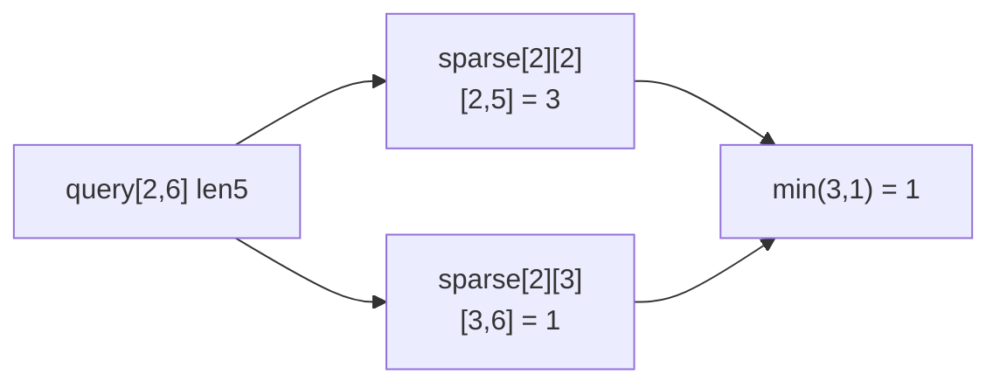
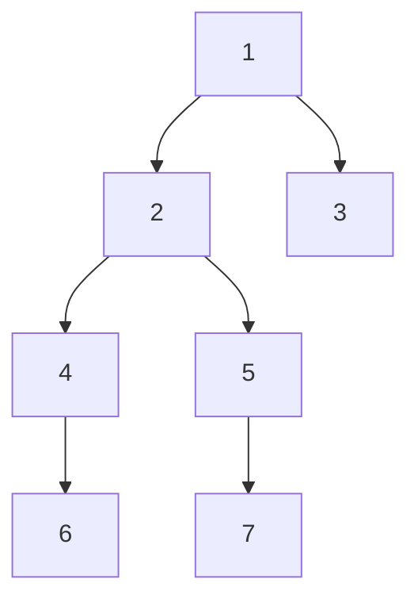

- **스파스 테이블(Sparse Table)** → 갱신 없는 불변 배열의 구간 질의(min·max·gcd)를 O(1)
- 핵심 → 모든 시작점에서 **2의 거듭제곱 길이 구간** 결과를 미리 계산해 표에 저장
- 같은 이진 점프 아이디어를 트리에 쓰면 → **LCA(최소 공통 조상)**를 O(log n)에 질의

## 2의 거듭제곱 구간 미리 계산으로 보기

- "어떤 구간 최솟값?"을 매번 훑으면 O(n) · 갱신이 없다면 미리 답을 표로 만들어두면 됨
- 모든 길이를 다 저장하면 너무 많으니 → 길이 1·2·4·8… 2의 거듭제곱 구간만 저장
- 임의 구간 `[l,r]`은 → 2의 거듭제곱 구간 **둘로 덮으면** 끝 (겹쳐도 min/max는 무방)
- 사다리를 한 칸씩 말고 1·2·4·8칸씩 뛰어오르는 식 → log n번이면 어디든 도달

<KeyPoint title="이 비유에서 가져갈 것">
스파스 테이블 = 2의 거듭제곱 길이 구간 결과를 전처리 ·
RMQ(min/max/gcd)는 두 거듭제곱 구간 겹쳐 O(1) · 같은 이진 점프로 트리 조상 빠르게 → LCA
</KeyPoint>

## 테이블 구조 `sparse[k][i]`

- `sparse[k][i]` → 인덱스 i부터 길이 `2^k` 구간(`[i, i+2^k-1]`)의 결과
- 배열 `[5, 2, 8, 6, 3, 7, 1, 4]` 기준 최솟값 테이블

| i | k=0 (len1) | k=1 (len2) | k=2 (len4) |
| --- | --- | --- | --- |
| 0 | 5 | 2 | 2 |
| 1 | 2 | 2 | 2 |
| 2 | 8 | 6 | 3 |
| 3 | 6 | 3 | 1 |
| 4 | 3 | 3 | 1 |
| 5 | 7 | 1 | - |
| 6 | 1 | 1 | - |
| 7 | 4 | - | - |

- 점화식 → `sparse[k][i] = min(sparse[k-1][i], sparse[k-1][i + 2^(k-1)])`
- 길이 `2^k` 구간 = 길이 `2^(k-1)` 구간 두 개를 합친 것

## O(1) 구간 질의 과정

- `query(2, 6)` → 구간 길이 5 · `k = floor(log2(5)) = 2` → 길이 4 구간 둘로 덮음
- 왼쪽 `[2,5]` = `sparse[2][2]` · 오른쪽 `[3,6]` = `sparse[2][3]` → 겹치지만 min은 무관



- 두 구간이 전체 `[2,6]`을 빈틈없이 덮음 · min/max/gcd는 중복 OK → O(1)
- 합(sum)은 중복 덮으면 중복 합산되어 불가 → 스파스 테이블은 **멱등 연산**에만 적용

## Python 구현 (RMQ)

```python
import math

class SparseTable:
    def __init__(self, data):
        n = len(data)
        self.log = [0] * (n + 1)
        for i in range(2, n + 1):            # 미리 floor(log2) 테이블
            self.log[i] = self.log[i // 2] + 1
        K = self.log[n] + 1
        self.table = [[0] * n for _ in range(K)]
        self.table[0] = data[:]              # k=0 → 원소 그대로
        for k in range(1, K):                # 전처리 O(n log n)
            span = 1 << (k - 1)
            for i in range(n - (1 << k) + 1):
                self.table[k][i] = min(
                    self.table[k - 1][i],
                    self.table[k - 1][i + span],
                )

    def query(self, l, r):                   # [l, r] 최솟값 O(1)
        k = self.log[r - l + 1]
        return min(self.table[k][l], self.table[k][r - (1 << k) + 1])
# 전처리 O(n log n)·공간 O(n log n) · 질의 O(1) · 단 갱신 불가
```

<Stats>
<Stat value="O(n log n)" label="전처리" sub="테이블 채우기" />
<Stat value="O(1)" label="구간 질의" sub="두 구간 겹침" />
<Stat value="O(n log n)" label="공간" sub="k×n 테이블" />
<Stat value="불가" label="갱신" sub="불변 배열 전용" />
</Stats>

## 이진 점프 LCA — 트리에 같은 아이디어

- LCA(Lowest Common Ancestor) → 트리에서 두 노드의 가장 가까운 공통 조상
- 전처리 → `up[k][v]` = v의 `2^k`번째 조상 · 점화식 `up[k][v] = up[k-1][ up[k-1][v] ]`
- 질의 → ① 깊은 노드를 깊이 차만큼 이진 점프로 올림 ② 두 노드 함께 위로 점프해 직전에서 멈춤



- `lca(6, 7)` → 6은 깊이 3·7도 깊이 3 → 깊이 맞춤 불필요 · 함께 점프 → 6→4→2·7→5→2 → 공통 2
- 깊이 차·공통 조상 탐색 모두 1·2·4… 이진 점프로 → 질의당 O(log n)

```python
def lca(u, v, up, depth, LOG):
    if depth[u] < depth[v]:
        u, v = v, u
    diff = depth[u] - depth[v]
    for k in range(LOG):                     # 깊은 쪽을 깊이 차만큼 올림
        if diff & (1 << k):
            u = up[k][u]
    if u == v:
        return u
    for k in reversed(range(LOG)):           # 함께 점프, 갈라지기 직전까지
        if up[k][u] != up[k][v]:
            u, v = up[k][u], up[k][v]
    return up[0][u]                          # 한 칸 위가 LCA
# 전처리 O(n log n) · 질의 O(log n)
```

## 스파스 테이블 vs 세그먼트 트리

<Compare>
<CompareCol title="스파스 테이블" subtitle="불변 배열 RMQ" color="sky">
- 질의 O(1) (멱등 연산)
- 전처리 O(n log n)
- 갱신 불가
- min·max·gcd만 (합 불가)
</CompareCol>
<CompareCol title="세그먼트 트리" subtitle="갱신 있는 구간 연산" color="green">
- 질의·갱신 O(log n)
- 합 등 모든 결합 연산
- 점·구간 갱신 지원
- 갱신 잦으면 필수
</CompareCol>
</Compare>

<ProsCons>
<Pros title="스파스 테이블이 적합">
- 배열이 한 번 정해지고 안 바뀜
- 같은 배열에 질의가 매우 많음
- min·max·gcd 같은 멱등 연산
</Pros>
<Cons title="스파스 테이블 부적합">
- 중간에 원소 갱신 필요
- 합·곱처럼 중복 덮기 안 되는 연산
- 메모리 O(n log n)이 부담일 때
</Cons>
</ProsCons>

## 대표 문제

<Cards cols={2}>
<Card icon="🌲" title="백준 11438 LCA 2">
이진 점프 LCA · 질의 O(log n) 필수
</Card>
<Card icon="📉" title="백준 17435 합성함수와 쿼리">
함수 2^k번 적용 = 이진 점프 응용
</Card>
<Card icon="🔢" title="백준 2104 부분배열 고르기">
구간 최솟값 활용 분할정복
</Card>
<Card icon="⛰️" title="LeetCode 1483 Kth Ancestor of a Tree Node">
`up[k][v]` 이진 점프 조상 질의
</Card>
</Cards>

<Note type="tip" title="LCA로 트리 거리·경로 질의">
LCA 구하면 → 두 노드 거리 = `depth[u] + depth[v] - 2*depth[lca]` ·
간선 가중치 누적까지 전처리하면 경로 합·최댓값 질의도 O(log n) · 트리 쿼리의 핵심 도구
</Note>
