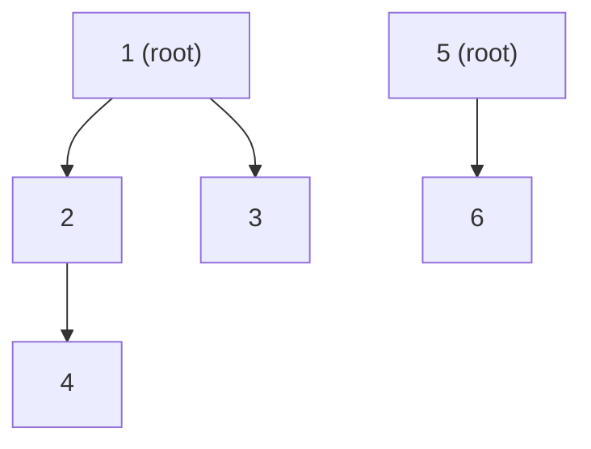
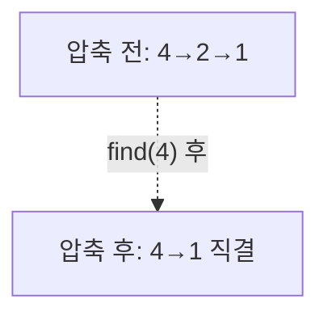

- **유니온파인드(Union-Find, Disjoint Set Union)** → 서로소 집합들을 합치고(union) 같은 집합인지 찾기(find)
- 핵심 → 각 집합을 트리로 표현 · 트리의 **루트(대표)**가 같으면 같은 집합
- 최적화 → 경로 압축 + 랭크/크기 합치기 → 한 연산 거의 O(1)(역아커만 α(n) ≤ 4)

## 친구의 친구로 보는 유니온파인드

- A-B 친구·B-C 친구 → A·B·C는 한 무리 · "A와 D 같은 무리?" 질문에 빠르게 답해야 함
- 각 무리의 **대표 한 명(루트)**을 정해두면 → "대표가 같으면 같은 무리"로 판정
- 새 친구 관계가 생기면(union) → 두 무리의 대표를 하나로 합침
- "누가 네 무리 대표냐?"를 거슬러 올라가는 게 find · 매번 올라가면 느리니 길을 압축

<KeyPoint title="이 비유에서 가져갈 것">
유니온파인드 = 집합을 트리로·루트가 대표 · find로 대표 찾고 union으로 두 대표 합침 ·
경로 압축으로 다음 find를 빠르게 · 랭크 합치기로 트리 평평하게 → 거의 O(1)
</KeyPoint>

## parent 배열로 집합 표현

- `parent[x]` → x의 부모 · `parent[x] == x`이면 x가 루트(대표)
- 초기에는 모두 자기 자신이 루트 → 원소 n개 = 집합 n개



- 위 → `{1,2,3,4}`·`{5,6}` 두 집합 · `find(4)` → 4→2→1 거슬러 루트 1 반환
- `union(4,6)` → `find(4)=1`·`find(6)=5` → 한쪽 루트를 다른 루트 자식으로 붙임

## 경로 압축 동작 시각화

- find하며 거쳐온 노드들을 **루트에 직접 연결** → 트리가 납작해져 다음 find 빨라짐



| find(4) 단계 | 방문 | 압축 결과 |
| --- | --- | --- |
| 1 | 4의 부모 2 | 4를 루트 쪽으로 당김 |
| 2 | 2의 부모 1 | 2를 루트 1에 직결 |
| 3 | 1 = 루트 | 4·2 모두 1 직속 |

- 다음에 `find(4)` 호출 시 → 한 번에 루트 도달 · 트리 높이 사실상 상수로 수렴

## Python 구현 (경로 압축 + 랭크 합치기)

```python
class DSU:
    def __init__(self, n):
        self.parent = list(range(n))     # 초기 각자 루트
        self.rank = [0] * n              # 트리 높이 근사

    def find(self, x):                   # 경로 압축 (반복형)
        root = x
        while self.parent[root] != root:
            root = self.parent[root]
        while self.parent[x] != root:    # 거쳐온 노드 전부 루트에 직결
            self.parent[x], x = root, self.parent[x]
        return root

    def union(self, a, b):               # 랭크 합치기
        ra, rb = self.find(a), self.find(b)
        if ra == rb:
            return False                 # 이미 같은 집합 → 합치면 사이클
        if self.rank[ra] < self.rank[rb]:
            ra, rb = rb, ra              # 높은 트리를 루트로
        self.parent[rb] = ra
        if self.rank[ra] == self.rank[rb]:
            self.rank[ra] += 1           # 높이 같으면 +1
        return True

    def connected(self, a, b):
        return self.find(a) == self.find(b)
# find·union 거의 O(α(n)) ≈ O(1) · α는 역아커만 함수, 실질 상수
```

<Stats>
<Stat value="O(n)" label="초기화" sub="parent·rank 세팅" />
<Stat value="~O(1)" label="find" sub="α(n) ≤ 4" />
<Stat value="~O(1)" label="union" sub="find 2회+연결" />
<Stat value="O(n)" label="공간" sub="parent+rank" />
</Stats>

## 두 최적화의 효과

<Compare>
<CompareCol title="최적화 없음" subtitle="단순 트리" color="stone">
- 최악 한 줄(linked list) 트리
- find → O(n)
- 한쪽으로 길게 늘어짐
- m연산 → O(n·m)
</CompareCol>
<CompareCol title="경로 압축만" subtitle="find 시 평탄화" color="sky">
- amortized O(log n)
- 호출할수록 납작
- 구현 간단
- rank 없이도 큰 개선
</CompareCol>
<CompareCol title="압축 + 랭크" subtitle="실전 표준" color="green">
- amortized O(α(n))
- 사실상 상수
- 트리 항상 평평 유지
- 대회·실무 기본형
</CompareCol>
</Compare>

## 사이클·연결 판정 활용

- 사이클 판정 → `union(a,b)` 전 `find(a)==find(b)`면 이미 연결 → 간선 추가 시 사이클
- 연결 요소 개수 → 초기 n에서 union 성공할 때마다 -1
- 크루스칼 MST → 간선 가중치 오름차순 정렬 후 사이클 안 만드는 간선만 채택


<Timeline>
<TimelineItem title="간선 정렬">
모든 간선 가중치 오름차순 정렬
</TimelineItem>
<TimelineItem title="작은 간선부터 union">
두 끝점 find 다르면 채택 · MST 간선 += 1
</TimelineItem>
<TimelineItem title="사이클 간선 skip">
같은 집합이면 버림 → 사이클 방지
</TimelineItem>
<TimelineItem title="n-1개 채택 시 종료">
MST 완성 · 전체 정점 한 집합
</TimelineItem>
</Timeline>

## 대표 문제

<Cards cols={2}>
<Card icon="🧩" title="백준 1717 집합의 표현">
union·find 정석 · 같은 집합 여부 판정
</Card>
<Card icon="🌐" title="백준 1976 여행 가자">
연결 요소로 같은 그룹 도시 판정
</Card>
<Card icon="🌳" title="백준 1197 최소 스패닝 트리">
크루스칼 MST · DSU로 사이클 방지
</Card>
<Card icon="🔢" title="LeetCode 547 Number of Provinces">
연결 요소 개수 = 집합 개수
</Card>
</Cards>

<Note type="tip" title="크기 합치기·확장 기법">
rank 대신 **집합 크기(size)**로 합쳐도 동일 효과 · 각 집합 원소 수도 같이 추적 가능 ·
**가중 유니온파인드**(루트까지 누적값 저장)로 "두 원소 간 관계·차이"까지 질의 가능(백준 3830 등)
</Note>
