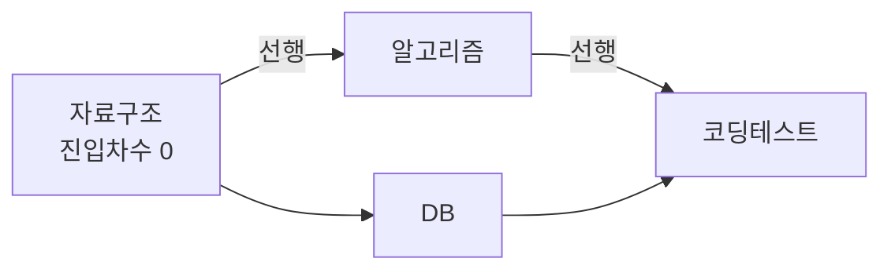

- **그래프** → 점(정점)과 선(간선)으로 이뤄진 자료구조 · 지도·지하철·SNS 친구망 다 그래프
- 고급 알고리즘 → 대부분 **DFS/BFS 탐색**을 토대로 확장
- 핵심 질문 → "어떤 순서로?"(위상정렬) · "가장 빠른 길?"(최단경로) · "최소 비용으로 다 잇기?"(MST)

## 지하철 노선도로 그래프 보기

- 역 = 정점(vertex) · 역 사이 구간 = 간선(edge) · 환승 소요시간 = 가중치(weight)
- "강남에서 홍대까지 최소 환승" → **최단 경로** 문제
- "모든 역을 최소 길이 케이블로 연결" → **최소 신장 트리(MST)** 문제
- "선수과목 다 듣고 졸업" → **위상 정렬** 문제

<KeyPoint title="이 비유에서 가져갈 것">
그래프 = 점과 선의 연결망 · 알고리즘은 결국 "연결을 따라가며 무엇을 최적화하느냐"의 차이 ·
가중치 유무·음수 간선 유무·방향 유무에 따라 쓸 알고리즘이 갈림
</KeyPoint>

## 알고리즘 한눈에

<Cards cols={3}>
<Card icon="📚" title="위상 정렬">
선행 관계 있는 작업 순서 정하기 · 빌드 의존성·수강신청
</Card>
<Card icon="🗺️" title="다익스트라">
가중치 양수일 때 최단 경로 · 내비게이션
</Card>
<Card icon="💸" title="벨만포드">
음수 간선 허용 최단 경로 · 환율 차익 탐지
</Card>
<Card icon="🔁" title="플로이드워셜">
모든 쌍 최단 경로 · 작은 그래프 거리표
</Card>
<Card icon="🌳" title="MST">
모든 점 최소 비용 연결 · 네트워크 케이블링
</Card>
<Card icon="🔗" title="SCC">
서로 도달 가능한 정점 묶음 · 순환 의존 탐지
</Card>
</Cards>

## 위상 정렬 — 수강 선수과목 순서

- "자료구조" 들어야 "알고리즘" 듣는다 → 선행 관계를 어긴 순서면 안 됨
- DAG(방향 비순환 그래프)에서만 가능 · 순환 있으면 순서를 못 정함
- 실무 → 빌드 시스템 의존성·태스크 스케줄러·패키지 설치 순서

<Compare>
<CompareCol title="Kahn 알고리즘" subtitle="진입차수 기반 BFS" color="sky">
- 진입 간선 0개인 정점부터 큐에 넣고 하나씩 제거
- 제거하며 이웃의 진입차수 감소 → 0 되면 큐 투입
- 큐 빌 때까지 못 비우면 → **순환 존재**
</CompareCol>
<CompareCol title="DFS 기반" subtitle="후위 순회 역순" color="pink">
- 깊이 우선으로 끝까지 들어간 뒤 빠져나오는 순서 기록
- 그 순서를 뒤집으면 위상 순서
- 재귀 도중 회색 노드 재방문 → 순환 존재
</CompareCol>
</Compare>



- 위 그래프 위상 순서 예 → `자료구조 → DB → 알고리즘 → 코딩테스트`

```python
from collections import deque

def topo_sort(n, edges):           # n: 정점 수, edges: (u→v)
    indeg = [0] * n
    adj = [[] for _ in range(n)]
    for u, v in edges:
        adj[u].append(v)
        indeg[v] += 1
    q = deque([i for i in range(n) if indeg[i] == 0])
    order = []
    while q:
        u = q.popleft()
        order.append(u)
        for v in adj[u]:
            indeg[v] -= 1
            if indeg[v] == 0:
                q.append(v)
    return order if len(order) == n else None   # None → 순환
# 시간복잡도 O(V+E)
```

## 다익스트라 — 내비게이션 최단 경로

- 한 출발지에서 모든 곳까지 최단 거리 · **간선 가중치 음수 없을 때만**
- "지금까지 가장 가까운 미확정 정점"을 우선순위 큐(힙)로 꺼내 확정
- 실무 → 내비게이션 경로, 네트워크 라우팅(OSPF)

```python
import heapq

def dijkstra(n, adj, start):       # adj[u] = [(v, w), ...]
    dist = [float('inf')] * n
    dist[start] = 0
    pq = [(0, start)]              # (거리, 정점)
    while pq:
        d, u = heapq.heappop(pq)
        if d > dist[u]:            # 이미 더 짧게 확정됨 → skip
            continue
        for v, w in adj[u]:
            if dist[u] + w < dist[v]:
                dist[v] = dist[u] + w
                heapq.heappush(pq, (dist[v], v))
    return dist
# 시간복잡도 O(E log V) (이진 힙)
```

<Note type="warning" title="음수 간선이면 다익스트라 금지">
- 다익스트라는 "한 번 꺼낸 정점은 최단 확정" 가정 → 음수 간선 있으면 깨짐
- 음수 간선 → 벨만포드 사용
</Note>

## 벨만포드 — 음수 간선과 음수 사이클 탐지

- 모든 간선을 V-1번 반복 완화(relax) → 음수 간선도 처리
- 한 번 더 돌려서 또 줄면 → **음수 사이클 존재** (예: 환율 차익 무한 루프)
- 실무 → 통화 거래 차익(arbitrage) 탐지·금융 그래프

```python
def bellman_ford(n, edges, start):     # edges: [(u, v, w), ...]
    dist = [float('inf')] * n
    dist[start] = 0
    for _ in range(n - 1):
        for u, v, w in edges:
            if dist[u] + w < dist[v]:
                dist[v] = dist[u] + w
    for u, v, w in edges:               # V번째 완화 → 음수 사이클 검사
        if dist[u] + w < dist[v]:
            return None                 # 음수 사이클
    return dist
# 시간복잡도 O(V·E)
```

## 플로이드워셜 — 모든 쌍 거리표

- 모든 정점 쌍의 최단 거리를 한 번에 · 정점 수 작을 때 적합
- "k를 거쳐 가면 더 짧은가?"를 모든 중간 정점 k에 대해 반복

```python
def floyd_warshall(n, dist):       # dist[i][j] 초기 거리 행렬
    for k in range(n):
        for i in range(n):
            for j in range(n):
                if dist[i][k] + dist[k][j] < dist[i][j]:
                    dist[i][j] = dist[i][k] + dist[k][j]
    return dist
# 시간복잡도 O(V^3)
```

## 최소 신장 트리 — 최소 비용으로 다 잇기

- 모든 정점을 사이클 없이 연결하는 최소 가중치 부분 그래프
- 실무 → 통신망 케이블 최소 설치·전력망·클러스터링

<Compare>
<CompareCol title="크루스칼" subtitle="간선 정렬 + 유니온파인드" color="green">
- 간선을 가중치 오름차순 정렬
- 사이클 안 생기면 채택(DSU로 판정)
- 간선 적은 희소 그래프 유리 · O(E log E)
</CompareCol>
<CompareCol title="프림" subtitle="정점 확장 + 힙" color="amber">
- 한 정점에서 시작해 가장 싼 간선으로 트리 확장
- 다익스트라와 구조 유사(힙 사용)
- 간선 많은 밀집 그래프 유리 · O(E log V)
</CompareCol>
</Compare>

```python
def kruskal(n, edges):             # edges: [(w, u, v), ...]
    parent = list(range(n))
    def find(x):
        while parent[x] != x:
            parent[x] = parent[parent[x]]   # 경로 압축
            x = parent[x]
        return x
    total, used = 0, 0
    for w, u, v in sorted(edges):
        ru, rv = find(u), find(v)
        if ru != rv:               # 사이클 안 생김 → 채택
            parent[ru] = rv
            total += w
            used += 1
    return total if used == n - 1 else None
# 시간복잡도 O(E log E)
```

## 강결합 요소(SCC) 개요

- **SCC** → 방향 그래프에서 서로 왕복 도달 가능한 정점 묶음
- 코사라주(2번 DFS)·타잔(1번 DFS) 알고리즘 · 둘 다 `O(V+E)`
- 실무 → 모듈 순환 의존 탐지·데드락 분석·웹 페이지 군집

## 복잡도 비교표

| 알고리즘 | 용도 | 음수 간선 | 시간복잡도 |
| --- | --- | --- | --- |
| 위상정렬 | 작업 순서 | - | O(V+E) |
| 다익스트라 | 단일 출발 최단 | 불가 | O(E log V) |
| 벨만포드 | 단일 출발 최단 | 가능 | O(V·E) |
| 플로이드워셜 | 모든 쌍 최단 | 가능 | O(V³) |
| 크루스칼 | MST | - | O(E log E) |
| 프림 | MST | - | O(E log V) |
| SCC(타잔) | 강결합 묶음 | - | O(V+E) |

<Stats>
<Stat value="O(E log V)" label="다익스트라" sub="힙 사용 단일 출발"/>
<Stat value="O(V³)" label="플로이드워셜" sub="모든 쌍, 작은 그래프"/>
<Stat value="O(V+E)" label="위상정렬/SCC" sub="선형 탐색"/>
</Stats>

<Note type="pink" title="실무에서 고르기">
- 양수 가중치 단일 출발 → 다익스트라 (내비·라우팅)
- 음수 간선·차익 탐지 → 벨만포드
- 정점 적고 모든 쌍 거리 필요 → 플로이드워셜
- 의존성 순서 → 위상정렬 · 순환 의존 탐지 → SCC
- 최소 비용 연결망 → 희소면 크루스칼·밀집이면 프림
</Note>
