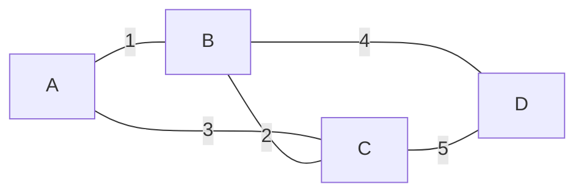

- **신장 트리(spanning tree)** → 모든 정점을 사이클 없이 잇는 부분 그래프 · 간선 V-1개
- **MST** → 그 중 가중치 합 최소인 트리
- 두 대표 알고리즘 → 크루스칼(간선 중심)·프림(정점 중심)

## 마을 도로망으로 보는 MST

- 마을 = 정점 · 도로 후보 = 간선 · 공사비 = 가중치
- "모든 마을을 잇되 총 공사비 최소" → MST 문제
- 사이클(중복 연결)은 낭비 → 사이클 안 생기게 싼 도로부터 채택
- 실무 → 통신망 케이블링·전력망·클러스터링(간선 끊어 군집화)

<KeyPoint title="이 비유에서 가져갈 것">
MST = 사이클 없이 다 잇는 최소 비용 트리 · 크루스칼은 싼 간선부터 욕심 ·
프림은 한 점에서 트리를 키워감 · 둘 다 그리디인데 사이클 판정 방식이 다름
</KeyPoint>

## 크루스칼 동작 단계



- 간선 가중치 오름차순 → `(1,A-B) (2,B-C) (3,A-C) (4,B-D) (5,C-D)`

| step | 간선(w) | 두 끝 루트 | 채택? | 누적 비용 | 트리 간선 수 |
| --- | --- | --- | --- | --- | --- |
| 1 | A-B(1) | A≠B | 채택 | 1 | 1 |
| 2 | B-C(2) | B≠C | 채택 | 3 | 2 |
| 3 | A-C(3) | A=C | 사이클 → skip | 3 | 2 |
| 4 | B-D(4) | B≠D | 채택 | 7 | 3 |
| 5 | C-D(5) | - | 이미 V-1개 → 종료 | 7 | 완료 |

- 채택 판정 → 두 정점 루트 같으면 사이클 → 유니온파인드(DSU)로 O(α) 판정

```python
def kruskal(n, edges):                 # edges: [(w, u, v), ...]
    parent = list(range(n))
    rank = [0] * n
    def find(x):
        while parent[x] != x:
            parent[x] = parent[parent[x]]      # 경로 압축
            x = parent[x]
        return x
    def union(a, b):
        ra, rb = find(a), find(b)
        if ra == rb:
            return False                       # 사이클
        if rank[ra] < rank[rb]:
            ra, rb = rb, ra
        parent[rb] = ra                        # union by rank
        if rank[ra] == rank[rb]:
            rank[ra] += 1
        return True
    total, used = 0, 0
    for w, u, v in sorted(edges):              # 가중치 오름차순
        if union(u, v):
            total += w
            used += 1
            if used == n - 1:                  # V-1개 채우면 종료
                break
    return total if used == n - 1 else None    # None → 비연결
# 시간 O(E log E) · 공간 O(V)
```

## 프림 동작 — 정점 확장

- 한 정점에서 시작 → 트리에 닿은 간선 중 가장 싼 것으로 확장
- 다익스트라와 구조 거의 동일(힙 사용) · 차이는 "누적거리" 대신 "한 간선 비용"

```python
import heapq

def prim(n, adj, start=0):             # adj[u] = [(v, w), ...]
    visited = [False] * n
    pq = [(0, start)]                  # (간선비용, 정점)
    total, cnt = 0, 0
    while pq and cnt < n:
        w, u = heapq.heappop(pq)
        if visited[u]:                 # 이미 트리에 포함 → skip
            continue
        visited[u] = True
        total += w
        cnt += 1
        for v, nw in adj[u]:
            if not visited[v]:
                heapq.heappush(pq, (nw, v))
    return total if cnt == n else None
# 시간 O(E log V) · 공간 O(V+E)
```

## 크루스칼 vs 프림

<Compare>
<CompareCol title="크루스칼" subtitle="간선 정렬 + DSU" color="green">
- 전체 간선 정렬 후 싼 것부터
- 사이클 판정 = 유니온파인드
- 간선 적은 **희소 그래프** 유리
- O(E log E) · 정렬이 지배
</CompareCol>
<CompareCol title="프림" subtitle="정점 확장 + 힙" color="amber">
- 한 점에서 트리를 키워감
- 닿은 간선만 힙에 관리
- 간선 많은 **밀집 그래프** 유리
- O(E log V) · 행렬+선형탐색 시 O(V²)
</CompareCol>
</Compare>

<Layers>
<Layer title="공통점" sub="둘 다 그리디 · 최적 보장" color="sky">
컷 정리(cut property) → 어떤 컷의 최소 간선은 항상 MST에 포함 · 그래서 욕심내도 최적
</Layer>
<Layer title="크루스칼 강점" sub="간선 수 적을 때" color="green">
간선 정렬만 하면 됨 · 분리된 숲에서 조각조각 합쳐도 OK
</Layer>
<Layer title="프림 강점" sub="밀집 그래프 · 인접행렬" color="amber">
V² 구현이 E log V보다 빠를 수 있음(E ≈ V²) · 트리 한 덩어리로 자람
</Layer>
</Layers>

## 대표 문제

| 문제 | 플랫폼 | 핵심 |
| --- | --- | --- |
| 최소 스패닝 트리 1197 | 백준 | 크루스칼/프림 기본 |
| 네트워크 연결 1922 | 백준 | MST 비용 합 |
| 별자리 만들기 4386 | 백준 | 좌표 → 간선 생성 후 MST |
| 1584 Min Cost to Connect All Points | LeetCode | 프림(완전그래프) |
| 1135 Optimize Water Distribution | LeetCode | 가상 정점 + 크루스칼 |

<ProsCons>
<Pros title="MST 그리디가 통하는 이유">
- 컷 정리 → 국소 최소 선택이 전역 최적과 모순 없음
- 사이클 회피 + 가장 싼 간선 → 항상 안전
</Pros>
<Cons title="함정·트레이드오프">
- 크루스칼 DSU 경로압축 없으면 find가 O(V) → 전체 느려짐
- 프림 visited 체크 없이 pop하면 같은 정점 중복 처리 → 비용 과다
- 비연결 그래프 → 간선 V-1개 못 채움 → None 처리 필수
- 음수 간선은 MST에 문제 없음(최단경로와 달리 그대로 동작)
</Cons>
</ProsCons>
