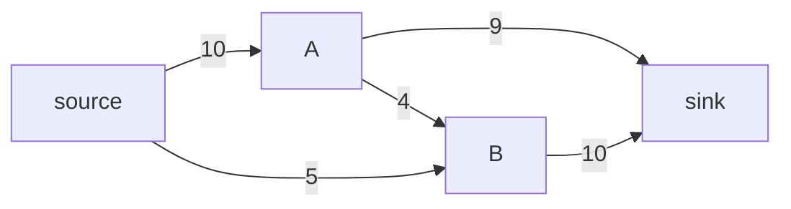

- **네트워크 유량** → source에서 sink까지 간선 용량 한도 내에서 흘릴 수 있는 최대 흐름
- 핵심 → 증가 경로(augmenting path)를 찾아 유량을 반복적으로 밀어 넣음
- 정리 → **최대 유량 = 최소 컷** · 응용 → 이분 매칭

## 수도관 물 흐름으로 보는 최대 유량

- source = 저수지 · sink = 도시 · 파이프 = 간선 · 파이프 굵기 = 용량(capacity)
- "저수지에서 도시로 보낼 수 있는 물의 최대량?" → 최대 유량 문제
- 병목 파이프가 전체 처리량 제한 → 가장 약한 단면 = 최소 컷
- 실무 → 트래픽 라우팅·작업 배정·이미지 분할·스포츠 우승 가능성 판정

<KeyPoint title="이 비유에서 가져갈 것">
최대 유량 = source→sink 최대로 흘릴 물 · 증가 경로 찾아 병목만큼 반복 투입 ·
역방향(잔여) 간선으로 "이미 보낸 물 되돌리기" 허용이 핵심 · 최대 유량 = 최소 컷
</KeyPoint>

## 잔여 그래프와 증가 경로

- **잔여 용량** → `cap(u,v) - flow(u,v)` · 아직 더 흘릴 수 있는 양
- 유량 f 흘리면 → 정방향 잔여 -f · **역방향 잔여 +f** (되돌릴 여지 생성)
- 역간선이 잘못 보낸 흐름을 교정 → 그리디만으로 안 되는 이유 해결

<Layers>
<Layer title="1. 증가 경로 탐색" sub="source→sink 잔여>0 경로" color="sky">
잔여 용량 양수인 간선만 따라 sink 도달 경로 찾기
</Layer>
<Layer title="2. 병목 결정" sub="경로상 최소 잔여" color="amber">
경로 간선들의 잔여 중 최솟값 = 이번에 밀 유량
</Layer>
<Layer title="3. 유량 갱신" sub="정방향 -·역방향 +" color="green">
정방향 잔여 감소 · 역방향 잔여 증가 → 되돌림 여지 확보
</Layer>
<Layer title="4. 반복" sub="경로 없을 때까지" color="rose">
더 이상 증가 경로 없으면 = 최대 유량 도달
</Layer>
</Layers>

## 포드풀커슨 vs 에드몬드카프

<Compare>
<CompareCol title="포드풀커슨" subtitle="증가 경로 = DFS" color="amber">
- 증가 경로를 DFS로 탐색
- 용량 무리수면 종료 안 될 수도
- 정수 용량 가정 시 O(E·maxflow)
</CompareCol>
<CompareCol title="에드몬드카프" subtitle="증가 경로 = BFS" color="sky">
- 최단(간선 수) 증가 경로 BFS
- 항상 종료 보장
- O(V·E²) · 용량 값과 무관
</CompareCol>
</Compare>

```python
from collections import deque, defaultdict

def edmonds_karp(n, cap, s, t):        # cap[u][v] = 용량 (defaultdict)
    flow = 0
    while True:
        parent = [-1] * n
        parent[s] = s
        q = deque([s])
        while q:                       # BFS로 증가 경로
            u = q.popleft()
            for v in range(n):
                if parent[v] == -1 and cap[u][v] > 0:
                    parent[v] = u
                    if v == t:
                        q.clear()      # sink 도달 → 종료
                        break
                    q.append(v)
        if parent[t] == -1:            # 증가 경로 없음 → 최대 유량
            break
        bottleneck = float('inf')      # 경로 병목
        v = t
        while v != s:
            u = parent[v]
            bottleneck = min(bottleneck, cap[u][v])
            v = u
        v = t                          # 유량 갱신
        while v != s:
            u = parent[v]
            cap[u][v] -= bottleneck    # 정방향 감소
            cap[v][u] += bottleneck    # 역방향 증가
            v = u
        flow += bottleneck
    return flow
# 시간 O(V·E^2) · 공간 O(V^2) (인접행렬 cap)
```

## 최대 유량 = 최소 컷 정리

- **컷(cut)** → 정점을 source 쪽 S와 sink 쪽 T로 가르기 · 컷 용량 = S→T 간선 용량 합
- **최소 컷** → 컷 용량 최소 · 곧 병목 단면
- 정리(max-flow min-cut) → 최대 유량 값 = 최소 컷 용량



- 위 네트워크 최대 유량 → 13 (S→A→T 9 + S→A→B→T 1 + S→B→T 3 등 조합)
- 최소 컷 → source 측 절단 합과 일치 · 알고리즘 종료 후 잔여 그래프에서 S 도달 가능 집합이 최소 컷의 S측

## 이분 매칭 — 유량의 응용

- 좌측 집합·우측 집합 간 1:1 최대 짝짓기 → 최대 유량으로 환원
- source→좌측(용량1)·좌측↔우측(간선 용량1)·우측→sink(용량1) → 최대 유량 = 최대 매칭
- 전용 알고리즘(쾨니그/홉크로프트카프) → DFS 증가 경로로 O(V·E)

```python
def bipartite_match(adj_left, n_right):   # adj_left[u] = [우측 후보들]
    match_r = [-1] * n_right               # 우측 정점이 매칭된 좌측
    def try_assign(u, visited):
        for v in adj_left[u]:
            if not visited[v]:
                visited[v] = True
                if match_r[v] == -1 or try_assign(match_r[v], visited):
                    match_r[v] = u         # u에 v 배정(또는 재배치)
                    return True
        return False
    cnt = 0
    for u in range(len(adj_left)):
        if try_assign(u, [False] * n_right):
            cnt += 1
    return cnt                             # 최대 매칭 수
# 시간 O(V·E) · 공간 O(V)
```

## 대표 문제

| 문제 | 플랫폼 | 핵심 |
| --- | --- | --- |
| 최대 유량 6086 | 백준 | 에드몬드카프 기본 |
| 열혈강호 11375 | 백준 | 이분 매칭 |
| 도시 왕복하기 2 17412 | 백준 | 간선 분리 최대 유량 |
| 최소 비용 최대 유량 11405 | 백준 | MCMF(SPFA + 유량) |
| 1066 Campus Bikes II | LeetCode | 매칭/할당(유량·DP) |

<Note type="danger" title="함정·트레이드오프">
- 역방향 간선 누락 → 그리디 함정에 빠져 최대 유량 못 찾음 (역간선이 정정 장치)
- 포드풀커슨 DFS → 무리수 용량/나쁜 경로 선택 시 종료 지연 → BFS(에드몬드카프) 권장
- 정점 용량 제한 → 정점 분할(v_in→v_out 용량) 기법 필요
- 무방향 간선 → 양방향 각각 용량 부여로 모델링
- 비용까지 최소화 → MCMF(최소 비용 최대 유량) · 증가 경로를 최단거리(SPFA)로 선택
- 인접행렬 cap → V 크면 O(V²) 메모리 폭발 → 인접 리스트 + edge 객체로 전환
</Note>
