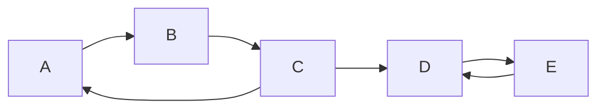

- **SCC(강결합 요소)** → 방향 그래프에서 서로 왕복 도달 가능한 정점 최대 묶음
- **단절점·다리** → 무방향 그래프에서 끊으면 그래프가 쪼개지는 정점·간선
- 공통 도구 → DFS 트리 + 방문 순서(disc) + 최소 도달 순서(low-link)

## SNS·도로망으로 보는 SCC와 단절점

- SCC → "A 팔로우 B, B 팔로우 A 식으로 서로 닿는 사용자 군집" · 순환 의존 모듈 덩어리
- 단절점 → "이 교차로 막히면 동네가 둘로 분리" → 네트워크 취약점
- 다리(bridge) → "이 다리 끊기면 섬 고립" → 단일 장애점(SPOF)
- 실무 → 모듈 순환 의존 탐지·데드락 분석·네트워크 SPOF·도로 취약 구간

<KeyPoint title="이 비유에서 가져갈 것">
SCC = 서로 왕복 가능한 최대 묶음(방향) · 단절점·다리 = 끊으면 쪼개지는 급소(무방향) ·
둘 다 DFS 한 번에 disc(방문순서)와 low(역방향으로 닿는 최소 순서)로 판정
</KeyPoint>

## 타잔 SCC — DFS 한 번

- DFS로 방문 순서 disc 부여 · low = 자신+서브트리에서 역간선 타고 닿는 최소 disc
- 정점을 스택에 쌓다가 `low[u] == disc[u]`이면 u가 SCC 루트 → 스택에서 묶음 추출



- 위 그래프 SCC → `{A,B,C}` (서로 왕복) · `{D,E}` (서로 왕복)
- A→D는 단방향 → 두 SCC 사이 합쳐지지 않음

```python
import sys

def tarjan_scc(n, adj):                # adj[u] = [v, ...]
    sys.setrecursionlimit(1 << 20)
    disc = [-1] * n
    low = [0] * n
    on_stack = [False] * n
    stack, sccs = [], []
    timer = [0]
    def dfs(u):
        disc[u] = low[u] = timer[0]
        timer[0] += 1
        stack.append(u)
        on_stack[u] = True
        for v in adj[u]:
            if disc[v] == -1:          # 트리 간선
                dfs(v)
                low[u] = min(low[u], low[v])
            elif on_stack[v]:          # 역간선(스택에 있음)
                low[u] = min(low[u], disc[v])
        if low[u] == disc[u]:          # SCC 루트
            comp = []
            while True:
                w = stack.pop()
                on_stack[w] = False
                comp.append(w)
                if w == u:
                    break
            sccs.append(comp)
    for i in range(n):
        if disc[i] == -1:
            dfs(i)
    return sccs
# 시간 O(V+E) · 공간 O(V)
```

## 코사라주 SCC — DFS 두 번

<Timeline>
<TimelineItem title="1단계 — 원본 DFS finish 기록">
원본 그래프 DFS · 끝나는(finish) 순서대로 스택에 push
</TimelineItem>
<TimelineItem title="2단계 — 역방향 그래프 준비">
모든 간선 방향 뒤집기 → 전치 그래프 G^T
</TimelineItem>
<TimelineItem title="3단계 — finish 역순으로 G^T DFS">
스택 pop 순서로 G^T 탐색 · 한 번에 닿는 묶음 = 하나의 SCC
</TimelineItem>
</Timeline>

<Compare>
<CompareCol title="타잔" subtitle="DFS 1회 + low-link" color="violet">
- 한 번의 DFS · 스택 + low 배열
- 구현 조밀 · 상수 작음
- low-link 개념 이해 필요
</CompareCol>
<CompareCol title="코사라주" subtitle="DFS 2회 + 전치" color="cyan">
- 그래프 두 번 순회 · 전치 그래프 필요
- 흐름 직관적(finish 역순)
- 메모리 2배(역방향 인접)
</CompareCol>
</Compare>

## 단절점·다리 — 무방향 급소

- 무방향 DFS 트리에서 disc·low로 판정
- **단절점(articulation point)** → 자식 v에 대해 `low[v] >= disc[u]` (루트는 자식 2개 이상)
- **다리(bridge)** → 간선 (u,v)에서 `low[v] > disc[u]` (역간선으로 우회 불가)

```python
def articulation(n, adj):              # 무방향 adj[u] = [v, ...]
    disc = [-1] * n
    low = [0] * n
    ap = set()
    bridges = []
    timer = [0]
    def dfs(u, parent):
        disc[u] = low[u] = timer[0]
        timer[0] += 1
        child = 0
        for v in adj[u]:
            if v == parent:
                continue
            if disc[v] == -1:
                child += 1
                dfs(v, u)
                low[u] = min(low[u], low[v])
                if low[v] > disc[u]:           # 다리
                    bridges.append((u, v))
                if parent != -1 and low[v] >= disc[u]:
                    ap.add(u)                  # 비루트 단절점
            else:
                low[u] = min(low[u], disc[v])  # 역간선
        if parent == -1 and child >= 2:        # 루트 단절점
            ap.add(u)
    for i in range(n):
        if disc[i] == -1:
            dfs(i, -1)
    return ap, bridges
# 시간 O(V+E) · 공간 O(V)
```

## 대표 문제

| 문제 | 플랫폼 | 핵심 |
| --- | --- | --- |
| Strongly Connected Component 2150 | 백준 | 타잔/코사라주 SCC |
| 도미노 4196 | 백준 | SCC 축약 + 진입차수 0 |
| 단절점 11400(다리)·11266 | 백준 | 다리·단절점 |
| 1192 Critical Connections | LeetCode | 다리 찾기(타잔) |
| 1568 Min Days to Disconnect | LeetCode | 단절점 응용 |

<Note type="danger" title="함정·트레이드오프">
- 역간선 갱신은 `disc[v]` 사용(low[v] 아님) → 표준 정의 · 혼동 시 오답
- 단절점 루트는 별도 규칙(자식 2개 이상) · 비루트는 `low[v] >= disc[u]` (등호 포함)
- 다리는 `>` (등호 없음) → 단절점과 부등호 다름 주의
- 다리 판정 시 중복 간선(multi-edge) 있으면 parent 한 번만 무시하도록 보정 필요
- 재귀 깊이 → V 크면 setrecursionlimit · 반복 DFS 전환 고려
- SCC 축약(condensation) → SCC를 정점으로 묶으면 항상 DAG → 위상 정렬 결합 가능
</Note>
