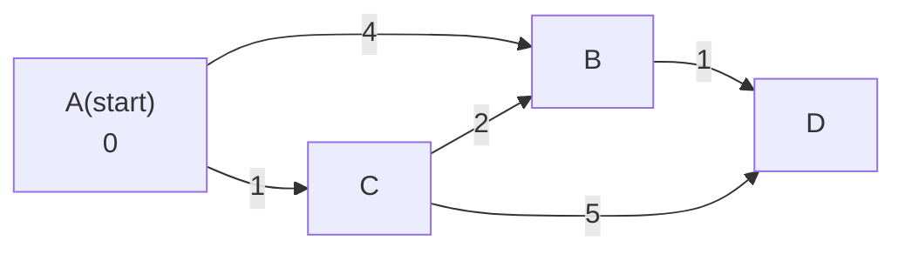

- **최단 경로** → 가중치 그래프에서 두 정점 사이 가중치 합 최소 경로
- 세 알고리즘 → 다익스트라(양수 단일 출발)·벨만포드(음수 허용)·플로이드워셜(모든 쌍)
- 갈림 기준 → 음수 간선 유무·출발지 개수·정점 규모

## 내비게이션으로 보는 최단 경로

- 출발지 = start 정점 · 도착지 = 목적지 정점 · 도로 = 간선 · 통과 시간 = 가중치
- "강남 → 모든 지점 최소 시간" → 단일 출발(single-source) 문제
- 내비는 매 순간 "지금까지 가장 빨리 도달한 지점"부터 확장 → 다익스트라의 핵심
- 환율 차익 무한 루프 → 음수 사이클 · 벨만포드로만 탐지

<KeyPoint title="이 비유에서 가져갈 것">
다익스트라 = 가장 가까운 곳 먼저 확정하는 욕심쟁이 · 음수 간선 있으면 이 가정이 깨짐 ·
음수 간선·음수 사이클 탐지는 벨만포드 · 작은 그래프 모든 쌍은 플로이드워셜
</KeyPoint>

## relax 한 줄로 이해하기

- 모든 최단 경로 알고리즘의 공통 연산 → **완화(relax)**
- `if dist[u] + w < dist[v]: dist[v] = dist[u] + w` → u 거쳐 가면 더 짧으면 갱신
- 다익스트라·벨만포드·플로이드워셜 → 완화를 "어떤 순서로 몇 번" 도느냐의 차이

## 다익스트라 동작 단계 시각화



- 위 그래프에서 start=A · 힙에서 거리 작은 정점 순으로 꺼내 확정

| step | 꺼낸 정점(거리) | dist[A] | dist[B] | dist[C] | dist[D] | 힙 상태 |
| --- | --- | --- | --- | --- | --- | --- |
| 0 | - | 0 | ∞ | ∞ | ∞ | (0,A) |
| 1 | A(0) | 0 | 4 | 1 | ∞ | (1,C)(4,B) |
| 2 | C(1) | 0 | 3 | 1 | 6 | (3,B)(4,B)(6,D) |
| 3 | B(3) | 0 | 3 | 1 | 4 | (4,B)(4,D)(6,D) |
| 4 | D(4) | 0 | 3 | 1 | 4 | 확정 완료 |

- step3에서 B 확정 후 D 완화 → `3+1=4 < 6` → dist[D]=4
- 힙에 남은 `(4,B)(6,D)` 낡은 값 → 꺼낼 때 `d > dist[u]` 검사로 skip

```python
import heapq

def dijkstra(n, adj, start):           # adj[u] = [(v, w), ...] · w >= 0
    dist = [float('inf')] * n
    dist[start] = 0
    pq = [(0, start)]                  # (누적거리, 정점)
    while pq:
        d, u = heapq.heappop(pq)
        if d > dist[u]:                # 낡은 항목 → skip
            continue
        for v, w in adj[u]:
            nd = d + w
            if nd < dist[v]:           # relax
                dist[v] = nd
                heapq.heappush(pq, (nd, v))
    return dist
# 시간 O(E log V) · 공간 O(V+E)
```

## 벨만포드 — 음수 간선·음수 사이클

- 모든 간선을 V-1번 완화 → 음수 간선도 안전 처리
- V번째에 또 줄면 → **음수 사이클 존재** (도달 가능 범위)

| 라운드 | 의미 |
| --- | --- |
| 1 ~ V-1 | 최단 경로 간선 수 최대 V-1 → V-1번이면 수렴 보장 |
| V번째 | 또 완화되면 → 음수 사이클 (무한히 줄어듦) |

```python
def bellman_ford(n, edges, start):     # edges: [(u, v, w), ...]
    dist = [float('inf')] * n
    dist[start] = 0
    for i in range(n - 1):             # V-1 라운드
        updated = False
        for u, v, w in edges:
            if dist[u] != float('inf') and dist[u] + w < dist[v]:
                dist[v] = dist[u] + w
                updated = True
        if not updated:                # 조기 종료
            break
    for u, v, w in edges:              # V번째 → 음수 사이클 검사
        if dist[u] != float('inf') and dist[u] + w < dist[v]:
            return None                # 음수 사이클
    return dist
# 시간 O(V·E) · 공간 O(V)
```

<Note type="warning" title="음수 간선이면 다익스트라 금지">
- 다익스트라는 "한 번 확정한 정점은 다시 줄지 않음" 가정 → 음수 간선이면 깨짐
- 음수 간선 → 벨만포드 · 음수 간선 + 단일 출발 빠르게 → SPFA(벨만포드 큐 최적화)
</Note>

## 플로이드워셜 — 모든 쌍 거리표

- 모든 정점 쌍 최단 거리 한 번에 · 중간 정점 k를 하나씩 끼워 완화
- 점화식 → `dist[i][j] = min(dist[i][j], dist[i][k] + dist[k][j])`
- k 루프가 **가장 바깥**이어야 정확 (i,j보다 먼저)

```python
INF = float('inf')

def floyd_warshall(n, dist):           # dist[i][j] 초기 인접 행렬
    for k in range(n):                 # 중간 정점 (반드시 최외곽)
        for i in range(n):
            for j in range(n):
                if dist[i][k] + dist[k][j] < dist[i][j]:
                    dist[i][j] = dist[i][k] + dist[k][j]
    for i in range(n):                 # 음수 사이클 → 대각선 음수
        if dist[i][i] < 0:
            return None
    return dist
# 시간 O(V^3) · 공간 O(V^2)
```

## 선택 기준 한눈에

<Compare>
<CompareCol title="다익스트라" subtitle="양수 단일 출발" color="sky">
- 간선 가중치 모두 0 이상
- 한 출발지 → 모든 정점
- O(E log V) 빠름 · 음수 불가
</CompareCol>
<CompareCol title="벨만포드" subtitle="음수 허용 단일 출발" color="amber">
- 음수 간선 OK · 음수 사이클 탐지
- O(V·E) 느림
- 환율 차익·제약 조건 그래프
</CompareCol>
<CompareCol title="플로이드워셜" subtitle="모든 쌍" color="green">
- 모든 쌍 거리 필요
- 정점 수 작을 때(V ≤ 500)
- O(V³) · 구현 단순(3중 루프)
</CompareCol>
</Compare>

## 대표 문제

| 문제 | 플랫폼 | 핵심 |
| --- | --- | --- |
| 최단경로 1753 | 백준 | 다익스트라 기본 |
| 타임머신 11657 | 백준 | 벨만포드 음수 사이클 |
| 플로이드 11404 | 백준 | 플로이드워셜 모든 쌍 |
| 743 Network Delay Time | LeetCode | 다익스트라 단일 출발 |
| 787 Cheapest Flights K Stops | LeetCode | 벨만포드 변형(라운드 제한) |

<Note type="danger" title="함정·트레이드오프">
- 다익스트라에 음수 간선 → 잘못된 답(검출도 안 됨) → 입력 가중치 확인 필수
- 플로이드워셜 k 루프 위치 바뀌면 오답 · INF + w 오버플로 주의(파이썬은 무한대라 안전)
- 벨만포드 V-1 라운드 미만이면 미수렴 · `dist[u] == INF` 가드 없으면 INF+음수로 오작동
- 정점 많고 모든 쌍 필요 → 플로이드워셜 O(V³) 폭발 → 다익스트라 V회 반복 고려
</Note>
