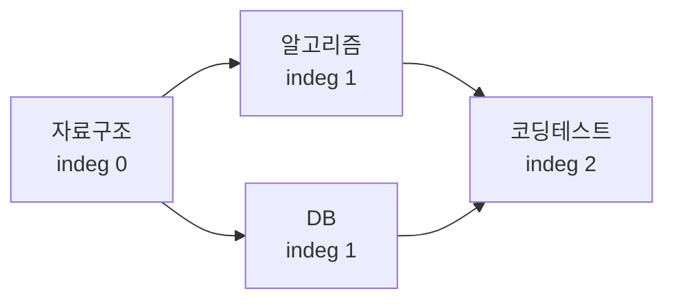

- **위상 정렬** → DAG(방향 비순환 그래프)의 정점을 선행 관계 안 어기게 일렬 나열
- 두 방식 → Kahn(진입차수 BFS)·DFS(후위 순회 역순)
- 순환 있으면 → 위상 순서 불가능 → 두 방식 모두 사이클 검출 가능

## 수강 선수과목으로 보는 위상 정렬

- 과목 = 정점 · "A 들어야 B 가능" = 간선 A→B · 선행 관계 = 방향
- "자료구조 → 알고리즘 → 코딩테스트" 순서를 어기면 안 됨 → 가능한 수강 순서가 위상 순서
- 답이 여러 개일 수 있음 (선행만 지키면 OK)
- 순환(A→B→A)이면 → 영원히 못 들음 → 사이클 = 위상 정렬 불가
- 실무 → 빌드 의존성·태스크 스케줄러·패키지 설치·스프레드시트 셀 계산 순서

<KeyPoint title="이 비유에서 가져갈 것">
위상 정렬 = 선행 관계 어기지 않는 작업 순서 · DAG에서만 성립 ·
Kahn은 "선행 없는 것부터" · DFS는 "끝난 것부터 거꾸로" · 둘 다 사이클을 잡아냄
</KeyPoint>

## Kahn 동작 단계 — 진입차수 갱신



- 초기 진입차수 → A:0 · B:1 · C:1 · D:2
- indeg 0인 정점을 큐에 → 꺼내며 이웃 indeg 감소 → 0 되면 큐 투입

| step | 큐 | 꺼낸 정점 | 갱신 후 indeg | order |
| --- | --- | --- | --- | --- |
| 0 | [A] | - | A0 B1 C1 D2 | [] |
| 1 | [B,C] | A | B0 C0 D2 | [A] |
| 2 | [C,D?] | B | C0 D1 | [A,B] |
| 3 | [C] | (D 미투입) | C0 D1 | [A,B] |
| 4 | [D] | C | D0 | [A,B,C] |
| 5 | [] | D | - | [A,B,C,D] |

- step2 → B 처리 후 D의 indeg 2→1 (아직 0 아님 → 큐 안 들어감)
- step4 → C 처리 후 D의 indeg 1→0 → 큐 투입 · 위상 순서 `A B C D`

```python
from collections import deque

def kahn(n, edges):                    # edges: [(u, v), ...] · u→v
    indeg = [0] * n
    adj = [[] for _ in range(n)]
    for u, v in edges:
        adj[u].append(v)
        indeg[v] += 1
    q = deque(i for i in range(n) if indeg[i] == 0)
    order = []
    while q:
        u = q.popleft()
        order.append(u)
        for v in adj[u]:
            indeg[v] -= 1
            if indeg[v] == 0:          # 선행 다 처리됨 → 투입
                q.append(v)
    return order if len(order) == n else None   # None → 사이클
# 시간 O(V+E) · 공간 O(V+E)
```

## DFS 기반 — 후위 순회 역순

- 깊이 우선으로 끝까지 들어간 뒤 빠져나오는 순간(finish)을 기록
- finish 순서를 뒤집으면 위상 순서
- 방문 상태 3색 → white(미방문)·gray(재귀 중)·black(완료) · gray 재방문 = 사이클

```python
def dfs_topo(n, edges):
    adj = [[] for _ in range(n)]
    for u, v in edges:
        adj[u].append(v)
    color = [0] * n                    # 0 white · 1 gray · 2 black
    order = []
    has_cycle = False
    def dfs(u):
        nonlocal has_cycle
        color[u] = 1                   # gray 진입
        for v in adj[u]:
            if color[v] == 1:          # gray 재방문 → 사이클
                has_cycle = True
            elif color[v] == 0:
                dfs(v)
        color[u] = 2                   # black 완료
        order.append(u)                # 후위 기록
    for i in range(n):
        if color[i] == 0:
            dfs(i)
    return None if has_cycle else order[::-1]    # 역순 → 위상 순서
# 시간 O(V+E) · 공간 O(V) (재귀 스택)
```

## Kahn vs DFS

<Compare>
<CompareCol title="Kahn (BFS)" subtitle="진입차수 큐" color="sky">
- 반복(iterative) → 스택 오버플로 없음
- 사이클 시 order 길이가 V 미만 → 즉시 판정
- 사전순 위상 정렬 → 큐를 힙으로 교체
</CompareCol>
<CompareCol title="DFS" subtitle="후위 역순" color="pink">
- 재귀 자연스러움 · 큰 그래프 → 재귀 한계
- gray 재방문으로 사이클 검출
- 역순 뒤집기 한 단계 필요
</CompareCol>
</Compare>

## 사이클 검출 관점

<Note type="note" title="두 방식 모두 사이클 검출기">
- Kahn → 처리한 정점 수가 V보다 적으면 사이클(indeg 0 못 되는 정점 잔존)
- DFS → 재귀 경로 상의 gray 정점 다시 만나면 후방 간선(back edge) → 사이클
- 방향 그래프 사이클 검출 = 위상 정렬 가능 여부 판정과 동치
</Note>

## 대표 문제

| 문제 | 플랫폼 | 핵심 |
| --- | --- | --- |
| 줄 세우기 2252 | 백준 | Kahn 기본 |
| 게임 개발 1516 | 백준 | 위상 정렬 + 누적 시간(DP) |
| 음악프로그램 2623 | 백준 | 다중 제약 위상 정렬 |
| 207 Course Schedule | LeetCode | 사이클 검출(가능 여부) |
| 210 Course Schedule II | LeetCode | 실제 위상 순서 반환 |

<Note type="danger" title="함정·트레이드오프">
- 위상 순서는 유일하지 않음 → 채점 시 "유효한 순서 중 하나" 또는 사전순 요구 확인
- Kahn에서 indeg 0 초기 정점 누락 → 시작 못 함 → 전 정점 스캔 필수
- DFS 재귀 깊이 → V 크면 setrecursionlimit 또는 반복 DFS로 전환
- 무방향 그래프엔 위상 정렬 개념 없음 → 반드시 방향 그래프(DAG)
- 사이클이면 None/예외 → 빌드 의존성에선 순환 의존 에러로 보고
</Note>
