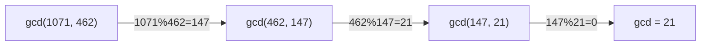
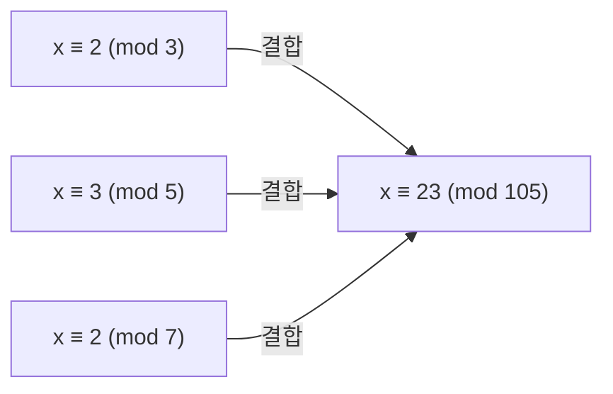

- **GCD(최대공약수)** → 두 수를 동시에 나누는 가장 큰 수
- 핵심 도구 → 유클리드 호제법 · 확장유클리드(베주 계수) · CRT
- 쓰임 → 기약분수·LCM·모듈러 역원·연립 합동 해

## 큰 타일을 정사각형으로 나누기

- 1071×462 직사각형 바닥을 빈틈없이 채울 **가장 큰 정사각형 타일**? → GCD
- 큰 변에서 작은 변만큼 잘라내고 남은 조각으로 다시 반복 → 더 못 자를 때 한 변이 GCD
- "여러 시계(나머지 조건)를 한꺼번에 맞추기" → CRT

<KeyPoint title="이 비유에서 가져갈 것">
유클리드 = 큰 수를 나머지로 계속 줄여 GCD 찾기 · 확장유클리드는 그 과정에서 ax+by=gcd의 계수까지 추적 ·
CRT는 서로소 modulus의 합동 조건들을 하나의 해로 합침
</KeyPoint>

## 유클리드 호제법 — 나머지로 줄이기

- `gcd(a, b) = gcd(b, a mod b)` · 나머지가 0 되면 그때 b가 GCD
- 매 단계 수가 빠르게 줄어 → O(log min(a,b))



| step | a | b | a mod b |
| --- | --- | --- | --- |
| 1 | 1071 | 462 | 147 |
| 2 | 462 | 147 | 21 |
| 3 | 147 | 21 | 0 → gcd=21 |

```python
def gcd(a, b):
    while b:
        a, b = b, a % b           # 나머지로 교체 반복
    return a

def lcm(a, b):
    return a // gcd(a, b) * b      # 먼저 나눠 오버플로 회피
# gcd 시간 O(log min(a, b))
```

## 확장유클리드 — 베주 항등식

- **베주 항등식** → `ax + by = gcd(a, b)`를 만족하는 정수 x, y가 항상 존재
- 유클리드를 거꾸로 따라오며 계수 x, y를 복원
- x가 곧 `a⁻¹ mod b` (gcd=1일 때) → 모듈러 역원의 일반 해법

```python
def ext_gcd(a, b):                # (gcd, x, y), ax + by = gcd
    if b == 0:
        return a, 1, 0
    g, x1, y1 = ext_gcd(b, a % b)
    return g, y1, x1 - (a // b) * y1
# 시간 O(log min(a, b)) · 재귀 깊이 동일

# 모듈러 역원 a⁻¹ mod m (gcd(a, m)=1 전제)
def mod_inverse(a, m):
    g, x, _ = ext_gcd(a, m)
    return x % m if g == 1 else None
```

## 중국인의 나머지 정리(CRT)

- 여러 시계를 동시에 맞추는 문제 → `x ≡ r₁ (mod m₁)`, `x ≡ r₂ (mod m₂)`, ...
- modulus들이 **서로소**면 → `0 ≤ x < m₁·m₂·...·mₖ` 범위에 유일한 해 존재
- 예 → "3으로 나누면 2, 5로 나누면 3, 7로 나누면 2" → x=23



<Timeline>
<TimelineItem title="조건 정리">
각 합동식 `x ≡ rᵢ (mod mᵢ)` 수집 · modulus 서로소 확인
</TimelineItem>
<TimelineItem title="전체 곱 M">
`M = m₁·m₂·...·mₖ` · 각 `Mᵢ = M / mᵢ`
</TimelineItem>
<TimelineItem title="역원·합산">
`tᵢ = Mᵢ⁻¹ mod mᵢ` (확장유클리드) · `x = Σ rᵢ·Mᵢ·tᵢ mod M`
</TimelineItem>
</Timeline>

```python
def crt(remainders, moduli):      # 서로소 가정
    M = 1
    for m in moduli:
        M *= m
    x = 0
    for r, m in zip(remainders, moduli):
        Mi = M // m
        ti = mod_inverse(Mi % m, m)   # Mi의 역원 (mod m)
        x = (x + r * Mi * ti) % M
    return x, M                   # x ≡ 해, mod M에서 유일
# 시간 O(k log M)
```

## 정리·실무 연결

<Compare>
<CompareCol title="유클리드" subtitle="GCD/LCM" color="sky">
- 기약분수·주기 정렬
- LCM = a/gcd·b
- 백준 1934 LCM·2609 GCD/LCM
</CompareCol>
<CompareCol title="확장유클리드" subtitle="역원·디오판토스" color="green">
- ax+by=c 정수해 존재 판정
- 모듈러 역원(합성수 mod)
- 일차 부정방정식
</CompareCol>
<CompareCol title="CRT" subtitle="연립 합동" color="amber">
- 큰 수 분산 계산(여러 소수 mod 후 합성)
- RSA 복호 가속(CRT 최적화)
- 주기 동기화 문제
</CompareCol>
</Compare>

<Note type="danger" title="함정·트레이드오프">
- LCM → `a*b // gcd` 순서면 곱에서 오버플로 → `a // gcd * b`로 먼저 나눔
- 확장유클리드 역원 → `gcd(a, m) ≠ 1`이면 역원 없음 → g 검사 필수
- CRT → modulus 서로소 아니면 기본 공식 깨짐 → 일반화 CRF(짝별 결합) 필요
- ax+by=c → c가 gcd(a,b)의 배수일 때만 정수해 존재
- 음수 결과 → `x % M` 후에도 언어에 따라 음수 → `(x % M + M) % M` 보정
</Note>
