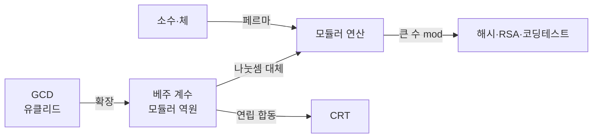

- **정수론** → 정수의 나눗셈·나머지·소수·배수 성질을 다루는 분야
- 코딩테스트·암호(RSA)·해시·난수 → 전부 정수론 위에 세워짐
- 핵심 질문 → "큰 수의 나머지?"(모듈러) · "소수인가?"(소수 판정) · "나눗셈을 어떻게?"(역원·CRT)

## 시계로 보는 정수론

- 시계는 12를 넘으면 1로 돌아옴 → 정수를 **나머지로 압축**하는 게 모듈러 연산
- "이 수가 더 못 쪼개지나?" → 소수(prime) · 모든 수는 소수의 곱으로 분해
- "큰 타일을 정사각형으로 빈틈없이?" → 최대공약수(GCD)와 유클리드 호제법
- "여러 시계를 동시에 맞추기" → 중국인의 나머지 정리(CRT)

<KeyPoint title="이 비유에서 가져갈 것">
정수론 알고리즘 = 큰 수를 나머지·소수·공약수라는 작은 구조로 압축 ·
나눗셈이 안 되는 모듈러 세계에서 역원이 나눗셈을 대신 · 큰 수 연산은 항상 mod를 끼고 계산
</KeyPoint>

## 왜 알고리즘·암호에 쓰나

- **오버플로 회피** → 큰 수 곱셈 결과를 `mod 10^9+7`로 압축해 64비트 안에 유지
- **해시** → 문자열·키를 소수 기반 모듈러로 버킷에 분산
- **암호(RSA)** → 큰 소수 곱은 분해가 어려움 → 공개키 안전성의 근거
- **난수·체크섬** → 모듈러 합·곱으로 검증값 생성

<Stats>
<Stat value="10^9+7" label="흔한 모듈러 소수" sub="결과 압축 표준값"/>
<Stat value="O(log n)" label="빠른 거듭제곱·GCD" sub="반씩 쪼개 계산"/>
<Stat value="O(n log log n)" label="에라토스테네스의 체" sub="n까지 소수 전부"/>
</Stats>

## 하위 토픽

<Cards cols={3}>
<Card icon="🕐" title="Modular & Inverse">
모듈러 사칙연산 · 페르마 소정리 · 모듈러 역원 · 빠른 거듭제곱
</Card>
<Card icon="🔢" title="Primes & Sieve">
소수 판정 · 에라토스테네스의 체 · 소인수분해 · 선형 체
</Card>
<Card icon="📐" title="GCD · Euclid · CRT">
유클리드·확장유클리드 · 베주 항등식 · 중국인의 나머지 정리
</Card>
</Cards>

## 토픽 연결 흐름

- GCD → 역원 → 모듈러 연산 → 실무(해시·암호)로 이어지는 의존 흐름
- 소수·체는 페르마 소정리로 모듈러 역원과 연결 · CRT는 확장유클리드 기반

## 핵심 요약

| 개념 | 한 줄 | 복잡도 |
| --- | --- | --- |
| 모듈러 사칙연산 | 더하기·곱하기마다 mod | O(1) |
| 빠른 거듭제곱 | 지수를 절반씩 | O(log n) |
| 모듈러 역원 | 나눗셈 대체(페르마/확장유클리드) | O(log mod) |
| 소수 판정 | √n까지 나눔 | O(√n) |
| 에라토스테네스 체 | n까지 소수 일괄 | O(n log log n) |
| 유클리드 GCD | 나머지로 줄이기 | O(log min) |
| CRT | 연립 합동 해 | O(k log m) |

<Note type="warning" title="모듈러 세계의 첫 함정">
- 모듈러에서 나눗셈은 그냥 안 됨 → `(a/b) mod m`은 `a · b⁻¹ mod m`
- 뺄셈 결과 음수 → `(a - b + m) % m`로 보정
- 곱셈 전에도 각 항을 미리 mod → 중간 오버플로 방지
</Note>
