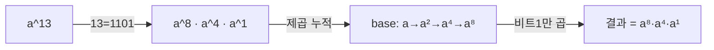

- **모듈러 연산** → 나눈 나머지만 보는 연산 · 큰 수를 작은 범위로 압축
- 핵심 도구 → 사칙연산 분배 · 빠른 거듭제곱 · 모듈러 역원
- 쓰임 → 큰 수 나머지(코딩테스트)·해시 분산·RSA 복호

## 시계로 보는 모듈러

- 시계는 15시를 가리켜도 우리는 "3시" → `15 mod 12 = 3`
- 7시간 뒤? → `(15 + 7) mod 12 = 10` · 더하기 후 나머지나, 나머지끼리 더하나 같음
- 핵심 → 연산 **중간중간 mod를 끼워도 결과 동일** → 큰 수가 작게 유지됨

<KeyPoint title="이 비유에서 가져갈 것">
모듈러 = 순환하는 시계 세계 · 덧셈·뺄셈·곱셈은 자유롭게 mod 분배 가능 ·
단 나눗셈은 직접 안 되고 역원(곱셈의 역)이 필요
</KeyPoint>

## 사칙연산 분배 법칙

| 연산 | 법칙 | 주의 |
| --- | --- | --- |
| 덧셈 | `(a+b) % m = ((a%m)+(b%m)) % m` | - |
| 뺄셈 | `(a-b) % m = ((a%m)-(b%m)+m) % m` | 음수 보정 +m |
| 곱셈 | `(a·b) % m = ((a%m)·(b%m)) % m` | 곱 전 각 항 mod |
| 나눗셈 | `(a/b) % m = (a · b⁻¹) % m` | 역원 필요 |

- 덧셈·곱셈은 그대로 분배 · 뺄셈은 음수 나올 수 있어 `+m` 보정
- 나눗셈만 특수 → 역원으로 곱셈 변환

## 빠른 거듭제곱 — 지수를 절반씩

- `a^13` 을 13번 곱하지 않음 → 지수를 이진수로 보고 **반씩 쪼갬**
- `13 = 1101₂` → `a^8 · a^4 · a^1` · 제곱을 누적하며 비트 켜진 곳만 곱함
- 곱셈 횟수 → O(n)에서 O(log n)으로 급감



| step | 지수 비트 | base | result |
| --- | --- | --- | --- |
| 1 | 1 (2⁰) | a | a |
| 2 | 0 (2¹) | a² | a |
| 3 | 1 (2²) | a⁴ | a·a⁴ = a⁵ |
| 4 | 1 (2³) | a⁸ | a⁵·a⁸ = a¹³ |

```python
def pow_mod(a, e, m):              # a^e mod m
    result = 1
    a %= m
    while e > 0:
        if e & 1:                  # 지수 최하위 비트 1 → 곱
            result = result * a % m
        a = a * a % m              # base 제곱
        e >>= 1                    # 지수 절반
    return result
# 시간 O(log e) · 공간 O(1)
# 파이썬은 pow(a, e, m) 내장으로 동일 동작
```

## 페르마 소정리 — 역원의 지름길

- m이 **소수**이고 a가 m의 배수가 아니면 → `a^(m-1) ≡ 1 (mod m)`
- 양변을 a로 나누면 → `a^(m-2) ≡ a⁻¹ (mod m)`
- 즉 모듈러 역원 → `pow(a, m-2, m)` 한 줄

```python
def inv_fermat(a, m):              # m이 소수일 때만
    return pow(a, m - 2, m)        # a^(m-2) mod m
# 시간 O(log m) · 전제: m 소수, gcd(a, m) = 1
```

## 모듈러 역원 — 확장유클리드 버전

- m이 소수가 아니어도 → `gcd(a, m) = 1`이면 확장유클리드로 역원
- `a·x + m·y = 1`의 해 x가 곧 `a⁻¹ mod m`
- 페르마는 소수 전용·간단 · 확장유클리드는 일반 modulus 대응

<Compare>
<CompareCol title="페르마 소정리" subtitle="modulus 소수" color="sky">
- `pow(a, m-2, m)` 한 줄
- m이 소수여야만 성립
- 코딩테스트 mod 10^9+7에 최적
</CompareCol>
<CompareCol title="확장유클리드" subtitle="gcd(a,m)=1" color="green">
- `a·x + m·y = gcd`의 x
- m이 합성수여도 동작
- 일반 modulus·CRT 결합에 사용
</CompareCol>
</Compare>

```python
def inv_egcd(a, m):                # gcd(a, m) = 1 전제
    g, x, _ = ext_gcd(a % m, m)
    if g != 1:
        return None                # 역원 없음
    return x % m                   # 음수 보정 포함

def ext_gcd(a, b):                 # a·x + b·y = gcd 반환
    if b == 0:
        return a, 1, 0
    g, x1, y1 = ext_gcd(b, a % b)
    return g, y1, x1 - (a // b) * y1
# 시간 O(log min(a, m))
```

## 실무·문제 연결

| 상황 | 적용 |
| --- | --- |
| 큰 수 나머지(팩토리얼·조합) | 곱마다 mod + 역원으로 나눗셈 |
| 조합 nCr mod p | 분모 r!·(n-r)! → 페르마 역원 |
| 해시 테이블 | 키 mod 소수 → 버킷 분산 |
| RSA 복호 | 빠른 거듭제곱 + 모듈러 역원 |
| 백준 13172 | 분수 합 mod → 모듈러 역원 |

<Note type="danger" title="오버플로·모듈러 함정">
- C++/Java → `a*b`가 int 범위 초과 → long long·128bit 필요 (파이썬은 큰 정수라 안전)
- 뺄셈 음수 → `(a - b + m) % m` 보정 안 하면 음수 인덱스·오답
- 페르마 역원 → m이 소수가 아니면 틀린 값(검출 안 됨) → modulus 소수 확인 필수
- `gcd(a, m) ≠ 1`이면 역원 자체가 없음 → 확장유클리드 g 검사 필요
</Note>
