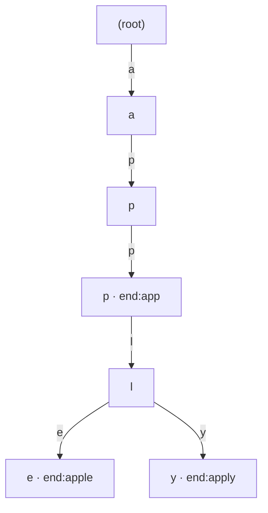

- **문자열 검색** → 긴 글(text) 안에서 짧은 패턴(pattern) 위치 찾기
- 단순 비교 → 매번 한 칸씩 밀며 다시 비교 → 최악 O(N·M) 느림
- KMP·라빈카프·트라이 → "이미 비교한 정보"를 버리지 않고 재활용

## 사전 자동완성으로 문자열 보기

- 검색창에 `app` 입력 → `apple`·`application`·`apply` 후보 즉시 뜸
- 한 글자씩 따라 내려가는 **사전 트리** 구조가 바로 **트라이(Trie)**
- "이 패턴이 글 어디 있나" → KMP·라빈카프 · "이 접두사로 시작하는 단어들" → 트라이

<KeyPoint title="이 비유에서 가져갈 것">
문자열 알고리즘 = "이미 본 글자 정보를 버리지 않는 것" ·
KMP는 실패해도 처음부터 안 돌아가고 · 트라이는 공통 접두사를 한 길로 합침
</KeyPoint>

## 알고리즘 한눈에

<Cards cols={2}>
<Card icon="🔍" title="KMP">
실패 함수로 비교 위치 점프 · 단일 패턴 검색 O(N+M)
</Card>
<Card icon="🎲" title="라빈카프">
해시값 비교로 빠른 후보 선별 · 다중 패턴·표절 검사
</Card>
<Card icon="🌲" title="트라이">
접두사 트리 · 자동완성·사전·IP 라우팅
</Card>
<Card icon="📑" title="접미사 배열">
모든 접미사 정렬 · 부분 문자열 대량 검색
</Card>
</Cards>

## KMP — 문자열 검색엔진의 점프

- 단순 검색 → 불일치 나면 패턴을 한 칸 밀고 **처음부터** 다시 비교 (낭비)
- KMP → 패턴 내부의 "접두사=접미사" 정보(실패 함수)로 **이미 맞춘 만큼 건너뜀**
- 실무 → grep·에디터 찾기·로그 패턴 매칭

```python
def build_lps(pattern):            # lps[i] = pattern[:i+1]의 최장 접두사=접미사 길이
    lps = [0] * len(pattern)
    length = 0
    for i in range(1, len(pattern)):
        while length > 0 and pattern[i] != pattern[length]:
            length = lps[length - 1]   # 점프
        if pattern[i] == pattern[length]:
            length += 1
            lps[i] = length
    return lps

def kmp_search(text, pattern):
    lps = build_lps(pattern)
    j = 0
    res = []
    for i in range(len(text)):
        while j > 0 and text[i] != pattern[j]:
            j = lps[j - 1]         # 불일치 → 처음 아닌 lps 위치로
        if text[i] == pattern[j]:
            j += 1
            if j == len(pattern):
                res.append(i - j + 1)
                j = lps[j - 1]
    return res
# 시간복잡도 O(N+M)
```

- 예시 → 패턴 `ABABC`의 lps → `[0,0,1,2,0]` · 불일치 시 이 값만큼 패턴을 당겨 비교 재개

## 라빈카프 — 해시로 빠르게 거르기

- 패턴과 글의 윈도우를 **해시값**으로 먼저 비교 → 같을 때만 글자 직접 확인
- 롤링 해시 → 한 칸 밀 때 전체 재계산 없이 O(1)로 갱신
- 실무 → 표절 탐지·중복 문서 검출·여러 패턴 동시 검색

```python
def rabin_karp(text, pattern, base=256, mod=1_000_000_007):
    n, m = len(text), len(pattern)
    if m > n:
        return []
    high = pow(base, m - 1, mod)
    ph = th = 0
    for i in range(m):             # 초기 해시
        ph = (ph * base + ord(pattern[i])) % mod
        th = (th * base + ord(text[i])) % mod
    res = []
    for i in range(n - m + 1):
        if ph == th and text[i:i+m] == pattern:   # 해시 같으면 실제 확인
            res.append(i)
        if i < n - m:              # 롤링 해시 갱신
            th = ((th - ord(text[i]) * high) * base + ord(text[i+m])) % mod
            th %= mod
    return res
# 평균 O(N+M), 최악 O(N·M) (해시 충돌)
```

<Note type="warning" title="해시 충돌 주의">
- 해시가 같아도 실제 문자열은 다를 수 있음 → 반드시 직접 비교로 확정
- mod·base 잘못 고르면 충돌 잦아져 최악 O(N·M)로 퇴화
</Note>

## 트라이(Trie) — 자동완성 사전

- 각 노드 = 글자 · 루트에서 단어 끝까지 한 경로 · 공통 접두사는 한 길로 합침
- `app`·`apple`·`apply` → `a-p-p` 까지 공유 후 분기
- 실무 → 검색 자동완성·맞춤법 사전·IP 라우팅 테이블(최장 접두사 매칭)



```python
class Trie:
    def __init__(self):
        self.children = {}
        self.is_end = False

    def insert(self, word):
        node = self
        for ch in word:
            node = node.children.setdefault(ch, Trie())
        node.is_end = True

    def starts_with(self, prefix):     # 자동완성 후보 탐색용
        node = self
        for ch in prefix:
            if ch not in node.children:
                return False
            node = node.children[ch]
        return True
# 삽입·검색 O(L), L = 단어 길이 (글 전체 크기와 무관)
```

## 접미사 배열 개요

- 한 문자열의 **모든 접미사를 사전순 정렬**한 인덱스 배열
- 정렬된 배열에서 이분 탐색 → 부분 문자열 존재 여부·빈도 빠르게
- 실무 → 대용량 텍스트 색인·생물정보학 DNA 검색·압축
- 구축 → 단순 O(N²·log N) · 개선 알고리즘 O(N log N)·O(N)

## 비교표

| 알고리즘 | 용도 | 전처리 | 검색 | 비고 |
| --- | --- | --- | --- | --- |
| 단순 비교 | 단일 패턴 | 없음 | O(N·M) | 짧은 글 |
| KMP | 단일 패턴 | O(M) | O(N) | 안정적 최악 보장 |
| 라빈카프 | 다중 패턴 | O(M) | O(N) 평균 | 표절·중복 검출 |
| 트라이 | 접두사 검색 | O(전체) | O(L) | 자동완성 |
| 접미사 배열 | 부분문자열 대량 | O(N log N) | O(M log N) | 정적 텍스트 색인 |

<Note type="pink" title="실무에서 고르기">
- 한 패턴 한 번 검색·최악 보장 필요 → KMP
- 여러 패턴 동시·표절/중복 검사 → 라빈카프(롤링 해시)
- "이 접두사로 시작하는 것들" 자동완성 → 트라이
- 같은 글에서 검색 수없이 반복(정적 텍스트) → 접미사 배열로 미리 색인
</Note>
