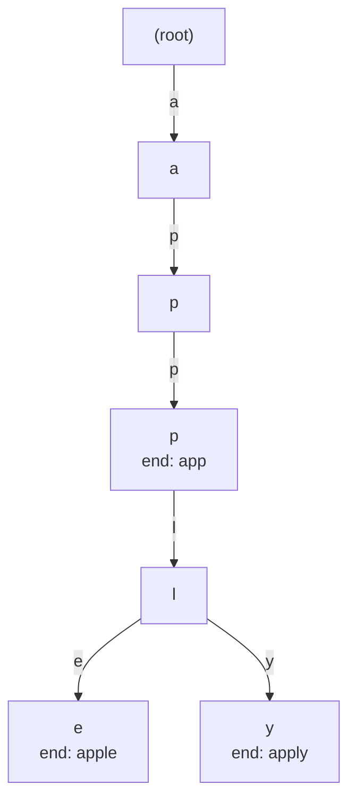

- **트라이(Trie)** → 글자를 간선으로 따라 내려가는 접두사 트리(prefix tree)
- 공통 접두사 → 한 경로로 합쳐 공유 → `app`·`apple`·`apply`는 `a-p-p`까지 공용
- 핵심 → 삽입·검색 모두 O(L) (단어 길이만큼) · 저장 단어 수·전체 크기와 무관

## 사전 자동완성 비유

- 검색창에 `app` 입력 → `apple`·`application`·`apply` 후보 즉시 등장
- 한 글자씩 따라 내려가는 사전 구조 → 그게 바로 트라이
- 접두사 노드에 도달 → 그 아래 서브트리 전부가 자동완성 후보

<KeyPoint title="이 비유에서 가져갈 것">
트라이 = "공통 접두사를 한 길로 합친 사전" ·
검색 비용이 단어 개수가 아니라 단어 길이에 비례 → 사전이 거대해도 빠름
</KeyPoint>

## 구조 그림 (`app` · `apple` · `apply`)



- `a-p-p` → 세 단어 공유 → `app` 노드에서 단어 끝(`is_end`) 표시
- `l` 분기 → `apple` · `apply` 갈라짐 · 각 끝 노드에 `is_end`

## 동작 단계

<Timeline>
<TimelineItem title="1. 삽입(insert)">
루트부터 글자 따라 내려가며 없는 자식은 새로 생성 · 마지막 노드 `is_end=True`
</TimelineItem>
<TimelineItem title="2. 검색(search)">
글자 따라 내려가다 자식 없으면 실패 · 끝 노드 `is_end` True여야 단어 존재
</TimelineItem>
<TimelineItem title="3. 접두사 검색(startsWith)">
끝까지 경로만 존재하면 성공 · `is_end` 무관 → 자동완성 후보 진입점
</TimelineItem>
<TimelineItem title="4. 자동완성(suggest)">
접두사 노드 도달 후 그 서브트리를 DFS → 끝 노드들 수집
</TimelineItem>
</Timeline>

## Python 구현

```python
class Trie:
    def __init__(self):
        self.children: dict[str, "Trie"] = {}
        self.is_end = False

    def insert(self, word: str) -> None:
        node = self
        for ch in word:
            node = node.children.setdefault(ch, Trie())  # 없으면 생성
        node.is_end = True

    def search(self, word: str) -> bool:
        node = self._walk(word)
        return node is not None and node.is_end          # 끝 표시까지 확인

    def starts_with(self, prefix: str) -> bool:
        return self._walk(prefix) is not None            # 경로만 존재하면 True

    def _walk(self, s: str) -> "Trie | None":
        node = self
        for ch in s:
            if ch not in node.children:
                return None
            node = node.children[ch]
        return node

    def suggest(self, prefix: str) -> list[str]:
        node = self._walk(prefix)
        if node is None:
            return []
        out = []
        def dfs(cur: "Trie", path: str):
            if cur.is_end:
                out.append(prefix + path)
            for ch, nxt in cur.children.items():
                dfs(nxt, path + ch)
        dfs(node, "")
        return out
# 삽입·검색·접두사 O(L) · 자동완성 O(접두사 + 후보 글자 총합)
```

<Stats>
<Stat value="O(L)" label="삽입 / 검색" sub="단어 길이 L · 단어 수 무관" />
<Stat value="O(L)" label="접두사 매칭" sub="해시맵보다 접두사에 강함" />
<Stat value="O(N·L·Σ)" label="최악 메모리" sub="노드마다 자식 포인터" />
</Stats>

## 메모리 트레이드오프

<ProsCons>
<Pros title="장점">
- 접두사 검색·자동완성 O(L) → 사전 커도 빠름
- 정렬·범위 탐색 자연스러움 (사전순 DFS)
- 공통 접두사 공유 → 중복 글자 저장 안 함
</Pros>
<Cons title="단점">
- 노드마다 자식 맵 → 단어 적고 분산되면 메모리 낭비
- 해시셋 대비 단순 존재 검사 오버헤드 큼
- 포인터 추적 → 캐시 지역성 나쁨
</Cons>
</ProsCons>

- 절충안 → 압축 트라이(Radix/Patricia) · 배열 기반 자식 · DAWG로 메모리 축소

## 활용처

<Cards cols={2}>
<Card icon="🔎" title="자동완성·검색어 추천">
접두사 노드 아래 서브트리 = 후보 목록
</Card>
<Card icon="📖" title="맞춤법 사전·사전 조회">
단어 존재·접두사 빠른 판정
</Card>
<Card icon="🌐" title="IP 라우팅(최장 접두사 매칭)">
비트 트라이로 라우팅 테이블 구성
</Card>
<Card icon="🧬" title="다중 패턴 매칭(Aho-Corasick)">
트라이 + 실패 링크 → 여러 패턴 동시 검색
</Card>
</Cards>

## 대표 문제

- 백준 5052 전화번호 목록 → 한 번호가 다른 번호의 접두사면 일관성 깨짐 → 트라이로 판정
- 14425 문자열 집합 · 9202 Boggle(트라이+DFS) · 자동완성형 다수

```python
def is_consistent(numbers: list[str]) -> bool:
    numbers.sort()                       # 정렬 시 접두사가 바로 앞에 옴
    trie = Trie()
    for num in numbers:
        node = trie
        for ch in num:
            if node.is_end:              # 진행 중 끝 단어 만남 → 접두사 충돌
                return False
            node = node.children.setdefault(ch, Trie())
        if node.children:                # 더 긴 단어의 접두사가 됨
            return False
        node.is_end = True
    return True
```

<Note type="warning" title="자주 하는 실수">
- `is_end` 미설정 → 접두사만 있고 단어는 없는 경우 구분 못 함
- `search`와 `starts_with` 혼동 → 단어 존재 검사엔 반드시 `is_end` 확인
- 삭제 시 다른 단어가 공유하는 노드까지 제거 → 자식·`is_end` 검사 후 정리
- 알파벳 큰데 자식 배열 26 고정 → 한글·유니코드는 dict 권장
</Note>
