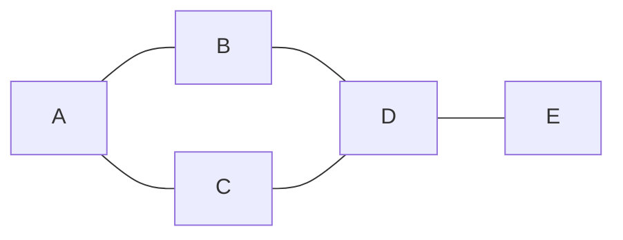

- **그래프 탐색** → 노드(정점) 하나에서 시작 → 연결된 노드 따라가며 전부 방문
- **BFS**(너비 우선) → 가까운 곳부터 한 겹씩 → 물결 퍼지듯
- **DFS**(깊이 우선) → 한 길 끝까지 가본 뒤 되돌아옴 → 미로 한 길 끝까지
- 두 방식 모두 핵심은 **방문 체크** → 같은 노드 두 번 안 들름

## 물결 vs 미로로 이해하기

- **BFS = 연못에 돌 던지기** → 돌 떨어진 자리에서 동심원이 가까운 곳부터 차례로 퍼짐 → 거리 1짜리 다 본 뒤 거리 2로
- **DFS = 미로에서 한 손 벽 짚기** → 갈림길 만나면 일단 한 길 끝까지 → 막히면 마지막 갈림길로 되돌아와(backtrack) 다른 길
- 같은 그래프라도 **방문 순서가 다름** → 목적에 따라 골라 씀

<KeyPoint title="이 비유에서 가져갈 것">
BFS = 가까운 순서 보장 → 무가중치 최단경로에 딱 ·
DFS = 한 줄기 깊이 파고듦 → 경로 존재·사이클·연결 요소 확인에 편함
</KeyPoint>

## 그래프를 코드로 담기 (인접 리스트)

- **인접 리스트** → 노드마다 "내 이웃 목록"만 저장 → 메모리 절약 · 희소 그래프에 유리
- 친구 추천 그래프 예시 → 사람=노드, 친구 관계=간선

```python
# 친구 관계 (무방향) → 인접 리스트
graph = {
    "A": ["B", "C"],
    "B": ["A", "D"],
    "C": ["A", "D"],
    "D": ["B", "C", "E"],
    "E": ["D"],
}
# A의 이웃 → graph["A"] == ["B", "C"]
```

## A에서 시작하는 탐색 (예제 그래프)



- 위 그래프를 A에서 시작 → BFS와 DFS 방문 순서 비교

### BFS 방문 순서 (큐 사용)

- 큐(FIFO) → 먼저 넣은 노드 먼저 꺼냄 → 가까운 겹부터

| step | 큐 상태(앞→뒤) | 꺼낸 노드 | 방문 표시 | 새로 큐에 넣음 |
|------|----------------|-----------|-----------|----------------|
| 1 | [A] | A | A | B, C |
| 2 | [B, C] | B | A B | D |
| 3 | [C, D] | C | A B C | (D는 이미 큐) |
| 4 | [D] | D | A B C D | E |
| 5 | [E] | E | A B C D E | - |

- 결과 → **A B C D E** → A 기준 거리순(0,1,1,2,3)

### DFS 방문 순서 (스택/재귀)

- 스택(LIFO) → 나중에 넣은 노드 먼저 꺼냄 → 한 길 끝까지

| step | 스택 상태(아래→위) | 꺼낸 노드 | 방문 표시 | 새로 스택에 넣음 |
|------|--------------------|-----------|-----------|------------------|
| 1 | [A] | A | A | B, C |
| 2 | [B, C] | C | A C | D |
| 3 | [B, D] | D | A C D | B, E |
| 4 | [B, B, E] | E | A C D E | - |
| 5 | [B, B] | B | A C D E B | - |

- 결과 → **A C D E B** → 한 줄기(C→D→E) 끝까지 판 뒤 되돌아옴

## BFS vs DFS

<Compare>
<CompareCol title="🌊 BFS" subtitle="너비 우선 · 큐" color="sky">
- 자료구조 → **큐**(FIFO)
- 가까운 노드부터 → 거리순 방문
- 무가중치 **최단경로** 보장
- 메모리 → 한 겹 노드 다 담음(넓으면 ⬆️)
</CompareCol>
<CompareCol title="🌀 DFS" subtitle="깊이 우선 · 스택/재귀" color="pink">
- 자료구조 → **스택** 또는 재귀 호출
- 한 길 끝까지 → backtrack
- 사이클·연결 요소·경로 존재 확인에 편함
- 메모리 → 경로 깊이만큼(깊으면 스택 ⬆️)
</CompareCol>
</Compare>

## BFS 코드 + 무가중치 최단경로

- 큐에 넣을 때 거리(dist) 같이 기록 → 처음 도달한 거리가 곧 최단

```python
from collections import deque

def bfs_shortest(graph, start):
    visited = {start}            # 방문 체크 (중복 방지)
    dist = {start: 0}
    q = deque([start])
    order = []
    while q:
        node = q.popleft()       # 큐 → 가까운 것 먼저
        order.append(node)
        for nxt in graph[node]:
            if nxt not in visited:
                visited.add(nxt)        # 큐에 넣을 때 바로 방문 표시
                dist[nxt] = dist[node] + 1
                q.append(nxt)
    return order, dist

# bfs_shortest(graph, "A")
# order → ['A','B','C','D','E'],  dist → {A:0,B:1,C:1,D:2,E:3}
```

- 시간복잡도 → 노드마다 한 번, 간선마다 한 번 → **O(V+E)**

<Note type="warning" title="방문 표시는 큐에 넣는 순간">
- 꺼낼 때 표시하면 → 같은 노드가 큐에 **여러 번** 들어가 중복 처리
- 큐에 넣자마자 visited 처리 → 한 번만 큐에 들어감
</Note>

## DFS 코드 (재귀 · 스택)

```python
# 재귀 버전 → 호출 스택이 곧 스택 역할
def dfs_recursive(graph, node, visited, order):
    visited.add(node)
    order.append(node)
    for nxt in graph[node]:
        if nxt not in visited:
            dfs_recursive(graph, nxt, visited, order)

# 명시적 스택 버전 → 깊은 그래프에서 재귀 한도 회피
def dfs_iterative(graph, start):
    visited, order, stack = set(), [], [start]
    while stack:
        node = stack.pop()       # 스택 → 나중 것 먼저
        if node in visited:
            continue
        visited.add(node)
        order.append(node)
        for nxt in graph[node]:
            if nxt not in visited:
                stack.append(nxt)
    return order
```

- 시간복잡도 → 마찬가지 **O(V+E)** · 공간 → O(V)(방문 집합) + 재귀 깊이

## 어디에 쓰나 (실무 예시)

<Cards cols={2}>
<Card icon="🤝" title="친구 추천 (BFS)">
거리 1 = 친구, 거리 2 = 친구의 친구 → BFS로 거리별 묶어 "알 수도 있는 사람" 추천
</Card>
<Card icon="🗺️" title="최단 경로 (BFS)">
무가중치 미로·격자 → 시작에서 목적지까지 최소 칸 수 → BFS 거리 그대로
</Card>
<Card icon="🧩" title="연결 요소 (DFS/BFS)">
방문 안 한 노드에서 탐색 시작 → 한 번에 닿는 노드 = 한 덩어리 → 시작 횟수 = 덩어리 개수
</Card>
<Card icon="🔁" title="사이클 탐지 (DFS)">
DFS 중 이미 방문 중인 노드를 다시 만나면 → 순환 존재 → 의존성 그래프 데드락 점검
</Card>
</Cards>

### 연결 요소 세기

```python
def count_components(graph):
    visited = set()
    count = 0
    for node in graph:
        if node not in visited:      # 새 덩어리 시작점
            count += 1
            dfs_recursive(graph, node, visited, [])
    return count
# 모든 노드가 이어져 있으면 → 1
```

## 시간복잡도 정리

<Stats>
<Stat value="O(V+E)" label="BFS / DFS" sub="정점 V + 간선 E 한 번씩"/>
<Stat value="O(V)" label="추가 공간" sub="방문 집합 + 큐/스택"/>
<Stat value="O(1)" label="이웃 조회" sub="인접 리스트 기준"/>
</Stats>

<Note type="pink" title="고를 때 한 줄 기준">
- **최단 거리·가까운 순** 필요 → BFS (큐)
- **경로 존재·사이클·연결 덩어리** → DFS (스택/재귀)
- 둘 다 방문 체크 필수 → 안 하면 무한 루프 (사이클 그래프)
- 가중치 있는 최단경로 → BFS 아님 → 다익스트라 등 별도 알고리즘
</Note>
