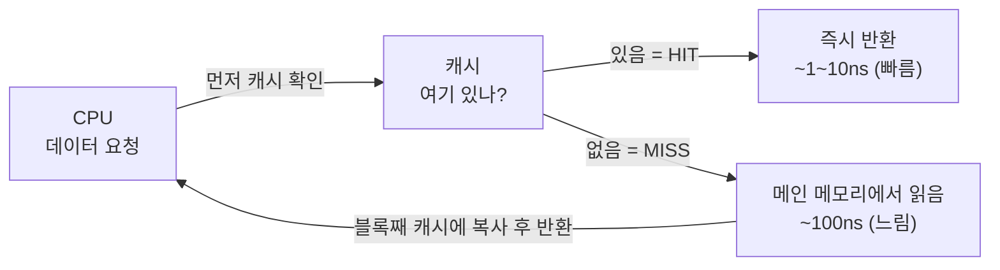

- **캐시** → 자주 쓰는 데이터를 CPU 가까이 미리 복사해 두는 **빠른 작은 저장소**
- 느린 메모리(RAM)까지 매번 가는 대신 → 가까운 캐시에서 바로 꺼내 속도 ⬆️
- 한 줄 요약 → "또 쓸 것 같은 것"을 가까이 둬서 → 느린 길을 덜 다님

## 자주 쓰는 양념을 손 닿는 곳에 두기

- 요리사가 소금·후추를 매번 **창고(RAM)** 까지 가서 가져오면 느림
- 자주 쓰니까 → **조리대 위(캐시)** 에 미리 꺼내 둠 → 손만 뻗으면 됨
- 필요한 게 조리대에 있음 → **캐시 히트** (빠름) / 없어서 창고 다녀옴 → **캐시 미스** (느림)
- 조리대는 작음 → 안 쓰는 양념은 다시 창고로 (교체)

<KeyPoint title="이 비유에서 가져갈 것">
캐시는 작고 빠른 임시 보관소 · "또 쓸 가능성 높은 것"을 미리 당겨둠 · 맞으면(hit) 즉시, 빗나가면(miss) 느린 메모리행 · 캐시가 잘 맞는지가 같은 코드의 속도를 몇 배까지 가름
</KeyPoint>

## 캐시가 통하는 이유 — 지역성

<Compare>
<CompareCol title="⏱️ 시간 지역성" subtitle="Temporal Locality" color="sky">
- 방금 쓴 데이터를 **곧 또** 쓸 확률 높음
- 예: 반복문 변수 `i`, 같은 함수 반복 호출
- → 한 번 가져온 건 캐시에 **남겨두면** 다음에 또 히트
</CompareCol>
<CompareCol title="📦 공간 지역성" subtitle="Spatial Locality" color="green">
- 쓴 데이터 **근처**를 곧 쓸 확률 높음
- 예: 배열 `a[0]` 썼으면 `a[1]`도 곧 씀
- → 캐시는 한 번에 **덩어리(블록/라인)** 로 가져옴
</CompareCol>
</Compare>

- → 캐시는 이 두 습성을 노려서 → "방금 것 + 그 주변"을 통째로 보관

## 히트와 미스 흐름



- **Hit Rate(적중률)** → 전체 요청 중 캐시에서 바로 찾은 비율 → 높을수록 빠름
- **Miss Penalty** → 미스 시 느린 메모리 다녀오는 추가 비용
- 평균 접근 시간 ≈ (히트율 × 캐시속도) + (미스율 × 메모리속도) → 히트율을 95%+ 로 올리는 게 핵심

## 매핑 방식 — 메모리 블록을 캐시 어디에 둘까

| 방식 | 규칙 | 장점 | 단점 |
|---|---|---|---|
| **Direct Mapped** | 블록마다 들어갈 **칸 1개로 고정** | 찾기 빠름·단순 | 같은 칸 노리면 충돌 잦음 |
| **Fully Associative** | 빈 칸 **아무 데나** 가능 | 충돌 최소 | 전체 검색 → 비쌈·느림 |
| **Set-Associative** | 칸을 그룹(set)으로 묶고 **그룹 안 어디든** | 절충안 (실무 표준) | 약간의 검색 비용 |

- **Direct** → "이 블록은 무조건 3번 칸" → 빠르지만 3번 칸 노리는 블록들끼리 서로 쫓아냄
- **N-way Set-Associative** → "이 그룹 안에 N칸 중 아무 데나" → 4-way, 8-way가 흔함 → 충돌·속도 균형

## 쓰기 정책 — 캐시 값을 바꾸면 메모리는 언제 갱신?

<Compare>
<CompareCol title="✍️ Write-Through" subtitle="즉시 반영" color="amber">
- 캐시 쓸 때 **메모리도 즉시** 같이 씀
- 항상 일치 → 데이터 안전·단순
- 쓸 때마다 느린 메모리 접근 → 쓰기 느림
</CompareCol>
<CompareCol title="🗂️ Write-Back" subtitle="나중에 한 번에" color="pink">
- 일단 **캐시에만** 쓰고 표시(dirty)
- 그 블록이 **밀려날 때** 메모리에 반영
- 쓰기 빠름 · 대신 일시적으로 불일치·복잡
</CompareCol>
</Compare>

<ProsCons>
<Pros title="Write-Back이 보통 유리">
- 같은 값을 여러 번 쓰면 → 메모리 접근 **한 번**으로 묶임
- 느린 메모리 트래픽 ⬇️ → 성능 ⬆️
</Pros>
<Cons title="대신 신경 쓸 것">
- 캐시와 메모리가 잠깐 다름 → 멀티코어에서 **캐시 일관성**(coherence) 문제
- 갑자기 전원 끊기면 → 아직 안 쓴 값 유실 위험
</Cons>
</ProsCons>

## L1 / L2 / L3 — 캐시도 계단식

<Layers>
<Layer title="L1 캐시" sub="코어 전용 · 가장 가까움" color="rose">
수십 KB · ~1ns · 가장 빠르고 작음 · 코어마다 따로 (명령어/데이터 분리되기도)
</Layer>
<Layer title="L2 캐시" sub="코어 전용 또는 공유" color="amber">
수백 KB ~ 수 MB · ~수ns · L1보다 크고 약간 느림
</Layer>
<Layer title="L3 캐시" sub="여러 코어 공유" color="green">
수 MB ~ 수십 MB · ~10ns대 · 가장 크고 느린 캐시 · 코어 간 공유
</Layer>
</Layers>

- CPU는 **L1 → L2 → L3 → RAM** 순으로 찾아 내려감 → 위에서 맞으면 바로 끝
- 위로 갈수록 → 빠름·작음 / 아래로 갈수록 → 느림·큼

## 실무 체감 — 배열 순회 순서가 속도를 가른다

```python
# 2차원 배열을 두 방식으로 합산 (같은 데이터, 결과 같음)

# (A) 행 우선 — 메모리에 붙어 있는 순서대로 접근
for i in range(N):
    for j in range(N):
        total += arr[i][j]   # a[i][0], a[i][1]... 연속 → 캐시 HIT 많음 (빠름)

# (B) 열 우선 — 멀리 떨어진 칸을 건너뛰며 접근
for j in range(N):
    for i in range(N):
        total += arr[i][j]   # 매번 N칸씩 점프 → 공간 지역성 깨짐 → 캐시 MISS 폭증 (느림)
```

- 같은 연산·같은 결과인데도 → (A)가 (B)보다 **수 배** 빠를 수 있음
- 이유 → 배열은 메모리에 **행 단위로 연속** 저장(row-major) → (A)는 캐시가 가져온 덩어리를 알뜰히 씀, (B)는 매번 새 블록 → 미스

<Note type="success" title="실무 한 줄">
- "데이터를 **접근 순서대로** 메모리에 붙여 두기" → 캐시 친화적 코드의 핵심
- 연속 메모리 구조(배열·struct of arrays)가 포인터 점프 구조(linked list)보다 순회에서 빠른 이유도 → 공간 지역성
- 멀티코어 + write-back → 같은 데이터를 여러 캐시가 들고 있을 때 일관성 유지(MESI 등)가 따라옴 → 공유 데이터는 [동기화](/cs/os/sync) 함께 고려
</Note>
