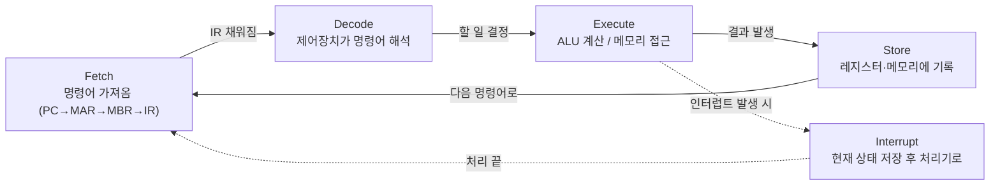

- **명령어 사이클** → CPU가 명령어 하나를 처리하는 **반복 루틴** → fetch → decode → execute → store
- 프로그램 = 명령어 수천만 줄 → CPU는 이 루틴을 **초당 수십억 번** 반복
- 한 줄 요약 → "가져와서(fetch) → 해석하고(decode) → 실행하고(execute) → 저장(store)" 무한 반복

## 레시피 한 줄씩 읽기로 이해하기

- 요리사가 **레시피 책**(메모리)을 펼침 → 명령어가 줄줄이 적혀 있음
- 지금 읽을 줄 번호를 손가락으로 짚음 → 이게 **PC(다음 줄 위치)**
- 한 줄 가져와 눈앞에 둠(fetch) → 무슨 뜻인지 읽음(decode) → 실제로 함(execute) → 결과 그릇에 담음(store)
- 한 줄 끝나면 → 손가락 다음 줄로 → **계속 반복**

<KeyPoint title="이 비유에서 가져갈 것">
CPU는 한 번에 명령어 한 줄만 처리 · 다음 줄 위치는 PC가 기억 · 지금 읽는 줄은 IR이 들고 있음 · 메모리에서 뭔가 꺼낼 땐 "주소(MAR)"와 "꺼낸 내용(MBR)"이 한 쌍으로 움직임
</KeyPoint>

## 핵심 레지스터 4종

| 레지스터 | 풀이름 | 역할 | 비유 |
|---|---|---|---|
| **PC** | Program Counter | 다음에 실행할 명령어 **주소** 보관 | 짚고 있는 줄 번호 |
| **IR** | Instruction Register | 지금 실행 중인 **명령어** 보관 | 눈앞에 펼친 그 줄 |
| **MAR** | Memory Address Register | 접근할 메모리 **주소** 담음 | "몇 번 칸 줘" |
| **MBR** | Memory Buffer Register | 그 주소에서 **읽고/쓸 데이터** 담음 | 그 칸에서 꺼낸 내용 |

- **PC** → 명령어 하나 가져오면 자동으로 다음 주소를 가리킴 (보통 +1)
- **MAR / MBR** → 항상 짝 → "MAR로 어디인지 말하고 → MBR로 내용 주고받음"

## 한 명령어가 도는 4단계

<Stepper>
<StepperItem title="Fetch (인출)">
PC가 가리킨 주소를 **MAR**에 넣음 → 메모리에서 그 주소의 명령어를 **MBR**로 읽어옴 → **IR**에 옮김 → PC는 다음 주소로 +1
</StepperItem>
<StepperItem title="Decode (해석)">
제어장치가 IR 속 명령어를 **분석** → "이건 덧셈이고, 피연산자는 이 레지스터들" → 어떤 신호를 보낼지 결정
</StepperItem>
<StepperItem title="Execute (실행)">
해석 결과대로 **ALU가 계산** 또는 메모리 접근 수행 → 예: 두 값을 더함, 점프 등
</StepperItem>
<StepperItem title="Store (저장)">
실행 결과를 **레지스터나 메모리**에 기록 → 메모리에 쓸 땐 MAR(주소)·MBR(값) 사용 → 끝나면 다시 Fetch로
</StepperItem>
</Stepper>

## Fetch 단계 레지스터 움직임 (예: `LOAD R1, [100]`)

<Timeline>
<TimelineItem title="① PC → MAR">
PC가 들고 있던 명령어 주소(예: 50)를 MAR로 복사 → "메모리 50번 칸 줘"
</TimelineItem>
<TimelineItem title="② 메모리 → MBR">
메모리 50번 칸의 명령어를 MBR로 읽어옴
</TimelineItem>
<TimelineItem title="③ MBR → IR">
가져온 명령어를 IR로 옮김 → 이제 CPU가 "지금 줄"을 손에 쥠
</TimelineItem>
<TimelineItem title="④ PC += 1">
PC는 다음 명령어(51번)를 미리 가리킴 → 다음 fetch 준비 완료
</TimelineItem>
</Timeline>

- 이후 decode → "LOAD네, 100번 칸 값을 R1에 넣어라"
- execute/store → MAR=100으로 메모리 읽어 MBR로 → MBR 값을 R1에 저장

## 전체 사이클 흐름

- 평소엔 Fetch → Decode → Execute → Store → 다시 Fetch **무한 반복**
- 중간에 급한 일(인터럽트)이 오면 → 잠깐 빠져나가 처리 후 복귀

## 인터럽트 사이클

- **인터럽트** → CPU에게 "지금 처리해줘" 하고 끼어드는 신호 (키 입력·타이머·I/O 완료 등)
- CPU는 명령어 하나가 끝날 때마다 → "인터럽트 들어온 거 있나?" 확인

<Timeline>
<TimelineItem title="1. 감지">
한 명령어 실행 후 인터럽트 신호 확인 → 있으면 처리 시작
</TimelineItem>
<TimelineItem title="2. 현재 상태 저장">
지금 하던 작업의 PC·레지스터 값을 **스택/PCB에 저장** → 나중에 돌아오려고
</TimelineItem>
<TimelineItem title="3. 처리기 실행">
인터럽트 종류에 맞는 **ISR(인터럽트 서비스 루틴)** 으로 점프해 처리
</TimelineItem>
<TimelineItem title="4. 복귀">
저장해둔 상태 복원 → 끊겼던 자리에서 **이어서** 실행
</TimelineItem>
</Timeline>

<Note type="note" title="인터럽트가 없다면?">
- CPU가 키보드·디스크를 **계속 직접 물어봐야 함**(폴링) → 묻는 데만 시간 낭비
- 인터럽트 덕분에 → 평소엔 다른 일 하다가 **신호 올 때만** 반응 → 효율 ⬆️
</Note>

<Note type="pink" title="실무 한 줄">
- 컨텍스트 스위칭([process-thread](/cs/os/process-thread))도 결국 → 인터럽트로 현재 상태 저장하고 다른 작업 복원하는 것과 같은 구조
- PC·IR·MAR·MBR은 면접 단골 → "주소 담당 vs 데이터 담당(MAR/MBR), 위치 vs 명령어(PC/IR)" 짝으로 외우면 안 헷갈림
</Note>
