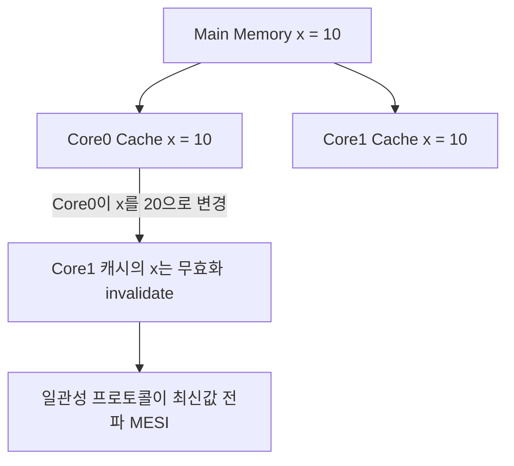

- **멀티코어** → CPU 하나에 일하는 코어 여러 개 → 진짜 동시에 여러 작업
- **병렬(parallel)** → 실제로 같은 순간에 여러 일이 진행
- **동시성(concurrency)** → 여러 일을 번갈아가며 진행 (한 순간엔 하나일 수도)

## 주방 요리사로 이해하기

- 코어 = **요리사** · 멀티코어 = 한 주방에 요리사 여러 명 → 요리 동시 진행
- 동시성 = 요리사 한 명이 국 끓이며 야채 썰기를 번갈아 → 한 순간엔 한 손
- 병렬 = 요리사 네 명이 각자 다른 요리를 실제로 동시에

<KeyPoint title="병렬 vs 동시성 한 줄">
병렬 = 진짜 동시에 여럿(코어 여러 개 필요) · 동시성 = 번갈아 잘 쪼개 진행(코어 하나로도 가능) →
동시성은 구조, 병렬은 실행
</KeyPoint>

## 병렬 vs 동시성

<Compare>
<CompareCol title="🍳 병렬 (Parallel)" subtitle="실제 동시 실행" color="sky">
- 같은 순간 여러 작업 진행
- 코어·CPU 여러 개 필요
- CPU 바운드 연산 속도 ↑ (이미지 처리·수치 계산)
- 멀티프로세싱·SIMD·GPU
</CompareCol>
<CompareCol title="🔀 동시성 (Concurrency)" subtitle="번갈아 진행" color="amber">
- 여러 작업을 잘게 쪼개 교대
- 코어 하나로도 가능
- I/O 대기 시간 활용에 강함 (네트워크·파일)
- async·이벤트 루프·스레드
</CompareCol>
</Compare>

- 둘은 배타적 아님 → 멀티코어에서 동시성 코드가 병렬로도 실행됨
- I/O 많음 → 동시성으로 충분 · CPU 연산 많음 → 병렬 필요 ([process-thread](/cs/os/process-thread))

## 멀티코어와 SMP

- **SMP**(Symmetric Multiprocessing) → 동등한 코어 여러 개가 **하나의 메모리를 공유**
- 모든 코어가 같은 RAM 접근 → 작업 분배 자유 · 대신 공유 자원 경쟁 발생

<Layers>
<Layer title="Core 0 ~ Core N" color="sky">
각 코어 독립 실행 · 자기 레지스터·L1/L2 캐시 보유
</Layer>
<Layer title="공유 L3 캐시" color="green">
여러 코어가 함께 쓰는 캐시 → 메인 메모리보다 빠름
</Layer>
<Layer title="공유 Main Memory (RAM)" color="amber">
모든 코어가 동일하게 접근 → SMP의 핵심 · 동기화 필요 지점
</Layer>
</Layers>

## 암달의 법칙 — 코어 늘려도 한계

- **설거지 1명만 가능하면** → 요리사 10명 와도 마지막 설거지에서 막힘
- 프로그램에 **순차 부분**이 있으면 → 코어 무한히 늘려도 그 부분이 천장
- 속도향상 = 1 / ( (1 - P) + P / N ) · P=병렬화 가능 비율, N=코어 수

<Stats>
<Stat value="P = 0.9" label="병렬 가능 90%" sub="순차 10% 남음" />
<Stat value="N → ∞" label="코어 무한" sub="이론상 최대" />
<Stat value="×10" label="최대 속도향상" sub="순차 10%가 천장 (1/0.1)" />
</Stats>

| 병렬 비율 P | 코어 2 | 코어 4 | 코어 8 | 코어 ∞ |
|------------|--------|--------|--------|--------|
| 50% | ×1.33 | ×1.6 | ×1.78 | ×2 |
| 75% | ×1.6 | ×2.29 | ×2.91 | ×4 |
| 90% | ×1.82 | ×3.08 | ×4.71 | ×10 |
| 95% | ×1.90 | ×3.48 | ×5.93 | ×20 |

<Note type="warning" title="현실 교훈">
- 코어 2배 ≠ 속도 2배 → 순차 부분이 발목 잡음
- 병렬 90%여도 코어 8개에서 약 4.7배뿐 → 무한히 늘려도 10배 한계
- 먼저 **순차 부분(P 줄이기)** 최적화가 코어 추가보다 효과 클 때 많음
</Note>

## 캐시 일관성 (Cache Coherence)

- 각 코어가 자기 캐시에 데이터 복사본 가짐 → 한 코어가 값 바꾸면 **다른 코어 복사본은 옛날 값**
- 이 불일치를 막는 장치 → 캐시 일관성 프로토콜(MESI 등)



- Core0이 x 수정 → 프로토콜이 Core1의 복사본을 **무효화** → Core1은 다시 최신값 읽음
- 이 동기화에 비용 발생 → 공유 데이터 자주 수정하면 성능 저하

## False Sharing — 같은 책상 모서리 부딪힘

- 캐시는 **줄(cache line, 보통 64바이트) 단위**로 관리 → 서로 다른 변수라도 같은 줄에 있으면 묶임
- 두 코어가 같은 줄의 **다른 변수**를 각각 수정 → 줄 전체가 계속 무효화 → 충돌 없는데 느려짐
- 비유 → 두 사람이 같은 책상의 다른 모서리를 쓰는데 책상이 통째라 계속 부딪힘

```python
# false sharing 유발 — 두 스레드가 인접한 인덱스 수정 (같은 cache line일 가능성)
counters = [0, 0]
# Thread A: counters[0] += 1  (반복)
# Thread B: counters[1] += 1  (반복)
# → 논리적으로 독립이지만 같은 line이면 서로 캐시 무효화 반복 → 느림

# 해결 — 변수 간격 띄워 다른 cache line에 배치 (padding)
```

<ProsCons>
<Pros title="멀티코어 병렬 장점">
- CPU 바운드 작업 실제 속도 ↑
- 코어별 작업 분산 → 처리량 증가
- 큰 데이터를 쪼개 동시 처리
</Pros>
<Cons title="주의·한계">
- 암달의 법칙 → 순차 부분이 상한
- 캐시 일관성·false sharing 비용
- 공유 데이터 동기화 필요 → 락 경합
- 디버깅 어려움(경쟁 조건·재현 난해)
</Cons>
</ProsCons>

## SIMD — 한 명령으로 여러 데이터

- **SIMD**(Single Instruction Multiple Data) → 명령 하나로 여러 값을 **한 번에** 연산
- 비유 → 도장 하나로 종이 8장을 동시에 찍음 (한 명령 → 8개 덧셈)
- 멀티코어와 다른 차원의 병렬 → 코어 **안에서** 데이터 병렬 (벡터 연산)

<Cards cols={3}>
<Card icon="➕" title="스칼라">
a+b, c+d, e+f ... → 한 번에 한 쌍씩 → 명령 여러 번
</Card>
<Card icon="📊" title="SIMD 벡터">
[a,c,e,g] + [b,d,f,h] → 한 명령으로 4쌍 동시 (SSE·AVX·NEON)
</Card>
<Card icon="🎮" title="활용처">
이미지·영상 처리, 행렬 연산, 머신러닝 → 같은 연산 대량 반복
</Card>
</Cards>

<Note type="success" title="병렬의 여러 층위">
- SIMD → 코어 1개 안에서 데이터 병렬 (벡터)
- 멀티코어 → 코어 여러 개로 작업 병렬 (스레드·프로세스)
- 멀티머신 → 여러 컴퓨터로 분산 (클러스터)
- 실무 → 세 층위를 함께 활용 (예: numpy=SIMD, multiprocessing=멀티코어, Spark=멀티머신)
</Note>

## 관련 링크

- [process-thread](/cs/os/process-thread) — 멀티프로세스·멀티스레드로 병렬 실행
- [tcp-ip](/cs/networks/tcp-ip) — 멀티머신 분산 시 노드 간 통신
