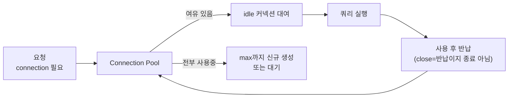

- **커넥션 풀** → DB 연결을 미리 만들어두고 **빌려 쓰고 반납**
- 핵심 한 문장 → "연결을 매번 새로 맺으면 느리니 **재사용**한다"
- **N+1 문제** → 목록 1번 + 각 항목마다 추가 쿼리 N번 → 쿼리 폭발
- 실무 한계 → Aurora·MySQL의 `max_connections` → 풀 크기 잘못 잡으면 연결 고갈

## 식당 테이블 세팅으로 이해하는 커넥션 풀

- 손님 올 때마다 테이블·의자·식기를 **처음부터 세팅** 하면? → 너무 느림
- 미리 테이블 N개를 **세팅해 두고** → 손님 오면 앉히고 → 가면 치워서 **재사용**
- 커넥션 풀 → DB 연결(테이블)을 미리 깔아두고 → 요청 오면 빌려주고 → 끝나면 반납
- 테이블이 다 차면 → 새 손님은 **대기** 또는 거절 → 풀 최대 크기 = 좌석 수

<KeyPoint title="이 비유에서 가져갈 것">
커넥션 = 매번 새로 만들면 비싼 자원(TCP·인증·세션) ·
풀 = 미리 만들어 재사용하는 좌석 묶음 ·
풀 크기 = DB가 감당하는 max_connections 안에서 잡아야 함
</KeyPoint>

## 커넥션은 왜 비싼가

<Layers>
<Layer title="① TCP 핸드셰이크" color="sky">
3-way handshake · 네트워크 왕복 발생 · 원격 DB일수록 RTT 누적
</Layer>
<Layer title="② 인증·핸드셰이크" color="amber">
계정·비밀번호 검증 · TLS면 암호화 협상까지 추가 왕복
</Layer>
<Layer title="③ 세션 초기화" color="green">
세션 변수·문자셋·격리수준 설정 · DB 측 메모리·스레드 할당
</Layer>
</Layers>

- 한 번 연결에 수~수십 ms → 요청마다 새로 맺으면 **누적 지연 폭발**
- 풀 → 이 비용을 **앱 시작 시 한 번만** 치르고 계속 재사용

## 풀 동작 흐름



- 핵심 → `close()`는 실제 연결 종료가 아니라 **풀에 반납**
- 반납 안 하면 → 풀 고갈 → 이후 요청 전부 대기 → 타임아웃

## N+1 문제 - 장바구니 따로 결제

- 장바구니 상품 10개를 사면서 → **한 번에 결제 안 하고** 10번 따로 결제
- N+1 → 목록 가져오는 쿼리 **1번** + 목록 각 행의 연관 데이터 쿼리 **N번**
- 주문 10건 조회 후 각 주문의 고객을 lazy loading하면 → 1 + 10 = **11번 쿼리**

<Compare>
<CompareCol title="❌ N+1 (lazy loading)" subtitle="11번 쿼리" color="pink">
- 주문 목록 1번 조회
- 루프 돌며 order.customer 접근 → 매번 쿼리
- 주문 10건 → 추가 10번 → 총 11번
- 100건이면 101번 → DB 왕복 폭발
</CompareCol>
<CompareCol title="✅ JOIN / eager" subtitle="1번 쿼리" color="green">
- JOIN으로 연관 데이터 **한 번에**
- 또는 IN 절로 묶어 2번에 끝냄
- 왕복 1~2회 → 지연·부하 급감
- 풀 점유 시간도 짧아짐
</CompareCol>
</Compare>

### 쿼리 로그 비교

```sql
-- ❌ N+1: 목록 1 + 건별 N
SELECT * FROM orders;                          -- (1)
SELECT * FROM customers WHERE id = 1;          -- (2)
SELECT * FROM customers WHERE id = 2;          -- (3)
SELECT * FROM customers WHERE id = 3;          -- ... 10건이면 11번

-- ✅ JOIN 1쿼리
SELECT o.*, c.name
FROM orders o
JOIN customers c ON c.id = o.customer_id;      -- (1) 끝

-- ✅ IN 묶기 (2쿼리)
SELECT * FROM orders;                          -- (1)
SELECT * FROM customers WHERE id IN (1,2,3,...);  -- (2)
```

## ORM 관점 - lazy가 부르는 N+1

```python
# ❌ SQLAlchemy - lazy loading 기본 → N+1
orders = session.query(Order).all()        # 쿼리 1
for o in orders:
    print(o.customer.name)                 # 접근마다 쿼리 → N

# ✅ eager loading (joinedload) → 1~2쿼리
from sqlalchemy.orm import joinedload
orders = (
    session.query(Order)
    .options(joinedload(Order.customer))   # JOIN으로 함께 로딩
    .all()
)
for o in orders:
    print(o.customer.name)                 # 추가 쿼리 없음
```

<Note type="note" title="ORM별 해결 키워드">
- SQLAlchemy → `joinedload`(JOIN) · `selectinload`(IN 묶기, N:M·1:N에 유리)
- Django ORM → `select_related`(1:1·N:1 JOIN) · `prefetch_related`(1:N·N:M IN)
- Rails ActiveRecord → `includes` · `preload` · `eager_load`
- 공통 원칙 → 목록 + 연관 데이터 쓸 거면 **미리 같이 로딩**
</Note>

## Aurora / MySQL 커넥션 한계

<Stats>
<Stat value="max_connections" label="DB 동시 연결 상한" sub="초과 시 'Too many connections'" />
<Stat value="인스턴스 메모리 비례" label="Aurora 기본 max" sub="클래스 클수록 큼" />
<Stat value="풀크기 × 앱수" label="실제 점유 커넥션" sub="합이 max 넘으면 고갈" />
</Stats>

<Note type="danger" title="흔한 커넥션 고갈 사고">
- 앱 인스턴스 10대 × 풀 크기 50 = **500 커넥션** 요구
- DB `max_connections`가 300이면 → 일부 앱이 연결 실패 → 장애
- 오토스케일로 앱 수 늘면 → 합계 급증 → 예측 못 한 고갈
- 계산식 → (앱 인스턴스 수 × 풀 max) + 여유분 ≤ DB max_connections
</Note>

<Note type="pink" title="실무 튜닝 팁">
- 풀 크기는 **무작정 크게 X** → CPU 코어·DB 한계 기준으로 작게 시작 후 관측
- 유휴 연결 → `idle timeout`·`max_lifetime`으로 정리 → 좀비 커넥션 방지
- Aurora → RDS Proxy로 커넥션 풀링·페일오버 시 연결 재사용 → 고갈 완화
- 트랜잭션·쿼리는 **짧게** → 풀 점유 시간 줄여 같은 풀로 더 많은 요청 처리
- N+1부터 잡기 → 쿼리 수 줄면 풀 점유·왕복 동시에 감소
</Note>

## 관련 링크

- [Transactions & ACID](/cs/db/transactions) → 커넥션 위에서 도는 트랜잭션·락
- [Index](/cs/db/index) → JOIN·IN 쿼리를 빠르게 하는 색인
