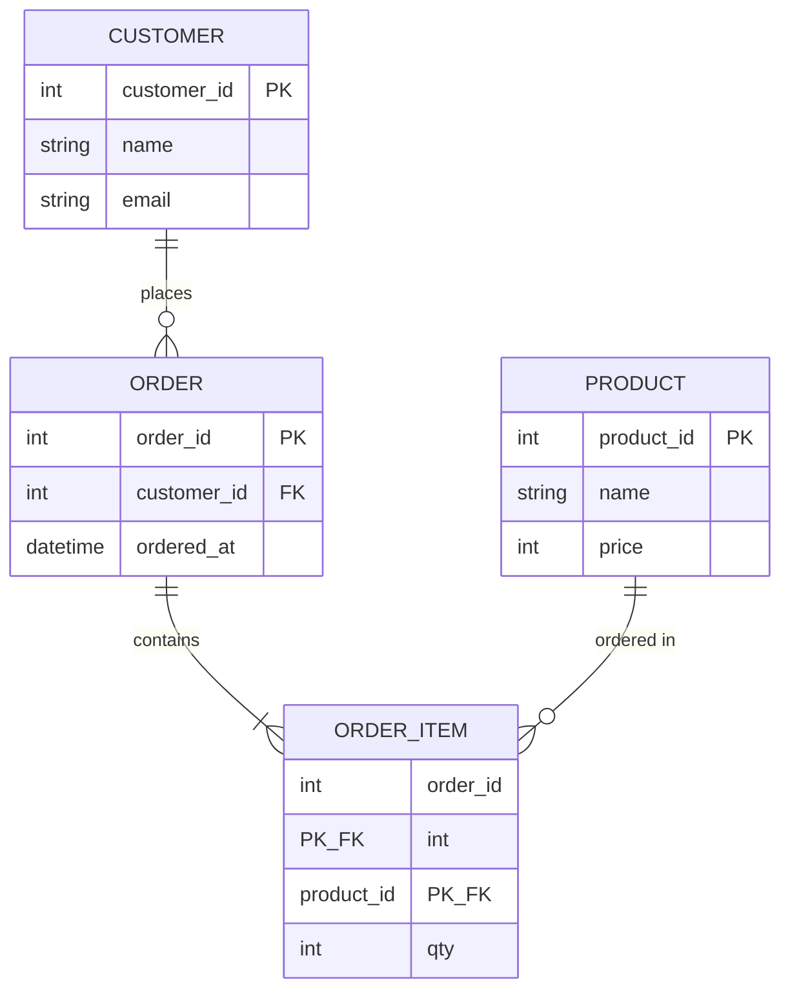

- **데이터 모델링** → 데이터를 표로 만들기 전에 **구조를 먼저 설계**
- 핵심 한 문장 → "테이블을 짜기 전 **무엇을 저장하고 어떻게 연결할지** 그림으로 정리"
- 결과물 → ERD (Entity-Relationship Diagram) · 엔터티·속성·관계로 표현
- 흐름 → 개념 모델 → 논리 모델 → 물리 모델 (DDL)

## 레고 설명서로 이해하는 데이터 모델링

- 레고를 조립하기 전 → **설명서(설계도)** 부터 봄 · 어떤 블록이 어디에 끼워지는지
- 바로 조립부터 하면 → 중간에 안 맞아서 **다 뜯고 재조립**
- 데이터 모델링 → 테이블(블록)을 만들기 전에 **연결 관계(끼움)** 를 먼저 그림
- ERD → 그 설계도 · 엔터티(블록 종류)와 관계(어떻게 끼우는지)를 한눈에

<KeyPoint title="이 비유에서 가져갈 것">
엔터티 = 저장할 대상 덩어리(고객·주문·상품) ·
속성 = 그 덩어리가 가진 정보(이름·가격) ·
관계 = 엔터티끼리 어떻게 연결되는지(고객이 주문을 한다)
</KeyPoint>

## 구성 3요소 - 엔터티·속성·관계

<Cards cols={3}>
<Card icon="📦" title="Entity 엔터티">
저장 대상 · 보통 **테이블**이 됨 · 예: Customer, Order, Product · 명사로 표현
</Card>
<Card icon="🏷️" title="Attribute 속성">
엔터티가 가진 항목 · 보통 **컬럼**이 됨 · 예: 고객의 name·email · PK·FK도 속성
</Card>
<Card icon="🔗" title="Relationship 관계">
엔터티 간 연결 · "고객이 주문을 한다" · **카디널리티**(1:1, 1:N, N:M)로 수량 표현
</Card>
</Cards>

## 카디널리티 - 관계의 수량

<Cards cols={3}>
<Card icon="1️⃣" title="1:1 (일대일)">
한쪽이 **하나**씩만 대응 · 예: User ↔ UserProfile · 자주 나뉘진 않음 · 보안·분리 목적
</Card>
<Card icon="🔢" title="1:N (일대다)">
한쪽이 **여러 개**를 가짐 · 예: Customer 1명 → Order 여러 건 · 가장 흔한 관계
</Card>
<Card icon="🔀" title="N:M (다대다)">
양쪽 다 **여러 개** · 예: Order ↔ Product · **중간(연결) 테이블** 으로 풀어야 함
</Card>
</Cards>

<Note type="warning" title="N:M은 그대로 못 만든다">
- 관계형 DB는 N:M을 **직접 표현 불가** · FK 한 칸에 여러 값 못 넣음
- 해결 → 중간 테이블(`order_items`)로 **1:N + 1:N** 으로 분해
- Order 1 : N order_items · Product 1 : N order_items
</Note>

## 주문-상품 ERD



- `CUSTOMER ||--o{ ORDER` → 고객 1명이 주문 0..N건 (1:N)
- `ORDER ||--|{ ORDER_ITEM` → 주문 1건이 항목 1..N개 (1:N)
- `PRODUCT ||--o{ ORDER_ITEM` → 상품 1개가 여러 주문항목에 등장 (1:N)
- 결과 → ORDER ↔ PRODUCT의 **N:M** 을 ORDER_ITEM이 중간에서 해소

## 논리 모델 vs 물리 모델

<Compare>
<CompareCol title="🧠 논리 모델" subtitle="개념·업무 관점" color="sky">
- DBMS 무관 · **업무 규칙** 중심
- 엔터티·속성·관계·PK·FK 정의
- 한글 명칭·정규화 반영
- 예: "고객은 주문을 가진다"
</CompareCol>
<CompareCol title="⚙️ 물리 모델" subtitle="실제 DB 구현" color="amber">
- 특정 DBMS(MySQL 등) 기준
- **타입·인덱스·제약·테이블명** 확정
- `VARCHAR(50)`, `INT`, 인덱스 설계
- 결과물 = 실행 가능한 **DDL**
</CompareCol>
</Compare>

## PK와 FK - 식별과 참조

<Layers>
<Layer title="PK (Primary Key) 기본키" color="sky">
행을 **유일하게 식별** · NULL 불가 · 중복 불가 · 예: customer_id · 보통 인덱스 자동 생성
</Layer>
<Layer title="FK (Foreign Key) 외래키" color="green">
다른 테이블의 PK를 **참조** · 관계를 물리적으로 구현 · 예: orders.customer_id → customers.customer_id
</Layer>
<Layer title="Composite Key 복합키" color="amber">
여러 컬럼을 묶어 PK 구성 · 예: order_items(order_id, product_id) · N:M 중간 테이블에서 흔함
</Layer>
</Layers>

```sql
CREATE TABLE customers (
  customer_id INT PRIMARY KEY,
  name        VARCHAR(50) NOT NULL,
  email       VARCHAR(100) UNIQUE
);
CREATE TABLE orders (
  order_id    INT PRIMARY KEY,
  customer_id INT NOT NULL,                       -- FK
  ordered_at  DATETIME NOT NULL,
  FOREIGN KEY (customer_id) REFERENCES customers(customer_id)
);
CREATE TABLE order_items (
  order_id    INT,
  product_id  INT,
  qty         INT NOT NULL,
  PRIMARY KEY (order_id, product_id),             -- 복합키
  FOREIGN KEY (order_id)   REFERENCES orders(order_id),
  FOREIGN KEY (product_id) REFERENCES products(product_id)
);
```

## 식별 관계 vs 비식별 관계

<Compare>
<CompareCol title="🔒 식별 관계" subtitle="부모 PK가 자식 PK의 일부" color="pink">
- 부모 키가 자식의 **PK에 포함**
- 자식은 부모 없이는 **존재 불가**
- 예: order_items(order_id를 PK로) → 주문 없이 항목 못 존재
- ERD에서 **실선**으로 표기
</CompareCol>
<CompareCol title="🔓 비식별 관계" subtitle="부모 PK가 자식의 일반 FK" color="stone">
- 부모 키가 자식의 **일반 컬럼(FK)**
- 자식이 부모 없이도 **독립 존재** 가능
- 예: orders.customer_id (PK 아닌 FK)
- ERD에서 **점선**으로 표기
</CompareCol>
</Compare>

<Note type="pink" title="실무 모델링 팁">
- PK는 가급적 **의미 없는 대리키**(auto_increment·UUID) → 업무값 변경에 안전
- FK 제약은 무결성 보장하지만 → 대량 쓰기·샤딩 환경에선 **앱 레벨 검증**으로 빼기도
- N:M은 무조건 **중간 테이블** → 거기에 부가속성(수량·할인) 같이 둠
- 논리 모델에서 정규화 → 물리 모델에서 성능 위해 선택적 반정규화
</Note>

## 관련 링크

- [Normalization](/cs/db/normalization) → 엔터티를 중복 없이 쪼개는 규칙
- [Index](/cs/db/index) → PK·FK 조회를 빠르게 하는 색인
- [Transactions & ACID](/cs/db/transactions) → 관계 무결성을 지키는 런타임 보장
