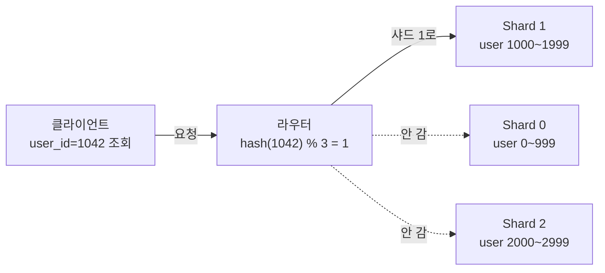
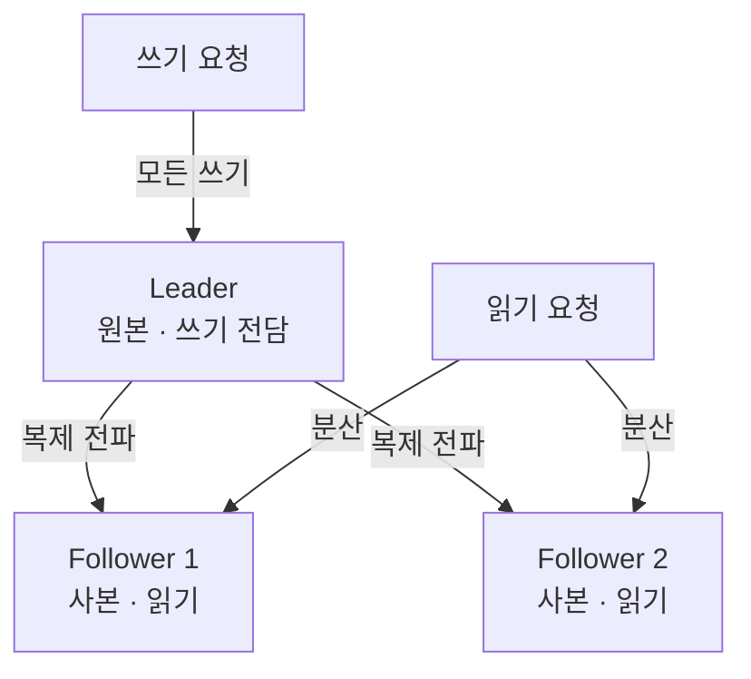
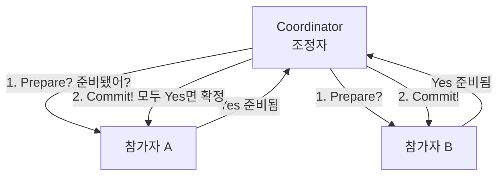

- **샤딩** → 데이터를 **쪼개서** 여러 서버에 나눠 담기 (각자 다른 조각)
- **레플리케이션** → 같은 데이터를 **복사해서** 여러 서버에 두기 (똑같은 사본)
- 한 줄 차이 → 나눔(샤딩 = 용량·성능) vs 복사(레플리케이션 = 안전·읽기)

## 도서관으로 이해하기

- **샤딩 = 책을 층별로 나눠 보관** → 1층 A~G, 2층 H~N… → 한 건물에 다 못 넣으니 분산 → 찾으려면 "몇 층?" 먼저 알아야 함
- **레플리케이션 = 중요 문서 사본 여러 곳 보관** → 한 곳 불나도 다른 사본 있음 → 여러 명이 동시에 다른 사본 열람 가능
- 둘은 **같이 씀** → 층별로 나누고(샤딩), 각 층 책을 또 복사(레플리케이션)

<KeyPoint title="이 비유에서 가져갈 것">
샤딩 = 데이터를 나눠 담아 **용량·쓰기 분산**(라우팅 필요) ·
레플리케이션 = 같은 데이터를 복사해 **장애 대비·읽기 분산**(동기화 필요)
</KeyPoint>

## 샤딩 vs 레플리케이션

<Compare>
<CompareCol title="✂️ 샤딩(Sharding)" subtitle="나눠 담기" color="pink">
- 데이터를 **조각**(shard)으로 분할 → 서버마다 다른 조각
- 용량·쓰기 부하 **분산** → 수평 확장
- 조회 시 "어느 샤드?" **라우팅** 필요
- 한 샤드 죽으면 그 조각 데이터만 접근 불가
</CompareCol>
<CompareCol title="📑 레플리케이션(Replication)" subtitle="복사하기" color="sky">
- 같은 데이터를 **여러 사본**으로 복제
- 장애 대비(하나 죽어도 사본) + 읽기 분산
- 사본 간 **동기화** 필요 → 지연(lag) 생김
- 쓰기는 보통 한 곳(리더) → 쓰기 분산은 안 됨
</CompareCol>
</Compare>

## 파티셔닝 — 어떻게 나눌까

- 샤딩의 핵심 = 데이터를 어떤 기준으로 조각낼지(파티셔닝 전략)

| 방식 | 기준 | 비유 | 장점 | 주의 |
| --- | --- | --- | --- | --- |
| Range | 값 범위(A~G, H~N) | 책 제목 가나다순 | 범위 조회 빠름 | 특정 구간 쏠림(hot) |
| Hash | 키 해시값 | 번호표 무작위 배정 | 고르게 분산 | 범위 조회 어려움 |
| Directory | 매핑표로 직접 지정 | 안내 데스크 명부 | 유연한 재배치 | 매핑표가 단일 장애점 |

## 샤드 라우팅 흐름

- 라우터가 키로 **어느 샤드인지 계산** → 해당 샤드에만 요청
- 샤드 추가 시(rebalancing) → 일부 데이터 이사 필요 → 그래서 **일관된 해싱**(consistent hashing)으로 이사량 최소화

## 리더-팔로워 (Leader-Follower)

- 레플리케이션의 대표 구조 · 쓰기는 리더가 받고, 사본(팔로워)으로 전파

<Layers>
<Layer title="동기 복제" sub="Synchronous" color="sky">
리더가 팔로워 저장까지 **확인 후** 응답 → 데이터 안전 · 대신 느림
</Layer>
<Layer title="비동기 복제" sub="Asynchronous" color="amber">
리더가 먼저 응답하고 팔로워엔 **나중에** 전파 → 빠름 · 대신 **복제 지연**(lag) 동안 사본은 옛 값
</Layer>
<Layer title="장애 시 — Failover" sub="리더 승격" color="green">
리더 죽으면 팔로워 중 하나를 **새 리더로 승격** → 잠깐 쓰기 멈춤 후 복구
</Layer>
</Layers>

## CAP → PACELC로 확장

- CAP은 "네트워크 끊겼을 때"만 다룸 → **PACELC**는 평상시도 포함

<Compare>
<CompareCol title="P 발생 시 (Partition)" subtitle="네트워크 끊김" color="pink">
- **A**(가용성) vs **C**(일관성) 중 택일
- 끊겨도 응답 줄까(A) vs 정확성 지킬까(C)
</CompareCol>
<CompareCol title="E 평상시 (Else)" subtitle="정상 동작 중" color="sky">
- **L**(지연) vs **C**(일관성) 중 택일
- 빠른 응답(L) vs 모든 사본 맞춘 정확성(C)
</CompareCol>
</Compare>

- 읽기 → **PA/EL**(DynamoDB류, 빠름·느슨) · **PC/EC**(전통 RDB, 느림·엄격)

## 일관성 모델

<Cards cols={3}>
<Card icon="🎯" title="Strong">
어느 사본을 읽어도 **항상 최신값** · 은행 잔액 · 느리지만 정확
</Card>
<Card icon="🌊" title="Eventual">
잠깐 옛 값 줄 수 있지만 **결국 수렴** · SNS 좋아요 수 · 빠르고 느슨
</Card>
<Card icon="🧭" title="Read-your-writes">
내가 쓴 건 **내가 바로** 읽힘 · 댓글 단 직후 내 화면엔 보임
</Card>
</Cards>

## 합의 알고리즘 개요

- 여러 노드가 "누가 리더냐"·"이 값이 맞냐"를 **다수결로 합의** · 일부 노드 죽어도 동작
- 대표 → **Raft**(이해 쉬움, etcd·Consul) · **Paxos**(원조, 복잡)

<Timeline>
<TimelineItem title="1. 선거(Election)">
리더 없으면 후보가 표 요청 → **과반(quorum)** 받으면 리더 됨
</TimelineItem>
<TimelineItem title="2. 로그 복제(Log Replication)">
리더가 변경을 로그로 팔로워에 전파 → 과반이 저장하면 **확정(commit)**
</TimelineItem>
<TimelineItem title="3. 장애 복구">
리더 응답 끊기면 → 다시 선거 → 새 리더 선출 → 서비스 지속
</TimelineItem>
</Timeline>

<Note type="note" title="왜 과반(quorum)인가">
- 5개 노드면 **3개** 동의로 확정 → 동시에 두 리더 생기는 분열(split-brain) 방지
- 노드 2개까지 죽어도 과반 가능 → **장애 내성**
</Note>

## 2PC — 분산 트랜잭션

- 여러 DB에 걸친 작업을 **모두 성공 or 모두 취소**로 묶기 · 결혼식 주례처럼 "동의?" 물어보고 진행

<ProsCons>
<Pros title="장점">
- 여러 노드 간 **원자성** 보장 (전부 성공 or 전부 실패)
- 구현·개념 단순
</Pros>
<Cons title="단점">
- 조정자 죽으면 **전체 멈춤**(blocking) → 단일 장애점
- 준비~확정 사이 자원 **잠금** → 느림
- 그래서 대규모는 **Saga**(보상 트랜잭션) 패턴으로 대체하기도
</Cons>
</ProsCons>

<Note type="warning" title="분산 DB 설계 팁">
- 샤딩 먼저 vs 레플리카 먼저 → 보통 **레플리카로 읽기·장애 대비**부터, 용량 한계 오면 샤딩
- 샤드 키는 **바꾸기 어려움** → 초반에 접근 패턴 보고 신중히 선택
- 강한 일관성은 공짜 아님 → 정말 필요한 데이터에만(잔액·재고), 나머진 eventual로 비용 절감
</Note>
