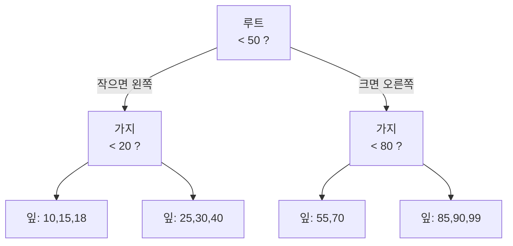

- **인덱스** → 데이터를 빨리 찾기 위한 **별도의 정렬된 길잡이** · 책 맨 뒤 색인과 같음
- 핵심 한 문장 → 전체를 처음부터 훑는(Full Scan) 대신 **정렬된 구조로 바로 점프**
- 공짜가 아님 → 읽기는 빨라지지만 **쓰기(INSERT/UPDATE)는 느려지고 저장 공간 증가**

## 책 맨 뒤 색인으로 이해하는 인덱스

- 두꺼운 책에서 "트랜잭션" 단어 찾기 → 1페이지부터 넘기면 **Full Table Scan** → O(n)
- 맨 뒤 색인에서 "ㅌ" 찾아 페이지 번호로 점프 → **인덱스 탐색** → O(log n)
- 색인 자체도 **가나다순 정렬** → 그래서 빠르게 좁혀감 → 이 정렬 구조가 **B-Tree**

<KeyPoint title="이 비유에서 가져갈 것">
인덱스 = 정렬된 색인 페이지(원본과 별개) ·
색인이 정렬돼 있어 범위·정렬에도 강함 ·
단 색인도 책이 바뀌면 다시 찍어야 함 → 쓰기 비용
</KeyPoint>

## B-Tree는 어떻게 빨리 찾나

- B-Tree → 정렬된 값을 **트리(루트→가지→잎)** 로 저장 · 한 번 비교마다 후보가 확 줄어듦
- 단계마다 절반(이상)씩 버려 → 100만 행도 **몇 단계면 도달** → O(log n)



- 잎 노드(leaf)는 서로 **연결 리스트**로 이어짐 → `WHERE age BETWEEN 25 AND 40` 같은 **범위 조회**도 빠름

## 클러스터 vs 논클러스터

<Compare>
<CompareCol title="📚 클러스터 인덱스" subtitle="데이터 자체가 정렬됨" color="amber">
- 인덱스 순서 = **실제 행 저장 순서**
- 테이블당 **딱 1개** (보통 PK)
- 잎 노드에 **실제 데이터** 있음
- InnoDB는 PK가 클러스터 인덱스
</CompareCol>
<CompareCol title="🔖 논클러스터(보조) 인덱스" subtitle="별도 색인" color="sky">
- 정렬된 색인 + **PK 값**을 가리킴
- 테이블당 **여러 개** 가능
- 보조 인덱스로 찾고 → PK로 본문 재조회(**back to table**)
- 그래서 커버링 인덱스가 유리
</CompareCol>
</Compare>

## 복합 인덱스와 커버링 인덱스

- **복합 인덱스** → 여러 컬럼을 묶은 인덱스 · `(a, b, c)` · **왼쪽부터 순서대로** 써야 탐
- **커버링 인덱스** → 쿼리에 필요한 컬럼이 **인덱스 안에 다 들어있어** 본문(테이블)을 안 봐도 됨

```sql
-- 복합 인덱스 (member_id, status, created_at)
-- 탐: member_id 단독 / member_id+status / member_id+status+created_at
-- 안 탐: status 단독 (왼쪽 member_id를 건너뜀)

CREATE INDEX idx_m_s_c ON orders (member_id, status, created_at);

-- 커버링: SELECT가 인덱스 컬럼만 요구 → 본문 조회 생략(Using index)
SELECT status, created_at FROM orders
WHERE  member_id = 100 AND status = 'PAID';
```

<Note type="note" title="왼쪽 접두사 규칙 (leftmost prefix)">
- 복합 인덱스 `(a, b, c)`는 책 색인이 "성→이름" 순 정렬된 것과 같음
- "성"만 알면 찾기 쉽지만 → "이름"만으로는 색인을 못 탐 (성을 건너뛸 수 없음)
- `WHERE a = ? AND b = ?` → 탐 · `WHERE b = ?` 단독 → 못 탐
</Note>

## EXPLAIN으로 인덱스 확인

```sql
EXPLAIN SELECT * FROM orders WHERE member_id = 100;
```

```bash
+----+-------------+--------+------+---------------+---------+---------+-------+------+-------------+
| id | select_type | table  | type | possible_keys | key     | key_len | ref   | rows | Extra       |
+----+-------------+--------+------+---------------+---------+---------+-------+------+-------------+
|  1 | SIMPLE      | orders | ref  | idx_member    | idx_member | 4    | const |   12 | Using index |
+----+-------------+--------+------+---------------+---------+---------+-------+------+-------------+
```

| 컬럼 | 보는 법 |
|---|---|
| `type` | `const`/`ref`/`range` 좋음 · `ALL`이면 **Full Scan(위험)** |
| `key` | 실제 사용된 인덱스 · `NULL`이면 인덱스 안 탐 |
| `rows` | 스캔 예상 행 수 · 적을수록 좋음 |
| `Extra` | `Using index`=커버링(좋음) · `Using filesort`/`Using temporary`=정렬·임시 테이블(주의) |

## 인덱스를 안 타는(못 타는) 경우

<ProsCons>
<Pros title="잘 타는 패턴">
- `WHERE col = ?` 등호 비교
- `WHERE col BETWEEN ? AND ?` 범위
- 복합 인덱스 **왼쪽 접두사**부터 사용
- `ORDER BY`가 인덱스 정렬 순서와 일치
- 카디널리티 높은 컬럼(값 종류 많음)
</Pros>
<Cons title="못 타는 패턴 (실무 함정)">
- `WHERE YEAR(created_at) = 2026` → 컬럼을 **함수로 감싸면** 못 탐
- `WHERE name LIKE '%kim'` → **앞 와일드카드**는 못 탐 (`'kim%'`는 탐)
- `WHERE status != 'PAID'` 부정 조건 · `IS NOT NULL`
- 암묵적 형변환 → `WHERE phone = 01012345678` (컬럼이 문자열인데 숫자 비교)
- 성별처럼 **값 종류 적은 컬럼**(낮은 카디널리티) → 옵티마이저가 Full Scan 선택
</Cons>
</ProsCons>

<Note type="pink" title="최적화 실무 팁">
- 인덱스 컬럼은 **가공하지 말고 그대로** 비교 → `created_at >= '2026-01-01'`로 풀어 쓰기
- 복합 인덱스는 **등호 조건 컬럼을 앞**, 범위 조건 컬럼을 뒤로
- 인덱스 남발 금지 → INSERT/UPDATE마다 모든 인덱스 갱신 → 쓰기 느려짐
- 느린 쿼리는 추측 말고 **EXPLAIN으로 확인** → `type=ALL`·`Using filesort` 잡기
</Note>
