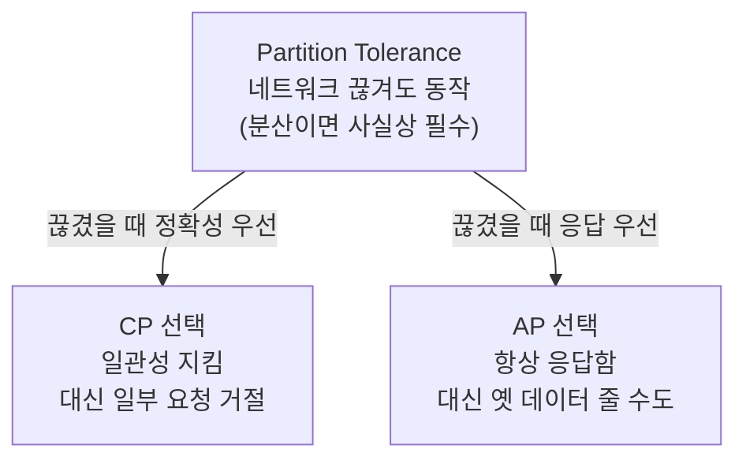

- **RDB** → 칸·열 미리 정해진 엑셀표 · 행마다 같은 모양 강제
- **NoSQL** → 양식 없는 메모장 · 항목마다 자유로운 모양 허용
- 한 줄 차이 → 스키마 **고정**(RDB) vs 스키마 **자유**(NoSQL)

## 엑셀표 vs 자유 메모장으로 이해하기

- **RDB = 엑셀표** → 열(이름·나이·주소) 미리 정함 → 새 행도 똑같은 칸 채워야 함 → 빈 칸은 NULL
- **NoSQL = 자유 메모장** → 어떤 메모엔 전화번호, 어떤 메모엔 취미 3개 → 모양 달라도 OK
- 표는 정리 깔끔·관계 추적 강함 · 메모장은 자유롭고 양 늘리기 쉬움

<KeyPoint title="이 비유에서 가져갈 것">
RDB = 정형(스키마 고정, JOIN·트랜잭션 강함, 세로 확장) ·
NoSQL = 비정형(스키마 자유, 대용량·고속, 가로 확장) → "관계 vs 규모"의 선택
</KeyPoint>

## RDB vs NoSQL

<Compare>
<CompareCol title="🗄️ RDB" subtitle="관계형 · MySQL/PostgreSQL" color="sky">
- 스키마 **고정** → 컬럼 미리 정의
- **JOIN**으로 테이블 연결
- **ACID** 트랜잭션 강력
- 수직 확장(Scale-up) 위주 → 서버 사양 ⬆️
- 정합성 중요한 금융·주문에 적합
</CompareCol>
<CompareCol title="📝 NoSQL" subtitle="비관계형 · Mongo/Redis/Dynamo" color="green">
- 스키마 **유연** → 문서마다 모양 달라도 됨
- JOIN 거의 없음 → 데이터 **중복 저장**(비정규화)
- 수평 확장(Scale-out) 쉬움 → 서버 **개수** ⬆️
- 대용량·고속 읽기쓰기에 강함
- 로그·캐시·실시간 피드 등에 적합
</CompareCol>
</Compare>

## NoSQL 4종류

<Cards cols={2}>
<Card icon="🔑" title="Key-Value">
키 하나에 값 하나 · 사물함(번호→물건) 구조 · 가장 단순·초고속 · 캐시·세션 저장 · **Redis · DynamoDB**
</Card>
<Card icon="📄" title="Document">
JSON 같은 문서 단위 저장 · 문서마다 구조 자유 · 중첩 가능 · 앱 데이터에 잘 맞음 · **MongoDB · CouchDB**
</Card>
<Card icon="📊" title="Column-Family">
열(컬럼) 묶음 단위 저장 · 특정 컬럼만 빠르게 스캔 · 시계열·대용량 분석 · **Cassandra · HBase**
</Card>
<Card icon="🕸️" title="Graph">
노드(점)+엣지(선)로 관계 저장 · 친구의 친구·추천 탐색 강함 · **Neo4j · Amazon Neptune**
</Card>
</Cards>

## 4종류 한눈에 비교

| 종류 | 저장 모양 | 비유 | 강점 | 대표 |
| --- | --- | --- | --- | --- |
| Key-Value | `key → value` | 사물함 | 단순·초고속 조회 | Redis, DynamoDB |
| Document | JSON 문서 | 자유 양식 서류철 | 유연한 앱 데이터 | MongoDB |
| Column | 컬럼 묶음 | 세로로 쌓는 장부 | 대용량 분석·시계열 | Cassandra |
| Graph | 노드+엣지 | 인맥 지도 | 관계 탐색 | Neo4j |

## CAP 정리 — 셋 다는 못 가짐

- 분산 DB는 **C·A·P 세 가지** 중 동시에 **둘만** 고를 수 있음
- 비유 → 멀리 떨어진 두 지점 사이 전화선이 끊겼을 때(P 발생) → "정확한 답"과 "일단 응답" 중 하나만 가능



<Layers>
<Layer title="C — Consistency" sub="일관성" color="sky">
어느 노드에 물어도 **같은 최신 값** · 은행 잔액처럼 틀리면 안 되는 데이터
</Layer>
<Layer title="A — Availability" sub="가용성" color="green">
요청하면 **항상 응답** · 좀 오래된 값이라도 일단 답을 줌
</Layer>
<Layer title="P — Partition tolerance" sub="분단 내성" color="amber">
노드 사이 **통신 끊겨도** 시스템 계속 동작 · 분산 시스템이면 거의 필수
</Layer>
</Layers>

<Note type="note" title="실무에선 보통 P는 고정">
- 네트워크 장애는 **반드시** 일어남 → P는 사실상 필수 선택
- 그래서 현실의 선택지는 **CP vs AP** → "끊겼을 때 정확성 우선 vs 응답 우선"
- 예 → 금융 잔액은 CP · SNS 좋아요 수는 AP(잠깐 틀려도 됨)
</Note>

## MongoDB — Document 실무

- 사용자 한 명 = 문서 하나 · 주소·취미 등 중첩·배열 그대로 저장

```json
// users 컬렉션의 문서 하나 — 행이 아니라 JSON 통째
{
  "_id": "u_1024",
  "name": "yoona",
  "email": "yoona@example.com",
  "address": { "city": "Seoul", "zip": "04524" },
  "hobbies": ["climbing", "coffee"],
  "lastLogin": "2026-06-18T09:00:00Z"
}
```

```javascript
// 조회 — 도시가 Seoul인 사용자
db.users.find({ "address.city": "Seoul" })

// 배열에 값 추가 — 스키마 변경 없이 필드 그냥 추가됨
db.users.updateOne(
  { _id: "u_1024" },
  { $push: { hobbies: "running" } }
)
```

## Redis — Key-Value 실무

- 메모리에 올려 초고속 · 캐시·세션·랭킹·큐에 활용

```bash
# 캐시 — 키에 값 저장, 60초 뒤 자동 만료(TTL)
SET session:u_1024 "logged_in" EX 60

# 카운터 — 원자적 증가 (조회수·좋아요)
INCR post:42:views

# 실시간 랭킹 — Sorted Set, 점수순 자동 정렬
ZADD leaderboard 1500 "yoona"
ZREVRANGE leaderboard 0 9 WITHSCORES   # 상위 10명
```

<Note type="success" title="Redis 자주 쓰는 곳">
- DB 앞단 **캐시** → 같은 조회 반복 시 DB 부하 ⬇️
- **세션** 저장 → 로그인 상태 빠르게 확인
- **TTL** → 만료 시간 줘서 자동 정리(임시 데이터에 딱)
</Note>

## DynamoDB — 파티션 키 실무

- 키로 어느 서버(파티션)에 둘지 결정 → 키 잘 고르면 무한히 가로 확장

```json
// 테이블 설계 — Partition Key + Sort Key
{
  "PK": "USER#1024",        // 파티션 키 → 데이터 분산 기준
  "SK": "ORDER#2026-06-18", // 정렬 키 → 한 파티션 내 정렬
  "amount": 39000,
  "status": "PAID"
}
```

- **파티션 키** → 데이터를 여러 서버로 흩뿌리는 기준 → 한쪽에 몰리면(hot partition) 느려짐
- 좋은 키 → 값이 골고루 퍼지는 것(예 user_id) · 나쁜 키 → 한 값에 쏠리는 것(예 "all")

<Note type="warning" title="NoSQL 고를 때 주의">
- 복잡한 JOIN·다중 테이블 트랜잭션 많음 → 아직 **RDB**가 유리
- 스키마 자유 = 양날의 검 → 앱이 데이터 모양을 책임져야 함(검증 누락 주의)
- "유행이라서"가 아니라 **접근 패턴**(어떻게 조회하나) 보고 종류 선택
</Note>
